# VNIndex 20-session Forecast: Hybrid Quantile and OOF Ensemble

Nghiên cứu so sánh năm mô hình: **HMM Regime**, **SVR**, **Random Forest**, **HMM–EGARCH–LightGBM Quantile** và **OOF HMM–Random Forest Ensemble**. Tập test được khóa khỏi toàn bộ quá trình tuning và học trọng số ensemble.

## Kết luận chính

- Mô hình đứng đầu theo `forecast_score`: **HMM Regime**.
- Return MAE thấp nhất: **HMM Regime**; RMSE thấp nhất: **HMM Regime**.
- Price MAE thấp nhất: **HMM Regime**; Balanced Accuracy cao nhất: **HMM-EGARCH-LightGBM Quantile**.
- Có **2/10** so sánh cặp đạt ý nghĩa 5% sau Holm.

## Kết quả test khóa

| rank | model                        | forecast_score | mae    | rmse   | r2      | spearman_ic | price_mae | price_rmse | balanced_accuracy | strategy_sharpe |
| ---- | ---------------------------- | -------------- | ------ | ------ | ------- | ----------- | --------- | ---------- | ----------------- | --------------- |
| 1    | HMM Regime                   | 0.0635         | 0.0418 | 0.0539 | -0.0255 | -0.0992     | 55.8546   | 74.8337    | 0.4779            | 0.4723          |
| 2    | OOF HMM-RF Ensemble          | 0.0610         | 0.0418 | 0.0541 | -0.0312 | -0.1000     | 55.9506   | 75.0105    | 0.4736            | 0.6465          |
| 3    | Random Forest                | 0.0381         | 0.0426 | 0.0554 | -0.0836 | -0.1042     | 56.9247   | 76.7229    | 0.4302            | 0.8528          |
| 4    | HMM-EGARCH-LightGBM Quantile | 0.0289         | 0.0433 | 0.0560 | -0.1057 | -0.0466     | 58.1040   | 78.2450    | 0.4788            | 0.2646          |
| 5    | SVR                          | -0.0402        | 0.0468 | 0.0596 | -0.2537 | -0.1032     | 62.5758   | 82.5531    | 0.4508            | 0.8380          |

`forecast_score` gồm 65% dự báo lợi suất, 25% dự báo giá và 10% dự báo hướng. Skill score so với dự báo không đổi (`return=0`, future price bằng current price).

### Cách đọc kết quả

- Hybrid chỉ được xem là cải thiện nếu point score, bootstrap CI và DM test đều ủng hộ; một metric tốt đơn lẻ không đủ.
- OOF ensemble học trọng số duy nhất từ expanding-fold predictions. Test không tham gia chọn trọng số.
- R²/IC âm cho thấy timing và xếp hạng biên độ còn yếu ngay cả khi MAE cải thiện.

## Tối ưu ba mô hình nền

| model         | candidate_id | cv_score | cv_score_std | cv_robust_score | selected_params                                                                                 |
| ------------- | ------------ | -------- | ------------ | --------------- | ----------------------------------------------------------------------------------------------- |
| HMM Regime    | 10           | 0.0447   | 0.0119       | 0.0417          | {"covariance_type": "tied", "n_components": 3, "n_iter": 500, "random_state": 7, "tol": 0.0001} |
| SVR           | 0            | -0.0247  | 0.0620       | -0.0402         | {"C": 0.05, "epsilon": 0.005, "gamma": "scale", "kernel": "rbf"}                                |
| Random Forest | 0            | 0.0245   | 0.0633       | 0.0087          | {"max_depth": 4, "max_features": "sqrt", "min_samples_leaf": 50, "n_estimators": 300}           |

- 64 cấu hình, 6-fold expanding `TimeSeriesSplit`, `gap=20`.
- Robust selection: `CV mean - 0.25 × CV standard deviation`.
- Thời gian fit cộng dồn: 591.1 giây.

## HMM–EGARCH–LightGBM Quantile

Hybrid dùng causal HMM state probabilities, EGARCH conditional volatility và technical features. LightGBM dự báo ba quantile `q10/q50/q90`; `q50` là point forecast, còn `q10-q90` là vùng bất định 80% dự kiến.

| egarch_params                              | lightgbm_params                                                                                                                                                         | cv_score | cv_score_std | cv_robust_score | cv_mae | cv_rmse |
| ------------------------------------------ | ----------------------------------------------------------------------------------------------------------------------------------------------------------------------- | -------- | ------------ | --------------- | ------ | ------- |
| {"dist": "normal", "o": 0, "p": 1, "q": 1} | {"colsample_bytree": 0.9, "learning_rate": 0.008, "max_depth": 3, "min_child_samples": 100, "n_estimators": 900, "num_leaves": 7, "reg_lambda": 20.0, "subsample": 0.9} | -0.0067  | 0.0577       | -0.0211         | 0.0669 | 0.0867  |

- 36 tổ hợp EGARCH–LightGBM.
- Feature preparation: 10.3 giây; LightGBM fits: 103.8 giây.

### Quantile calibration

| model                        | coverage_80 | mean_interval_width | pinball_q10 | pinball_q50 | pinball_q90 |
| ---------------------------- | ----------- | ------------------- | ----------- | ----------- | ----------- |
| HMM-EGARCH-LightGBM Quantile | 0.7742      | 0.1378              | 0.0108      | 0.0217      | 0.0098      |

Coverage gần 80% là mong muốn. Interval quá rộng có coverage cao nhưng ít hữu ích; cần đọc coverage cùng `mean_interval_width` và pinball loss.

### Hybrid feature importance

| feature          | importance |
| ---------------- | ---------- |
| vol_60           | 581        |
| vol_120          | 554        |
| sma_ratio_120    | 536        |
| ret_120          | 326        |
| vol_20           | 304        |
| macd_hist        | 268        |
| range_pct        | 266        |
| sma_ratio_60     | 171        |
| vol_10           | 165        |
| hmm_prob_state_1 | 138        |
| ret_60           | 136        |
| macd             | 135        |
| macd_signal      | 99         |
| hmm_prob_state_0 | 94         |
| hmm_prob_state_2 | 79         |

## OOF HMM–Random Forest Ensemble

| hmm_weight | random_forest_weight | cv_score | cv_score_std | cv_robust_score | cv_rmse |
| ---------- | -------------------- | -------- | ------------ | --------------- | ------- |
| 0.8200     | 0.1800               | 0.0484   | 0.0188       | 0.0437          | 0.0814  |

Trọng số được chọn trên lưới 0–100% HMM theo robust OOF score. Nếu trọng số dồn về một biên, dữ liệu OOF không chứng minh mô hình còn lại bổ sung đủ thông tin.

## Chia dữ liệu

| split | rows | start      | end        |
| ----- | ---- | ---------- | ---------- |
| train | 4295 | 2001-05-18 | 2019-01-11 |
| valid | 920  | 2019-01-14 | 2022-09-20 |
| test  | 921  | 2022-09-21 | 2026-06-03 |

Dữ liệu có 6,298 quan sát từ 2000-07-28 đến 2026-07-01. Target là return sau 20 phiên.

## Bootstrap uncertainty

| model                        | estimate | ci_lower_95 | ci_upper_95 | block_size |
| ---------------------------- | -------- | ----------- | ----------- | ---------- |
| HMM Regime                   | 0.0635   | 0.0427      | 0.0889      | 20         |
| SVR                          | -0.0402  | -0.0946     | 0.0079      | 20         |
| Random Forest                | 0.0381   | -0.0047     | 0.0746      | 20         |
| HMM-EGARCH-LightGBM Quantile | 0.0289   | -0.0216     | 0.0703      | 20         |
| OOF HMM-RF Ensemble          | 0.0610   | 0.0404      | 0.0852      | 20         |

## Diebold–Mariano/Holm pairwise tests

| model_a                      | model_b                      | dm_stat | holm_p_value | lower_loss_model             | significant_5pct |
| ---------------------------- | ---------------------------- | ------- | ------------ | ---------------------------- | ---------------- |
| HMM Regime                   | HMM-EGARCH-LightGBM Quantile | -1.6576 | 0.5843       | HMM Regime                   | False            |
| HMM Regime                   | OOF HMM-RF Ensemble          | -0.9018 | 0.7343       | HMM Regime                   | False            |
| HMM Regime                   | Random Forest                | -1.5240 | 0.5843       | HMM Regime                   | False            |
| HMM Regime                   | SVR                          | -3.1096 | 0.0187       | HMM Regime                   | True             |
| HMM-EGARCH-LightGBM Quantile | OOF HMM-RF Ensemble          | 1.5767  | 0.5843       | OOF HMM-RF Ensemble          | False            |
| HMM-EGARCH-LightGBM Quantile | Random Forest                | 0.4102  | 0.7343       | Random Forest                | False            |
| HMM-EGARCH-LightGBM Quantile | SVR                          | -2.3848 | 0.1367       | HMM-EGARCH-LightGBM Quantile | False            |
| OOF HMM-RF Ensemble          | Random Forest                | -1.6428 | 0.5843       | OOF HMM-RF Ensemble          | False            |
| OOF HMM-RF Ensemble          | SVR                          | -2.9911 | 0.0250       | OOF HMM-RF Ensemble          | True             |
| Random Forest                | SVR                          | -2.0153 | 0.3071       | Random Forest                | False            |

`significant_5pct=True` mới cho phép kết luận squared forecast error khác nhau sau hiệu chỉnh nhiều kiểm định.

## Độ ổn định theo năm

| model                        | year | rows | forecast_score | mae    | rmse   | price_mae | balanced_accuracy |
| ---------------------------- | ---- | ---- | -------------- | ------ | ------ | --------- | ----------------- |
| HMM Regime                   | 2022 | 73   | 0.0543         | 0.0670 | 0.0788 | 70.0616   | 0.4782            |
| HMM Regime                   | 2023 | 249  | 0.0699         | 0.0338 | 0.0420 | 38.0776   | 0.5002            |
| HMM Regime                   | 2024 | 250  | 0.0525         | 0.0267 | 0.0332 | 33.0992   | 0.4710            |
| HMM Regime                   | 2025 | 249  | 0.0857         | 0.0519 | 0.0643 | 74.9039   | 0.4573            |
| HMM Regime                   | 2026 | 100  | 0.0025         | 0.0556 | 0.0695 | 99.2036   | 0.2990            |
| HMM-EGARCH-LightGBM Quantile | 2022 | 73   | 0.1172         | 0.0645 | 0.0745 | 67.4636   | 0.7027            |
| HMM-EGARCH-LightGBM Quantile | 2023 | 249  | 0.0623         | 0.0344 | 0.0424 | 38.7295   | 0.5526            |
| HMM-EGARCH-LightGBM Quantile | 2024 | 250  | 0.0087         | 0.0278 | 0.0349 | 34.5150   | 0.4552            |
| HMM-EGARCH-LightGBM Quantile | 2025 | 249  | 0.0151         | 0.0558 | 0.0689 | 80.5930   | 0.3864            |
| HMM-EGARCH-LightGBM Quantile | 2026 | 100  | -0.0357        | 0.0578 | 0.0740 | 102.4884  | 0.3667            |
| OOF HMM-RF Ensemble          | 2022 | 73   | 0.0375         | 0.0675 | 0.0789 | 70.5078   | 0.3472            |
| OOF HMM-RF Ensemble          | 2023 | 249  | 0.0695         | 0.0338 | 0.0420 | 38.1156   | 0.5022            |
| OOF HMM-RF Ensemble          | 2024 | 250  | 0.0535         | 0.0267 | 0.0333 | 33.1275   | 0.5000            |
| OOF HMM-RF Ensemble          | 2025 | 249  | 0.0837         | 0.0520 | 0.0646 | 74.9919   | 0.4598            |
| OOF HMM-RF Ensemble          | 2026 | 100  | 0.0161         | 0.0556 | 0.0697 | 99.3782   | 0.4556            |
| Random Forest                | 2022 | 73   | 0.0164         | 0.0702 | 0.0809 | 73.1748   | 0.4257            |
| Random Forest                | 2023 | 249  | 0.0608         | 0.0342 | 0.0424 | 38.5532   | 0.5130            |
| Random Forest                | 2024 | 250  | 0.0191         | 0.0272 | 0.0343 | 33.7337   | 0.3632            |
| Random Forest                | 2025 | 249  | 0.0595         | 0.0525 | 0.0665 | 75.5392   | 0.3717            |
| Random Forest                | 2026 | 100  | -0.0208        | 0.0573 | 0.0715 | 102.4343  | 0.3485            |
| SVR                          | 2022 | 73   | -0.0229        | 0.0757 | 0.0840 | 79.1916   | 0.6051            |
| SVR                          | 2023 | 249  | 0.0494         | 0.0347 | 0.0429 | 39.0038   | 0.5079            |
| SVR                          | 2024 | 250  | -0.1341        | 0.0321 | 0.0392 | 39.7170   | 0.3298            |
| SVR                          | 2025 | 249  | -0.0666        | 0.0612 | 0.0735 | 88.9663   | 0.3537            |
| SVR                          | 2026 | 100  | -0.0216        | 0.0570 | 0.0757 | 100.5749  | 0.5152            |

## HMM regimes

| state | full_train_observations | mean_forward_return | is_current_regime |
| ----- | ----------------------- | ------------------- | ----------------- |
| 0     | 459                     | 4.41%               | False             |
| 1     | 4792                    | 0.57%               | True              |
| 2     | 885                     | 0.67%               | False             |

Current regime chiếm 78.1% lịch sử có nhãn. State labels được lấy từ chính causal HMM refit dùng cho forecast tương lai.

## Random Forest feature importance

| feature       | importance |
| ------------- | ---------- |
| vol_60        | 0.0901     |
| sma_ratio_20  | 0.0797     |
| vol_10        | 0.0632     |
| ret_20        | 0.0632     |
| vol_20        | 0.0597     |
| mom_20        | 0.0569     |
| sma_ratio_60  | 0.0568     |
| sma_ratio_120 | 0.0472     |
| mom_120       | 0.0449     |
| sma_ratio_10  | 0.0427     |
| ret_120       | 0.0400     |
| vol_120       | 0.0396     |

## Dự báo VNIndex tương lai

Phiên gần nhất là `2026-07-01`, VNIndex đóng cửa **1,865.37**. Target khoảng `2026-07-29`.

| as_of_date | target_date | model                        | pred_return | predicted_close | predicted_close_q10 | predicted_close_q90 | pred_direction | test_forecast_score |
| ---------- | ----------- | ---------------------------- | ----------- | --------------- | ------------------- | ------------------- | -------------- | ------------------- |
| 2026-07-01 | 2026-07-29  | HMM Regime                   | 0.57%       | 1875.9970       | NA                  | NA                  | 1              | 0.0635              |
| 2026-07-01 | 2026-07-29  | SVR                          | -0.26%      | 1860.5790       | NA                  | NA                  | 0              | -0.0402             |
| 2026-07-01 | 2026-07-29  | Random Forest                | 0.61%       | 1876.8167       | NA                  | NA                  | 1              | 0.0381              |
| 2026-07-01 | 2026-07-29  | HMM-EGARCH-LightGBM Quantile | -0.00%      | 1865.3172       | 1709.9513           | 1976.7277           | 0              | 0.0289              |
| 2026-07-01 | 2026-07-29  | OOF HMM-RF Ensemble          | 0.58%       | 1876.1445       | NA                  | NA                  | 1              | 0.0610              |

Độ phân tán point forecast: **0.87%**. HMM Regime: bullish nhẹ (+0.57%); SVR: trung tính (-0.26%); Random Forest: bullish nhẹ (+0.61%); HMM-EGARCH-LightGBM Quantile: trung tính (-0.00%); OOF HMM-RF Ensemble: bullish nhẹ (+0.58%). Với hybrid, `predicted_close_q10-q90` nên được ưu tiên hơn q50 khi đánh giá rủi ro.

Đây là nghiên cứu định lượng, không phải khuyến nghị đầu tư. Cần cập nhật `data.csv` để có forecast realtime.

## Biểu đồ

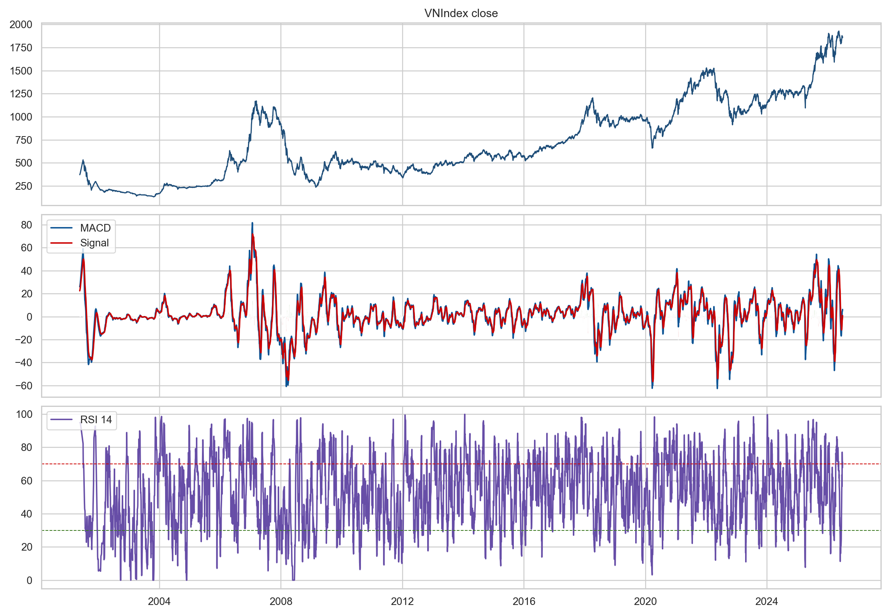

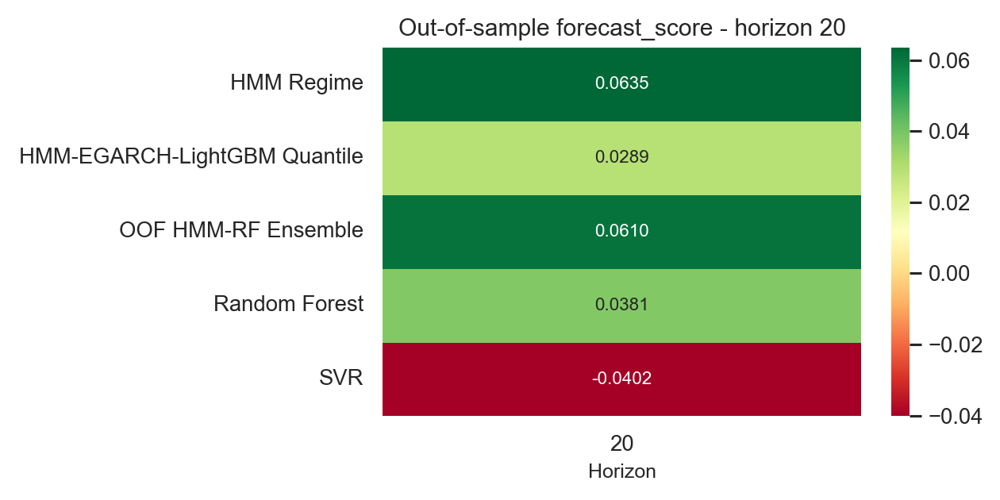

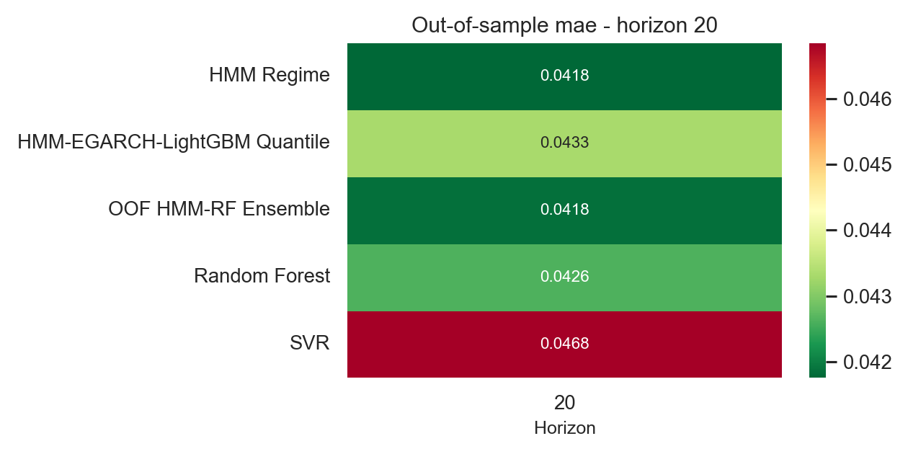

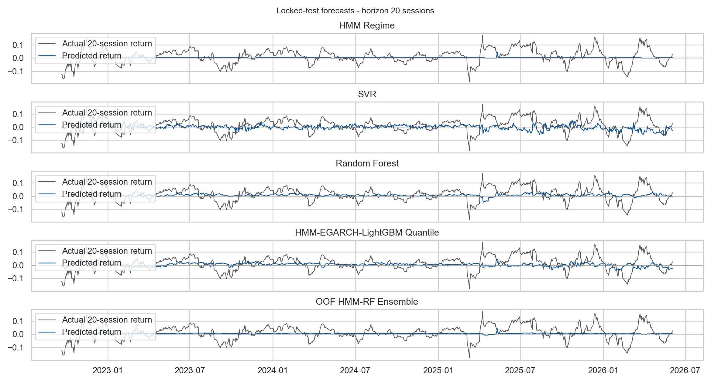

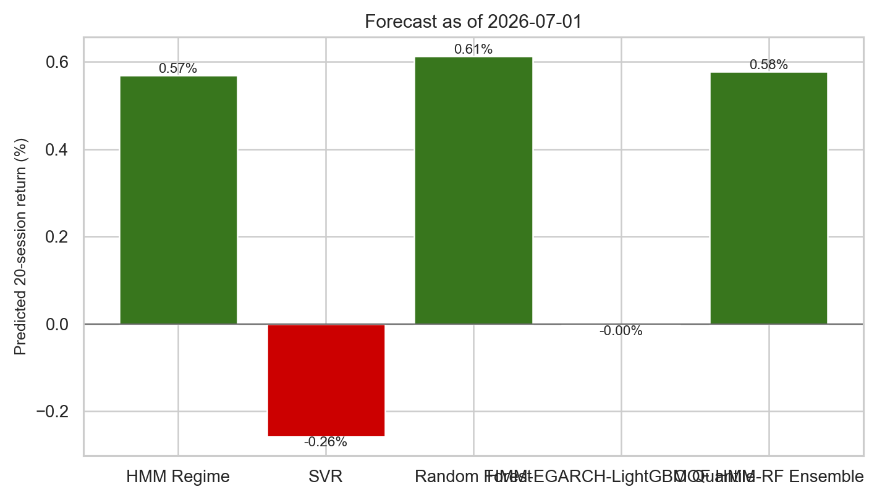

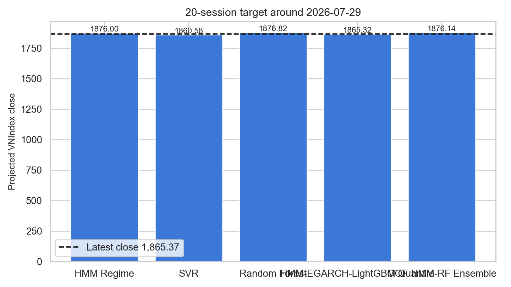

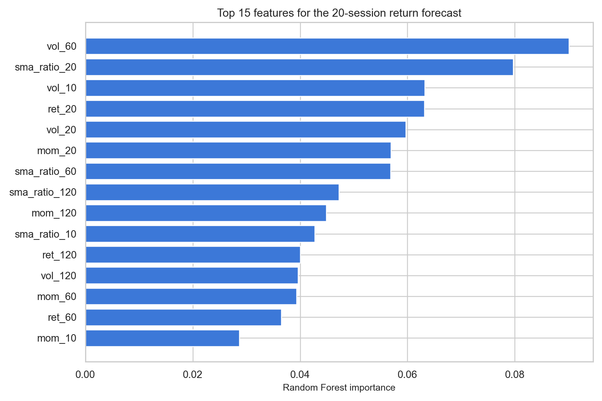

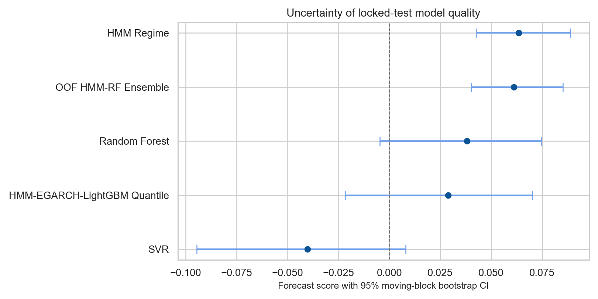

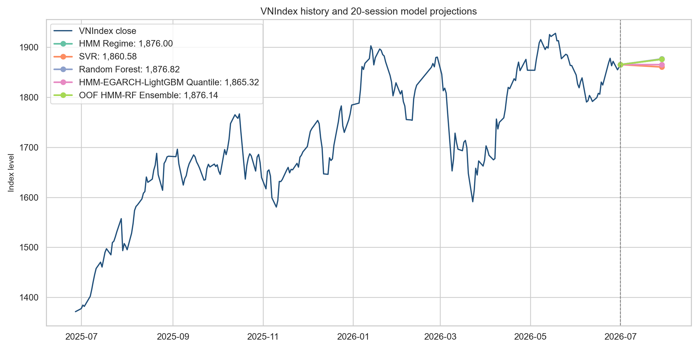

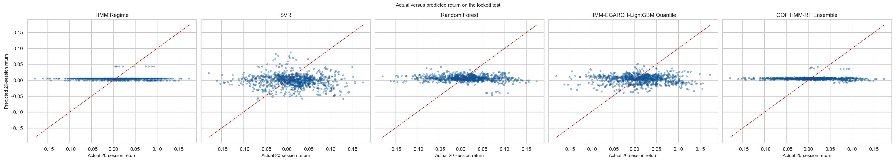

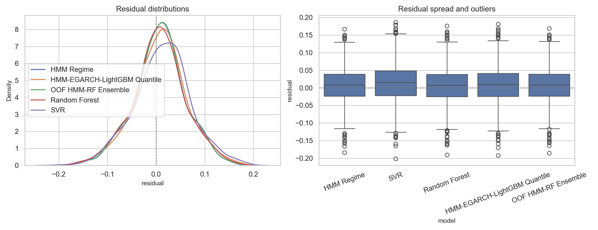

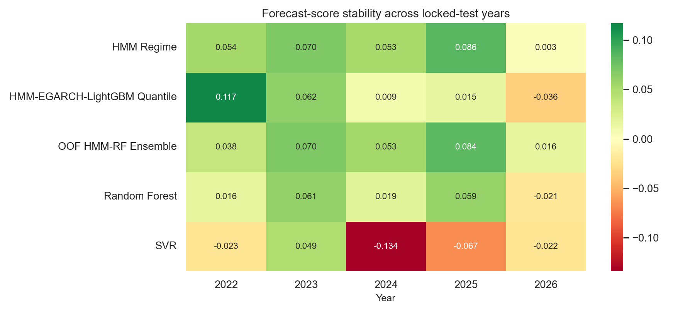

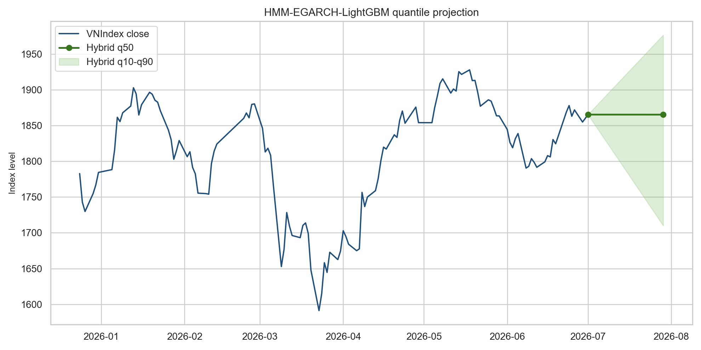

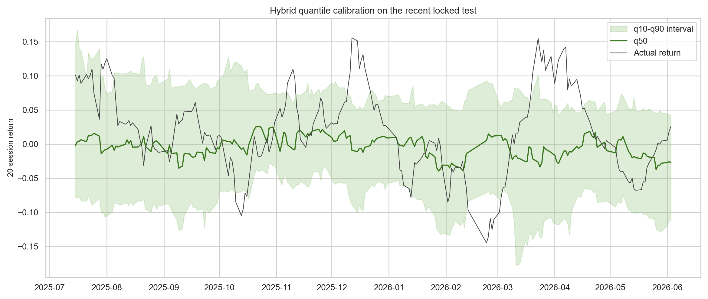

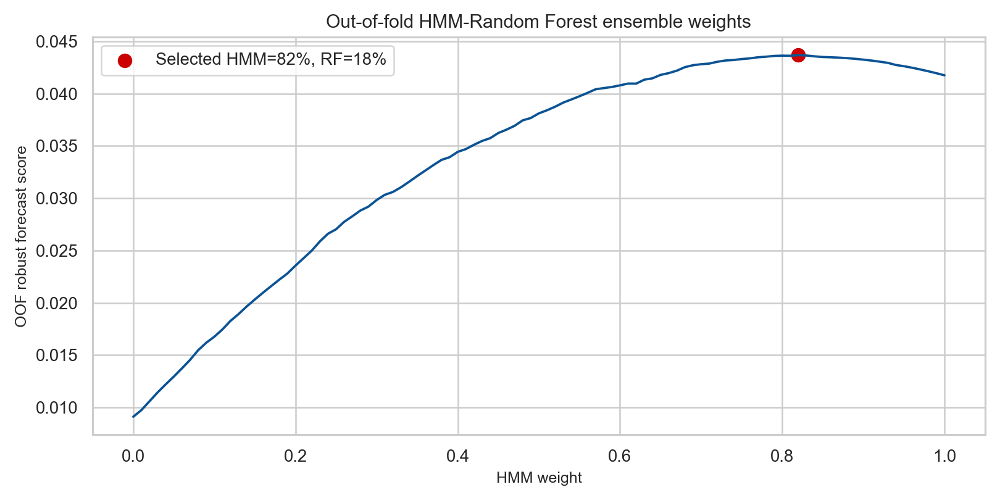

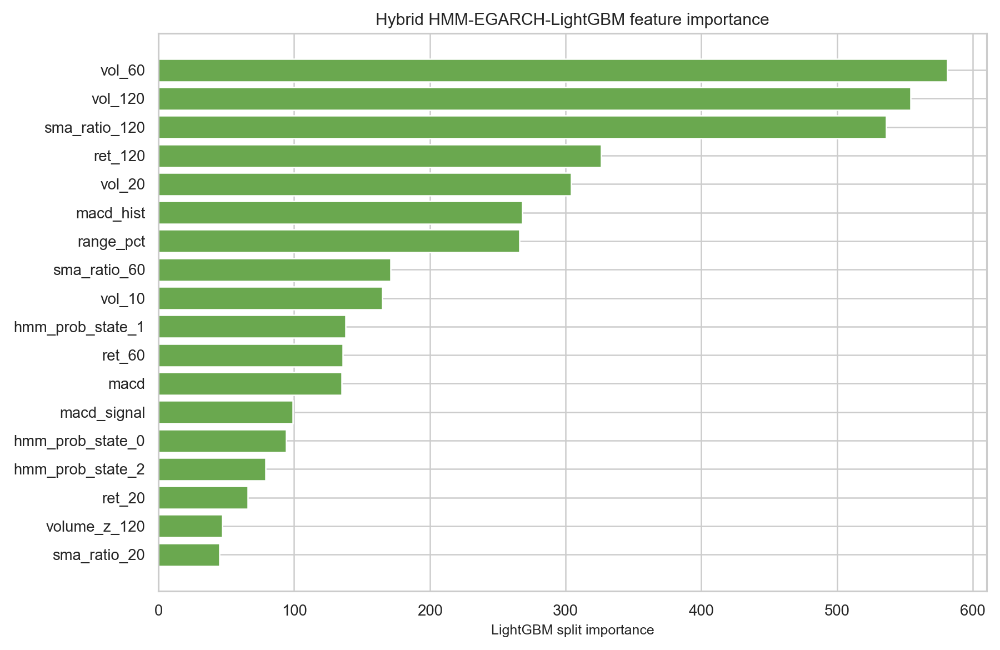

## Chạy lại

```bash
/home/namngyh/miniconda3/envs/eda/bin/python run_benchmark.py
```

Artifact mới gồm `hybrid_tuning_trials.csv`, `hybrid_best_hyperparameters.csv`, `quantile_metrics.csv`, `ensemble_weight_trials.csv`, `ensemble_oof_predictions.csv`, `ensemble_best_weights.csv` và `hybrid_feature_importance.csv`.

## Giới hạn

EGARCH parameters được fit trên từng training fold rồi cố định để lọc validation/test theo thời gian; HMM cũng dùng causal filtering. Tuy vậy, target 20 phiên chồng lấn làm số quan sát hiệu dụng thấp hơn số dòng. Block bootstrap/HAC giảm thiên lệch tự tin nhưng không loại bỏ model-selection bias hoặc structural breaks.
