# RAEMF-MC: Regime-Aware Explainable Multi-Horizon Forecasting with Monte Carlo

[](https://github.com/namngyh/Regime-Aware-Explainable-Multi-Horizon-Forecasting-with-Monte-Carlo/actions/workflows/tests.yml)
[](https://www.python.org/downloads/)
[](LICENSE)
[](https://github.com/namngyh/Regime-Aware-Explainable-Multi-Horizon-Forecasting-with-Monte-Carlo/actions/workflows/tests.yml)
[](docs/reproducibility.md)

Tác giả và người phát triển mô hình: **Nguyễn Hoài Nam**.

RAEMF-MC là repository nghiên cứu định lượng cho VN-Index. Mô hình dự báo xác suất của bốn trạng thái `Bull`, `Sideway`, `Bear` và `Stress` tại các chân trời 20, 40 và 60 phiên. Mục tiêu là đánh giá liệu thông tin chế độ thị trường, rủi ro có điều kiện và calibration có cải thiện dự báo xác suất ngoài mẫu hay không, đồng thời mô tả bất định bằng Monte Carlo theo chế độ.

Đây là nghiên cứu thực nghiệm, không phải lời khuyên đầu tư và không bảo đảm hiệu quả tương lai.

## Mục lục

- [Kiến trúc](#kiến-trúc)
- [Phương pháp](#phương-pháp)
- [Phòng ngừa leakage](#phòng-ngừa-leakage)
- [Cài đặt](#cài-đặt)
- [Lệnh thực thi](#lệnh-thực-thi)
- [Cấu trúc repository](#cấu-trúc-repository)
- [Kết quả thực nghiệm](#kết-quả-thực-nghiệm-mới-nhất)
- [Khả năng tái lập](#khả-năng-tái-lập)
- [Giới hạn](#giới-hạn)
- [Trích dẫn và giấy phép](#trích-dẫn-và-giấy-phép)

## Kiến trúc

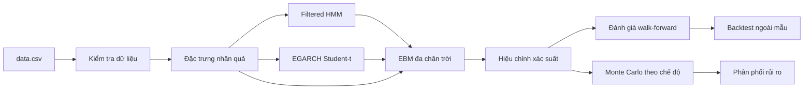

## Phương pháp

### Đặc trưng kỹ thuật nhân quả

Các đặc trưng return, trend, volatility, OHLC shape, volume và calendar tại thời điểm \(t\) chỉ dùng dữ liệu đến hết \(t\). Median imputation và feature selection được fit riêng trên train. Pipeline không dùng centered rolling window hoặc `bfill()` xuyên toàn chuỗi.

### Filtered HMM và căn chỉnh trạng thái

Filtered HMM tính xác suất hiện tại bằng forward recursion:

$$
p(S_t=k \mid \mathcal{F}_t).
$$

State thô được căn chỉnh bằng mean return, volatility, downside, xác suất lợi suất âm, tần suất và duration trên train. Các tên `Expansion`, `Range`, `Contraction` và `Turbulence` là diễn giải kinh tế tương đối, không phải cách đổi tên trực tiếp sang bốn nhãn dự báo.

### EGARCH Student-t

EGARCH mô hình hóa log variance đệ quy và leverage effect:

$$
\log \sigma_t^2
=
\omega
+ \beta \log \sigma_{t-1}^2
+ \alpha (|z_{t-1}|-\mathbb{E}|z|)
+ \gamma z_{t-1}.
$$

Cú sốc dùng Student-t với bậc tự do \(\nu\) ước lượng từ dữ liệu train. Cùng tham số này được chuyển sang Monte Carlo.

### EBM đa lớp theo từng chân trời

Mỗi horizon có một Explainable Boosting Machine riêng. EBM nhận đặc trưng kỹ thuật, xác suất Filtered HMM và đặc trưng EGARCH. Repository lưu global importance, shape plot và local counterfactual contribution cho dự báo deployment mới nhất.

### Hiệu chỉnh xác suất

Temperature scaling chỉ được chọn trên validation và chỉ dùng khi giảm validation log loss. Reliability diagram trên final test hiển thị ECE, Brier score và số quan sát trong từng bin.

### Purged walk-forward validation

Với nhãn tại \(t\) có ngày kết thúc \(e_{t,h}\), train trước boundary \(b\) phải thỏa:

$$
e_{t,h} < b.
$$

Tuning dùng expanding-window folds có purge trước final test. Evaluation model fit trên train, calibration trên validation và chấm một lần trên final test. Deployment model chỉ được refit sau khi khóa kiến trúc và tham số.

### Bootstrap theo khối

Moving-block bootstrap giữ một phần phụ thuộc chuỗi thời gian khi ước lượng khoảng tin cậy 95% cho chênh lệch Brier, log loss, macro F1, recall Bear và recall Stress. Khoảng tin cậy chứa 0 được báo cáo là chưa đủ bằng chứng về khác biệt ổn định.

### Monte Carlo có điều kiện theo chế độ

Mỗi state \(k\) có drift \(\mu_k\) và scale rủi ro riêng. State kế tiếp được lấy từ ma trận chuyển HMM; volatility cập nhật bằng EGARCH; innovation dùng Student-t với \(\nu\) đã fit. Xác suất EBM ở cuối horizon tái trọng số quỹ đạo:

$$
w_m \propto
\frac{p_{\mathrm{EBM},h}(S_h^{(m)})}
{p_{\mathrm{MC},h}(S_h^{(m)})},
\qquad
\mathrm{ESS}
=
\frac{(\sum_m w_m)^2}
{\sum_m w_m^2}.
$$

Clipping và tempering được dùng khi ESS quá thấp. Fan chart là phân phối kịch bản có điều kiện, không phải dự báo giá chắc chắn.

### Backtest ngoài mẫu

Backtest chính chỉ dùng final test. Signal sau đóng cửa ngày \(t\) tạo position cho lợi suất ngày \(t+1\), có transaction cost và turnover. RAEMF-MC được so sánh trên cùng ngày với Buy-and-Hold, Cash, MACD deterministic, MACD probabilistic, XGBoost và Random Forest.

## Phòng ngừa leakage

- Mọi feature tại \(t\) chỉ phụ thuộc dữ liệu đến \(t\).
- `target_end_date_h` được purge trước validation và test boundary.
- HMM, EGARCH, imputer và feature selector của evaluation chỉ fit trên train.
- Hyperparameter tuning không nhìn final test.
- Calibration chỉ học từ validation.
- Backtest chỉ nhận xác suất final-test và lag position một phiên.
- Dự báo mới nhất đến từ deployment model refit, không tái sử dụng evaluation prediction cũ.

Chi tiết kiểm tra nằm trong [leakage prevention](docs/leakage_prevention.md).

## Cài đặt

```bash
git clone https://github.com/namngyh/Regime-Aware-Explainable-Multi-Horizon-Forecasting-with-Monte-Carlo.git
cd Regime-Aware-Explainable-Multi-Horizon-Forecasting-with-Monte-Carlo
python -m venv .venv
source .venv/bin/activate
python -m pip install --upgrade pip
python -m pip install -e .
```

Python 3.10 trở lên được hỗ trợ. Không yêu cầu một môi trường Conda có tên cố định.

## Lệnh thực thi

Laptop mode:

```bash
python -m raemf_mc.cli run --data data.csv --config configs/laptop.yaml
```

Research mode:

```bash
python -m raemf_mc.cli run --data data.csv --config configs/research.yaml
```

Chạy kiểm thử:

```bash
python -m pytest -q
```

Chỉ tạo lại báo cáo và cập nhật vùng kết quả README:

```bash
python -m raemf_mc.cli report --run-dir outputs/latest
```

Chỉ tạo lại biểu đồ từ artifact đã lưu:

```bash
python -m raemf_mc.cli plots --run-dir outputs/latest --data data.csv
```

Tái tạo toàn bộ kết quả laptop:

```bash
python -m raemf_mc.cli reproduce --data data.csv --config configs/laptop.yaml
```

Các shell script tương ứng nằm trong `scripts/`.

## Cấu trúc repository

```text
.
├── configs/                 # Cấu hình laptop và research
├── docs/                    # Phương pháp, model card và báo cáo kỹ thuật
├── outputs/
│   ├── data_validation/     # Hồ sơ chất lượng dữ liệu
│   ├── latest/              # Bản sao run hoàn tất gần nhất
│   └── runs/                # Run bất biến theo timestamp và Git SHA
├── scripts/                 # Lệnh chạy và cập nhật README
├── src/raemf_mc/
│   ├── backtest/            # Position lag, chi phí và metric OOS
│   ├── calibration/         # Temperature scaling và metric xác suất
│   ├── data/                # Parser và validation dữ liệu
│   ├── features/            # Đặc trưng nhân quả và selection
│   ├── models/              # EBM, XGBoost, Random Forest và MACD
│   ├── regime/              # Filtered HMM và state alignment
│   ├── reporting/           # Plot, bảng, diễn giải và báo cáo
│   ├── risk/                # EGARCH Student-t
│   ├── simulation/          # Monte Carlo và EBM reweighting
│   ├── tuning/              # Random search purged walk-forward
│   └── validation/          # Split và assertion chống leakage
└── tests/                   # Unit, leakage, Markdown và smoke tests
```

<!-- RESULTS_START -->

## Kết quả thực nghiệm mới nhất

Bảng dưới đây được cập nhật tự động từ `outputs/latest/metrics_by_model_horizon.csv`.

| model | horizon | macro_f1 | balanced_accuracy | mcc | brier | log_loss | ece | recall_bear | recall_stress |
| --- | --- | --- | --- | --- | --- | --- | --- | --- | --- |
| RAEMF-MC | 20 | 0.3057 | 0.3118 | 0.1093 | 0.7287 | 1.3451 | 0.0894 | 0.0667 | 0.2338 |
| XGBoost (full features) | 20 | 0.3394 | 0.3430 | 0.1278 | 0.7283 | 1.3445 | 0.0931 | 0.1037 | 0.3682 |
| Random Forest (full features) | 20 | 0.3514 | 0.3639 | 0.1876 | 0.7278 | 1.3434 | 0.1445 | 0.0593 | 0.3682 |
| MACD probabilistic | 20 | 0.1990 | 0.2544 | 0.0133 | 0.7274 | 1.3557 | 0.0657 | 0.0000 | 0.0000 |
| RAEMF-MC | 40 | 0.3006 | 0.3058 | 0.1237 | 0.7261 | 1.3388 | 0.0950 | 0.0632 | 0.1467 |
| XGBoost (full features) | 40 | 0.2696 | 0.2722 | 0.0594 | 0.7288 | 1.3403 | 0.0359 | 0.0316 | 0.3067 |
| Random Forest (full features) | 40 | 0.2630 | 0.2705 | 0.0609 | 0.7335 | 1.3536 | 0.0669 | 0.1053 | 0.0756 |
| MACD probabilistic | 40 | 0.1367 | 0.2500 | 0.0000 | 0.7172 | 1.3280 | 0.0940 | 0.0000 | 0.0000 |
| RAEMF-MC | 60 | 0.2797 | 0.2815 | 0.0557 | 0.7303 | 1.3417 | 0.0681 | 0.0286 | 0.2035 |
| XGBoost (full features) | 60 | 0.2363 | 0.2470 | 0.0064 | 0.7434 | 1.3625 | 0.0432 | 0.0286 | 0.3723 |
| Random Forest (full features) | 60 | 0.2218 | 0.2195 | -0.0183 | 0.7416 | 1.3624 | 0.0181 | 0.0143 | 0.1732 |
| MACD probabilistic | 60 | 0.1359 | 0.2500 | 0.0000 | 0.7082 | 1.2861 | 0.0926 | 0.0000 | 0.0000 |

**Nhận xét:** Metric này được đọc theo hướng thấp hơn là tốt hơn. 20 phiên: tốt nhất là MACD probabilistic (0.7274); RAEMF-MC đạt 0.7287, chênh +0.0013; 40 phiên: tốt nhất là MACD probabilistic (0.7172); RAEMF-MC đạt 0.7261, chênh +0.0088; 60 phiên: tốt nhất là MACD probabilistic (0.7082); RAEMF-MC đạt 0.7303, chênh +0.0221. So sánh điểm không tự nó chứng minh ưu thế ổn định theo thời gian.

### Dự báo triển khai mới nhất

| date | horizon | Bull | Sideway | Bear | Stress | predicted_class | confidence | entropy | margin | market_filter |
| --- | --- | --- | --- | --- | --- | --- | --- | --- | --- | --- |
| 2026-07-01 | 20 | 0.2347 | 0.2823 | 0.2482 | 0.2349 | Sideway | Uncertain | 1.3833 | 0.0341 | Uncertain |
| 2026-07-01 | 40 | 0.2469 | 0.2886 | 0.2570 | 0.2075 | Sideway | Uncertain | 1.3795 | 0.0316 | Uncertain |
| 2026-07-01 | 60 | 0.2649 | 0.3191 | 0.1876 | 0.2284 | Sideway | Uncertain | 1.3676 | 0.0542 | Uncertain |

**Nhận xét:** Dự báo deployment tại 2026-07-01: 20 phiên: Sideway (28.2%), confidence=Uncertain, entropy=1.38, margin=0.03; 40 phiên: Sideway (28.9%), confidence=Uncertain, entropy=1.38, margin=0.03; 60 phiên: Sideway (31.9%), confidence=Uncertain, entropy=1.37, margin=0.05. Xác suất phản ánh bất định của mô hình trên dữ liệu hiện có, không phải khuyến nghị đầu tư.

## Hình ảnh và diễn giải

### VN-Index và phân chia train, validation, test


*Chú thích:* Hình được tạo từ dữ liệu và artifact của run hiện tại: `vnindex_va_phan_chia_du_lieu.png`.

**Nhận xét định lượng:** Validation bắt đầu 2017-07-05 và final test bắt đầu 2021-04-02. Mọi metric chính và backtest chỉ dùng final test; ranh giới được xác định theo thời gian, không xáo trộn quan sát.

### Xác suất trạng thái Filtered HMM

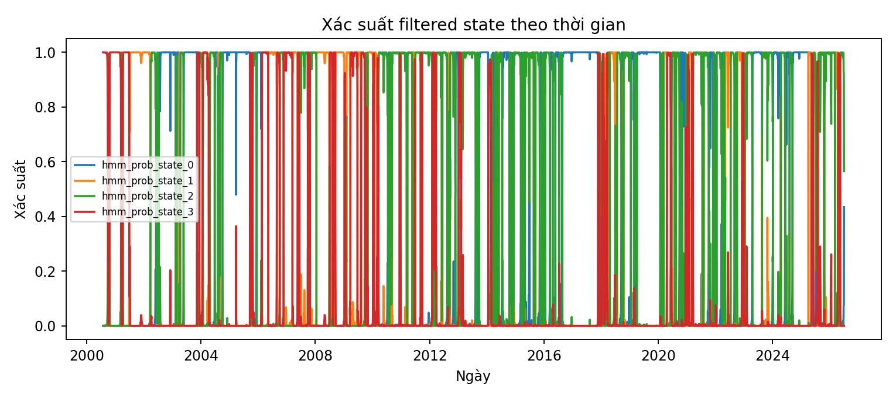

*Chú thích:* Hình được tạo từ dữ liệu và artifact của run hiện tại: `xac_suat_filtered_hmm.png`.

**Nhận xét định lượng:** Căn chỉnh train-only cho thấy Expansion: mean=0.651%, sigma=1.956%, tần suất=16.0%, Range: mean=0.021%, sigma=1.127%, tần suất=38.2%, Contraction: mean=0.000%, sigma=0.658%, tần suất=28.5%, Turbulence: mean=-0.360%, sigma=2.518%, tần suất=17.4%. Tên state là diễn giải tương đối theo quy tắc định lượng, không đồng nhất trực tiếp với nhãn dự báo.

### Biến động điều kiện EGARCH

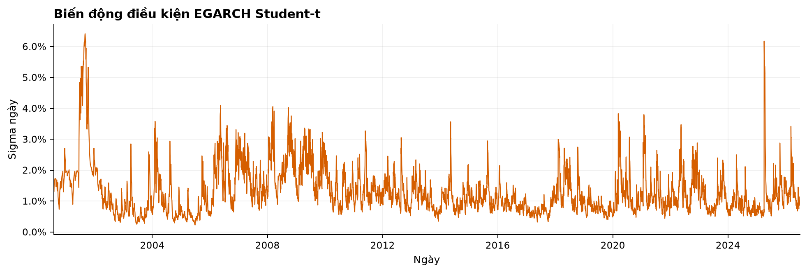

*Chú thích:* Hình được tạo từ dữ liệu và artifact của run hiện tại: `egarch_conditional_volatility.png`.

**Nhận xét định lượng:** Sigma EGARCH trung vị là 1.084% và cực đại 6.414%. Tham số được fit trên train cho evaluation; các đỉnh volatility là ước lượng mô hình, không phải volatility quan sát trực tiếp.

### So sánh Brier score

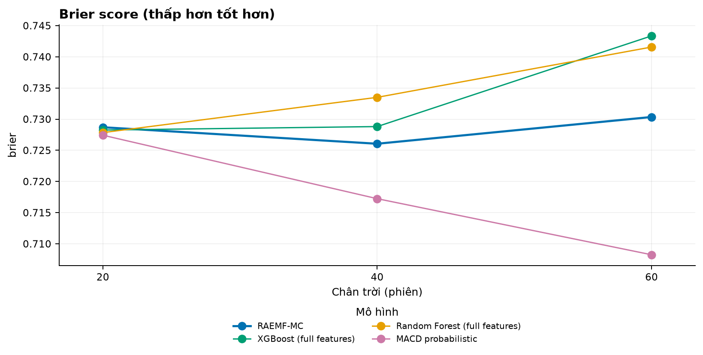

*Chú thích:* Hình được tạo từ dữ liệu và artifact của run hiện tại: `so_sanh_brier.png`.

**Nhận xét định lượng:** Metric này được đọc theo hướng thấp hơn là tốt hơn. 20 phiên: tốt nhất là MACD probabilistic (0.7274); RAEMF-MC đạt 0.7287, chênh +0.0013; 40 phiên: tốt nhất là MACD probabilistic (0.7172); RAEMF-MC đạt 0.7261, chênh +0.0088; 60 phiên: tốt nhất là MACD probabilistic (0.7082); RAEMF-MC đạt 0.7303, chênh +0.0221. So sánh điểm không tự nó chứng minh ưu thế ổn định theo thời gian.

### So sánh macro F1

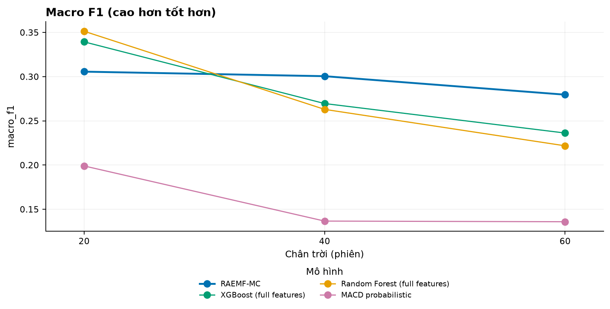

*Chú thích:* Hình được tạo từ dữ liệu và artifact của run hiện tại: `so_sanh_macro_f1.png`.

**Nhận xét định lượng:** Metric này được đọc theo hướng cao hơn là tốt hơn. 20 phiên: tốt nhất là Random Forest (full features) (0.3514); RAEMF-MC đạt 0.3057, chênh -0.0457; 40 phiên: tốt nhất là RAEMF-MC (0.3006); RAEMF-MC đạt 0.3006, chênh +0.0000; 60 phiên: tốt nhất là RAEMF-MC (0.2797); RAEMF-MC đạt 0.2797, chênh +0.0000. So sánh điểm không tự nó chứng minh ưu thế ổn định theo thời gian.

### Reliability diagram 20 phiên


*Chú thích:* Hình được tạo từ dữ liệu và artifact của run hiện tại: `reliability_diagram_20.png`.

**Nhận xét định lượng:** Trên validation 20 phiên, temperature scaling làm Brier thay đổi từ 0.7529 xuống 0.7447, log loss từ 1.3864 xuống 1.3744, và ECE từ 0.0666 xuống 0.0142. Reliability trên test vẫn có thể lệch do drift và số mẫu trong các bin không đồng đều.

### Fan chart Monte Carlo 20 phiên

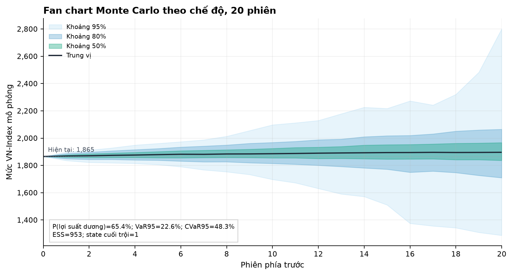

*Chú thích:* Hình được tạo từ dữ liệu và artifact của run hiện tại: `fan_chart_monte_carlo_20.png`.

**Nhận xét định lượng:** Tại 20 phiên, phân phối tái trọng số có xác suất lợi suất dương 65.4%, VaR 95% 22.6%, CVaR 95% 48.3%, và xác suất drawdown vượt 10% 20.3%. ESS đạt 953 (79.4% số quỹ đạo), với bậc tự do Student-t 6.65. Đây là phân phối kịch bản có điều kiện, không phải khoảng đảm bảo cho mức chỉ số tương lai.

### Fan chart Monte Carlo 40 phiên

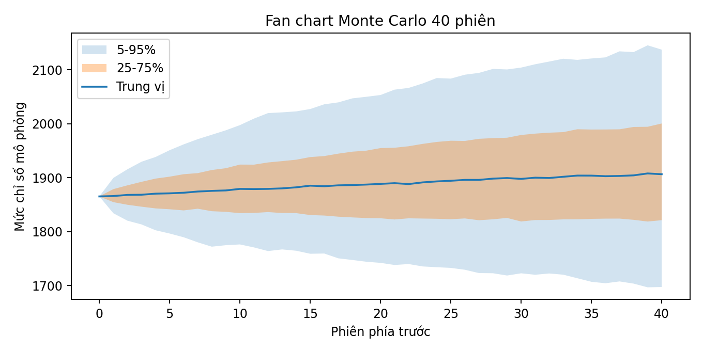

*Chú thích:* Hình được tạo từ dữ liệu và artifact của run hiện tại: `fan_chart_monte_carlo_40.png`.

**Nhận xét định lượng:** Tại 40 phiên, phân phối tái trọng số có xác suất lợi suất dương 66.5%, VaR 95% 41.2%, CVaR 95% 90.0%, và xác suất drawdown vượt 10% 40.8%. ESS đạt 1171 (97.6% số quỹ đạo), với bậc tự do Student-t 6.65. Đây là phân phối kịch bản có điều kiện, không phải khoảng đảm bảo cho mức chỉ số tương lai.

### Fan chart Monte Carlo 60 phiên

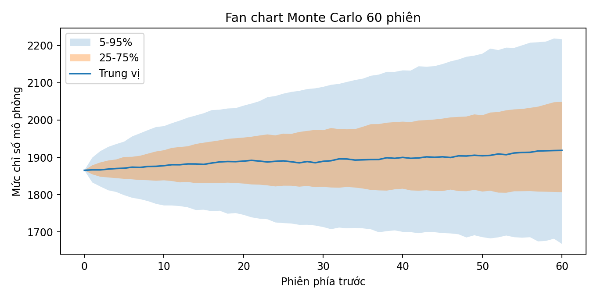

*Chú thích:* Hình được tạo từ dữ liệu và artifact của run hiện tại: `fan_chart_monte_carlo_60.png`.

**Nhận xét định lượng:** Tại 60 phiên, phân phối tái trọng số có xác suất lợi suất dương 64.4%, VaR 95% 83.7%, CVaR 95% 153.3%, và xác suất drawdown vượt 10% 53.9%. ESS đạt 1167 (97.3% số quỹ đạo), với bậc tự do Student-t 6.65. Đây là phân phối kịch bản có điều kiện, không phải khoảng đảm bảo cho mức chỉ số tương lai.

### Đường vốn ngoài mẫu

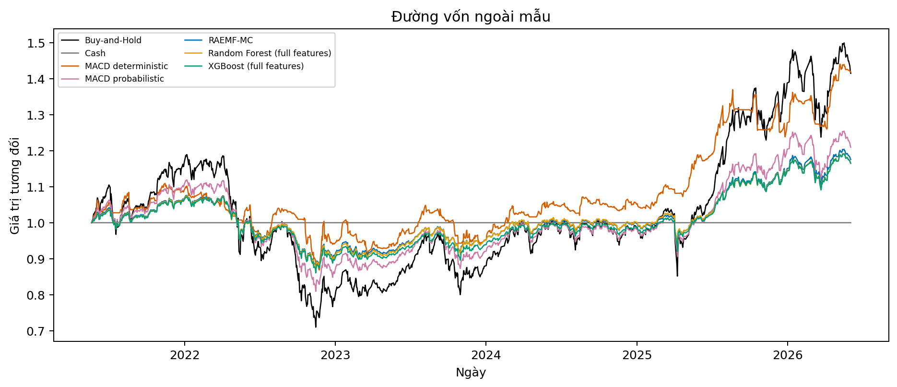

*Chú thích:* Hình được tạo từ dữ liệu và artifact của run hiện tại: `backtest_equity_oos.png`.

**Nhận xét định lượng:** Trên cùng final-test OOS, Sharpe cao nhất thuộc MACD deterministic (0.618). RAEMF-MC có lợi suất tích lũy 17.6%, Sharpe 0.393, drawdown cực đại -19.0%, turnover 21.58 và chi phí 2.16%. Backtest là proxy trên VN-Index, chưa phản ánh tracking error, thanh khoản hay khả năng giao dịch chỉ số trực tiếp.

### Drawdown ngoài mẫu

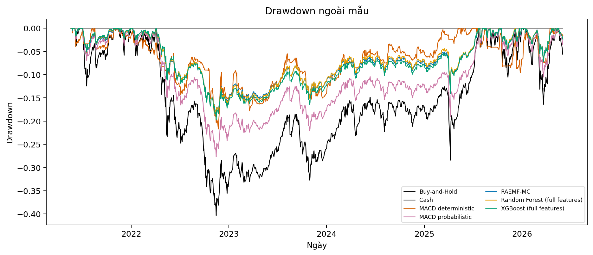

*Chú thích:* Hình được tạo từ dữ liệu và artifact của run hiện tại: `backtest_drawdown_oos.png`.

**Nhận xét định lượng:** Trên cùng final-test OOS, Sharpe cao nhất thuộc MACD deterministic (0.618). RAEMF-MC có lợi suất tích lũy 17.6%, Sharpe 0.393, drawdown cực đại -19.0%, turnover 21.58 và chi phí 2.16%. Backtest là proxy trên VN-Index, chưa phản ánh tracking error, thanh khoản hay khả năng giao dịch chỉ số trực tiếp.

### Tầm quan trọng đặc trưng RAEMF-MC

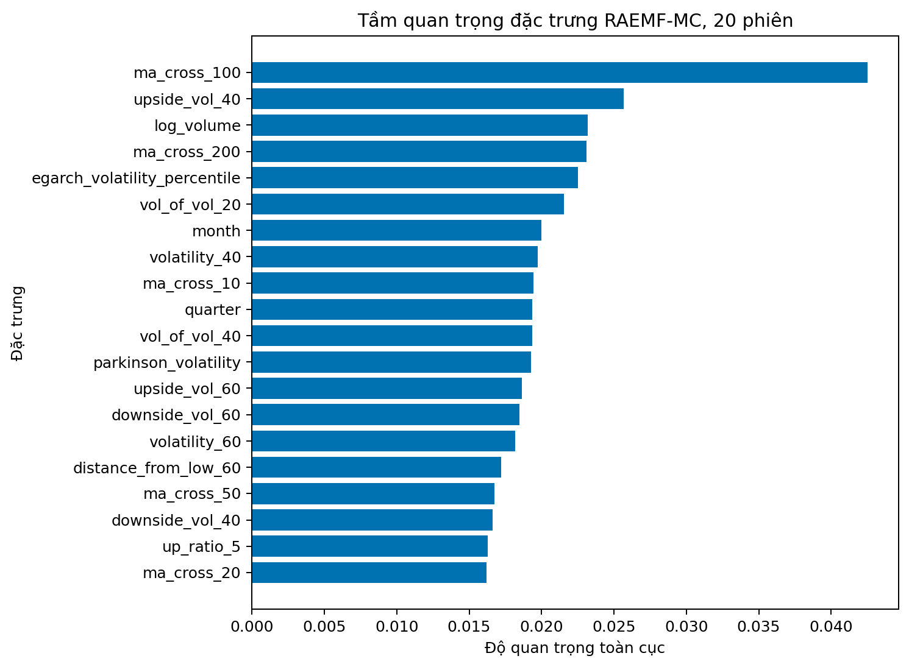

*Chú thích:* Hình được tạo từ dữ liệu và artifact của run hiện tại: `feature_importance_raemf_mc_20.png`.

**Nhận xét định lượng:** Năm term quan trọng nhất ở 20 phiên là ma_cross_100 (0.043), upside_vol_40 (0.026), log_volume (0.023), ma_cross_200 (0.023), egarch_volatility_percentile (0.023). Độ quan trọng toàn cục không biểu thị quan hệ nhân quả và interaction term có thể chia sẻ tín hiệu với đặc trưng tương quan.

### Kết quả ablation

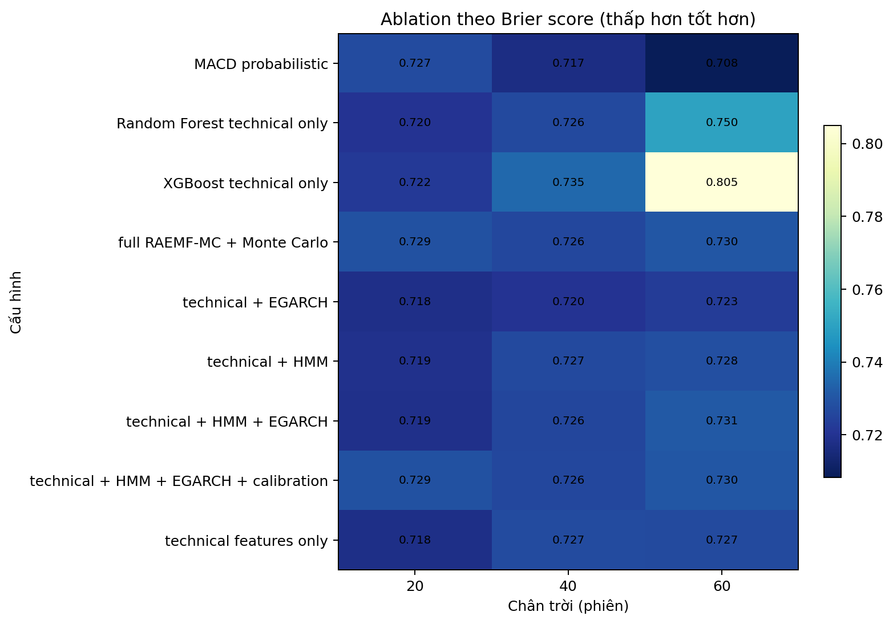

*Chú thích:* Hình được tạo từ dữ liệu và artifact của run hiện tại: `ablation_study.png`.

**Nhận xét định lượng:** 20 phiên: technical features only có Brier thấp nhất (0.7179); 40 phiên: MACD probabilistic có Brier thấp nhất (0.7172); 60 phiên: MACD probabilistic có Brier thấp nhất (0.7082). Tác động của HMM, EGARCH và calibration không được giả định là nhất quán nếu thứ hạng đổi giữa các chân trời.

### Khoảng tin cậy bootstrap của Brier

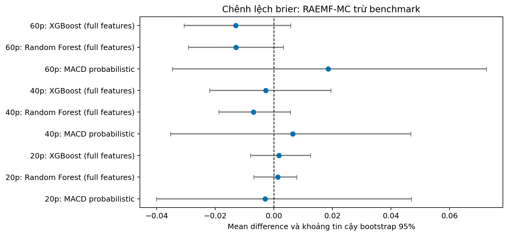

*Chú thích:* Hình được tạo từ dữ liệu và artifact của run hiện tại: `bootstrap_forest_brier.png`.

**Nhận xét định lượng:** Forest plot dùng định nghĩa RAEMF-MC trừ benchmark; chênh lệch âm có lợi cho RAEMF-MC. Có 0/9 khoảng tin cậy 95% không chứa 0. Các khoảng còn chứa 0 chưa cung cấp bằng chứng ổn định về khác biệt.

<!-- RESULTS_END -->

## Khả năng tái lập

Mỗi run lưu config snapshot, checksum `data.csv`, Python version, OS, random seed, Git SHA, thời gian bắt đầu, kết thúc và tổng runtime. Dependency trực tiếp được khóa trong `requirements-lock.txt`. Cùng seed và cùng dependency tạo kết quả số có thể tái lập trong sai số số học của thư viện nền.

Xem [tài liệu tái lập](docs/reproducibility.md) và [báo cáo kỹ thuật](docs/technical_report.md).

## Giới hạn

Dữ liệu chỉ gồm OHLCV lịch sử VN-Index, không có dữ liệu vĩ mô, market breadth hoặc thành phần chỉ số. State HMM và nhãn dự báo phụ thuộc quy tắc nghiên cứu. Final test là một giai đoạn lịch sử hữu hạn. Backtest chưa phản ánh tracking error, spread biến thiên, thuế hoặc khả năng giao dịch VN-Index trực tiếp.

Mọi kết luận đều phải đọc cùng bootstrap, class support, calibration và drift. Repository không tuyên bố RAEMF-MC vượt trội khi bằng chứng không nhất quán giữa metric hoặc horizon.

## Trích dẫn và giấy phép

Thông tin trích dẫn máy đọc được nằm trong [CITATION.cff](CITATION.cff).

Dự án được phát hành theo [MIT License](LICENSE). Copyright 2026 Nguyễn Hoài Nam.
