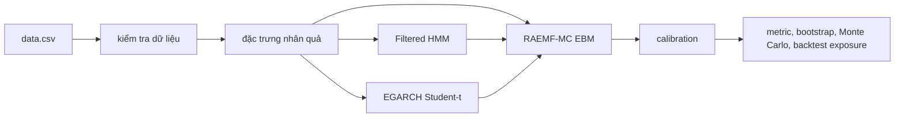

# RAEMF-MC: Regime-Aware Explainable Multi-Horizon Forecasting with Monte Carlo

Tác giả và người phát triển mô hình: Nguyễn Hoài Nam.

RAEMF-MC dự báo trạng thái tương lai của VN-Index tại 20, 40 và 60 phiên theo bốn lớp `Bull`, `Sideway`, `Bear`, `Stress`. Repository này nhấn mạnh chống rò rỉ dữ liệu tương lai, đánh giá ngoài mẫu theo thời gian, xác suất có hiệu chỉnh và phân tích bất định.



## Cài đặt

```bash
conda activate eda
python -m pip install -e .
```

## Chạy laptop mode

```bash
bash scripts/run_laptop.sh
```

## Quy tắc chống leakage

- Đặc trưng tại thời điểm t chỉ dùng dữ liệu đến t.
- Nhãn dùng `target_end_date_h`; train phải thỏa `target_end_date_h < validation_start`.
- Calibration chỉ fit trên validation, không fit trên test.
- Backtest dùng tín hiệu sau đóng cửa ngày t cho lợi suất từ t+1.

## Kết quả thực nghiệm mới nhất

| model | horizon | macro_f1 | balanced_accuracy | brier | log_loss | recall_bear | recall_stress |
| --- | --- | --- | --- | --- | --- | --- | --- |
| MACD | 20 | 0.2245 | 0.2340 | 1.2270 | 2.3501 | 0.2000 | 0.0547 |
| RAEMF-MC | 20 | 0.3026 | 0.3223 | 0.7423 | 1.3707 | 0.2593 | 0.3383 |
| XGBoost | 20 | 0.3332 | 0.3372 | 0.7283 | 1.3444 | 0.1185 | 0.3383 |
| Random Forest | 20 | 0.3546 | 0.3652 | 0.7320 | 1.3516 | 0.0963 | 0.4129 |
| MACD | 40 | 0.1917 | 0.2014 | 1.2779 | 2.4436 | 0.1474 | 0.0311 |
| RAEMF-MC | 40 | 0.2591 | 0.2733 | 0.7246 | 1.3255 | 0.0526 | 0.4222 |
| XGBoost | 40 | 0.2683 | 0.2687 | 0.7275 | 1.3379 | 0.0316 | 0.2756 |
| Random Forest | 40 | 0.2822 | 0.2884 | 0.7320 | 1.3506 | 0.1053 | 0.0978 |
| MACD | 60 | 0.2096 | 0.2392 | 1.2348 | 2.3644 | 0.2571 | 0.0130 |
| RAEMF-MC | 60 | 0.2075 | 0.2333 | 0.7864 | 1.4336 | 0.1714 | 0.3810 |
| XGBoost | 60 | 0.2393 | 0.2507 | 0.7417 | 1.3584 | 0.0286 | 0.3810 |
| Random Forest | 60 | 0.2301 | 0.2289 | 0.7397 | 1.3595 | 0.0143 | 0.1861 |

## Dự báo mới nhất

```json
{
  "as_of_date": "2026-07-01",
  "last_close": 1865.37,
  "horizons": {
    "20": {
      "probabilities": {
        "Bull": 0.1418633071332986,
        "Sideway": 0.25935881959416385,
        "Bear": 0.3605209328507657,
        "Stress": 0.2382569404217719
      },
      "predicted_class": "Bear",
      "confidence": "Uncertain",
      "market_filter": "Uncertain"
    },
    "40": {
      "probabilities": {
        "Bull": 0.302917708294685,
        "Sideway": 0.18539009350995633,
        "Bear": 0.25806874995062756,
        "Stress": 0.2536234482447311
      },
      "predicted_class": "Bull",
      "confidence": "Uncertain",
      "market_filter": "Uncertain"
    },
    "60": {
      "probabilities": {
        "Bull": 0.30904599463325,
        "Sideway": 0.301103974930659,
        "Bear": 0.076360610244674,
        "Stress": 0.313489420191417
      },
      "predicted_class": "Stress",
      "confidence": "Low",
      "market_filter": "Uncertain"
    }
  },
  "note": "Không phải lời khuyên đầu tư."
}
```

## Hình ảnh chính

Các hình được lưu trong `outputs/latest/figures/`, gồm VN-Index theo thời gian, phân phối lớp, so sánh metric, xác suất Filtered HMM, EGARCH và fan chart Monte Carlo.

## Giới hạn

Dữ liệu chỉ gồm VN-Index trong `data.csv`; không có dữ liệu vĩ mô, market breadth hoặc thành phần chỉ số. VN-Index không phải tài sản có thể giao dịch trực tiếp theo giả định đơn giản. Kết quả không phải lời khuyên đầu tư và không bảo đảm hiệu quả tương lai.
