# VNIndex ML Forecast Benchmark vs MACD

Repo này so sánh khả năng dự báo của MACD 12-26-9 với các mô hình Machine Learning:
SVC, SVR, Random Forest, XGBoost, LightGBM, CatBoost và HMM/Regime Model.

Trọng tâm là dự báo theo 3 khung thời gian:

- Ngắn hạn: 5 phiên
- Trung hạn: 20 phiên
- Dài hạn: 60 phiên

## Dữ liệu và phương pháp

- File gốc: `data.csv`
- Số dòng hợp lệ: `6,298`
- Giai đoạn dữ liệu: `2000-07-28` đến `2026-07-01`
- Biến dự báo: return tương lai `close[t+h] / close[t] - 1`
- Nhãn hướng: tăng nếu return tương lai lớn hơn 0
- Chia tập: theo thời gian, không shuffle, tránh leakage
- Chiến lược tài chính: long/flat; nếu mô hình dự báo tăng thì nắm giữ cho phiên kế tiếp, nếu không thì đứng ngoài
- MACD baseline: `MACD line > Signal line` được xem là tín hiệu bullish để dự báo hướng

### Split thời gian

| split | rows | start      | end        |
| ----- | ---- | ---------- | ---------- |
| train | 4267 | 2001-05-18 | 2018-11-30 |
| valid | 914  | 2018-12-03 | 2022-08-01 |
| test  | 915  | 2022-08-02 | 2026-04-03 |

## Kết luận nhanh

Top 3 mô hình theo điểm tổng hợp dự báo gồm `balanced_accuracy`, `f1`, `spearman_ic`, `r2` và `strategy_sharpe`:

| horizon | model         | rank_score | balanced_accuracy | f1     | spearman_ic | strategy_sharpe |
| ------- | ------------- | ---------- | ----------------- | ------ | ----------- | --------------- |
| 5       | SVC           | 0.8000     | 0.5217            | 0.6531 | 0.0361      | 0.9470          |
| 5       | HMM Regime    | 0.7750     | 0.5357            | 0.6066 | 0.0479      | 1.5148          |
| 5       | MACD 12-26-9  | 0.7000     | 0.5184            | 0.5725 | 0.0254      | 0.9119          |
| 20      | MACD 12-26-9  | 0.8000     | 0.5329            | 0.5966 | 0.0338      | 0.9119          |
| 20      | XGBoost       | 0.7250     | 0.5344            | 0.6650 | 0.0137      | 0.2267          |
| 20      | Random Forest | 0.6000     | 0.5049            | 0.6469 | -0.1057     | 0.5679          |
| 60      | MACD 12-26-9  | 0.7000     | 0.4658            | 0.5714 | 0.0197      | 0.9119          |
| 60      | HMM Regime    | 0.7000     | 0.4392            | 0.6852 | -0.0911     | 0.9145          |
| 60      | Random Forest | 0.6500     | 0.5115            | 0.6554 | -0.1179     | 0.4529          |

Top 3 mô hình theo Sharpe chiến lược:

| horizon | model        | strategy_total_return | strategy_sharpe | strategy_max_drawdown | strategy_exposure |
| ------- | ------------ | --------------------- | --------------- | --------------------- | ----------------- |
| 5       | HMM Regime   | 0.8485                | 1.5148          | -0.0943               | 0.5727            |
| 5       | SVC          | 0.5795                | 0.9470          | -0.1663               | 0.7049            |
| 5       | MACD 12-26-9 | 0.4274                | 0.9119          | -0.1779               | 0.5344            |
| 20      | HMM Regime   | 0.8485                | 1.5148          | -0.0943               | 0.5727            |
| 20      | MACD 12-26-9 | 0.4274                | 0.9119          | -0.1779               | 0.5344            |
| 20      | SVC          | 0.5281                | 0.9002          | -0.1837               | 0.5880            |
| 60      | HMM Regime   | 0.5408                | 0.9145          | -0.1291               | 0.7770            |
| 60      | MACD 12-26-9 | 0.4274                | 0.9119          | -0.1779               | 0.5344            |
| 60      | LightGBM     | 0.4255                | 0.7960          | -0.1384               | 0.5005            |

Vị trí của MACD trong bảng dự báo:

| horizon | model        | rank_score | balanced_accuracy | f1     | spearman_ic | strategy_sharpe |
| ------- | ------------ | ---------- | ----------------- | ------ | ----------- | --------------- |
| 5       | MACD 12-26-9 | 0.7000     | 0.5184            | 0.5725 | 0.0254      | 0.9119          |
| 20      | MACD 12-26-9 | 0.8000     | 0.5329            | 0.5966 | 0.0338      | 0.9119          |
| 60      | MACD 12-26-9 | 0.7000     | 0.4658            | 0.5714 | 0.0197      | 0.9119          |

## Dự báo tương lai từ phiên mới nhất

Ngày dự báo mới nhất trong dữ liệu là `2026-07-01`, VNIndex đóng cửa `1,865.37`.
Các mô hình được train lại trên toàn bộ phần lịch sử đã có nhãn cho từng horizon, sau đó dự báo từ trạng thái kỹ thuật mới nhất.

### Nhận xét hướng đi VNIndex

- Horizon 5 phiên đến khoảng `2026-07-08`: đồng thuận `Bullish`, 8/8 mô hình bullish, median return `0.40%`, target median `1,872.91`. Đa số mô hình ủng hộ xu hướng tăng.
- Horizon 20 phiên đến khoảng `2026-07-29`: đồng thuận `Mixed/Neutral`, 3/8 mô hình bullish, median return `0.19%`, target median `1,868.86`. Tín hiệu phân hóa, nên ưu tiên quan sát xác nhận.
- Horizon 60 phiên đến khoảng `2026-09-23`: đồng thuận `Mixed/Neutral`, 4/8 mô hình bullish, median return `2.52%`, target median `1,912.33`. Tín hiệu phân hóa, nên ưu tiên quan sát xác nhận.

Bảng đồng thuận tổng hợp:

| horizon | target_date | models | bullish_models | bullish_share | median_pred_return | weighted_pred_return | median_predicted_close | consensus_view |
| ------- | ----------- | ------ | -------------- | ------------- | ------------------ | -------------------- | ---------------------- | -------------- |
| 5       | 2026-07-08  | 8      | 8              | 100%          | 0.40%              | 0.64%                | 1,872.91               | Bullish        |
| 20      | 2026-07-29  | 8      | 3              | 38%           | 0.19%              | 0.70%                | 1,868.86               | Mixed/Neutral  |
| 60      | 2026-09-23  | 8      | 4              | 50%           | 2.52%              | 2.77%                | 1,912.33               | Mixed/Neutral  |

Top mô hình theo chất lượng backtest dùng để tham khảo dự báo hiện tại:

| horizon | model         | direction_label | pred_return | predicted_close | rank_score | test_balanced_accuracy | test_strategy_sharpe |
| ------- | ------------- | --------------- | ----------- | --------------- | ---------- | ---------------------- | -------------------- |
| 5       | SVC           | Bullish         | 0.0085      | 1881.2625       | 0.8000     | 0.5217                 | 0.9470               |
| 5       | HMM Regime    | Bullish         | 0.0131      | 1889.8550       | 0.7750     | 0.5357                 | 1.5148               |
| 5       | MACD 12-26-9  | Bullish         | 0.0055      | 1875.7155       | 0.7000     | 0.5184                 | 0.9119               |
| 5       | Random Forest | Bullish         | 0.0025      | 1870.1030       | 0.6250     | 0.5173                 | 0.6789               |
| 20      | MACD 12-26-9  | Bullish         | 0.0160      | 1895.2246       | 0.8000     | 0.5329                 | 0.9119               |
| 20      | XGBoost       | Bearish/Flat    | -0.0100     | 1846.7625       | 0.7250     | 0.5344                 | 0.2267               |
| 20      | Random Forest | Bearish/Flat    | 0.0048      | 1874.3476       | 0.6000     | 0.5049                 | 0.5679               |
| 20      | HMM Regime    | Bullish         | 0.0359      | 1932.4033       | 0.5750     | 0.4909                 | 1.5148               |
| 60      | MACD 12-26-9  | Bullish         | 0.0382      | 1936.6039       | 0.7000     | 0.4658                 | 0.9119               |
| 60      | HMM Regime    | Bullish         | 0.0625      | 1981.9330       | 0.7000     | 0.4392                 | 0.9145               |
| 60      | Random Forest | Bearish/Flat    | 0.0122      | 1888.0497       | 0.6500     | 0.5115                 | 0.4529               |
| 60      | LightGBM      | Bearish/Flat    | -0.0210     | 1826.1398       | 0.5750     | 0.4730                 | 0.7960               |

Diễn giải nhanh:

- `direction_label` là tín hiệu hướng từ classifier hoặc ngưỡng return dự báo; `pred_return` là mức return kỳ vọng từ regressor/ước lượng regime. Với mô hình vừa classification vừa regression, hai lớp này có thể lệch nhau khi xác suất hướng yếu nhưng return kỳ vọng vẫn hơi dương.
- Nếu `bullish_share` cao nhưng `median_pred_return` nhỏ, thị trường có thiên hướng tăng nhưng biên kỳ vọng chưa mạnh.
- Nếu các mô hình tốt trong backtest đồng thuận với MACD/HMM, tín hiệu đáng chú ý hơn.
- Nếu heatmap phân hóa mạnh giữa mô hình tuyến tính/kernel và mô hình cây/boosting, nên xem đó là trạng thái nhiễu hoặc chuyển regime.

Ảnh dự báo tương lai:

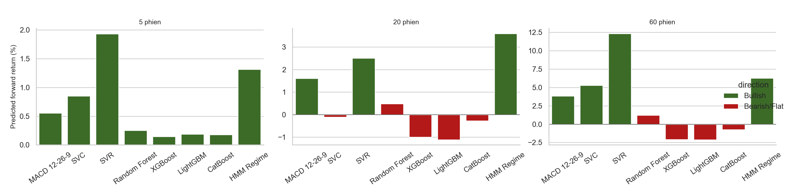

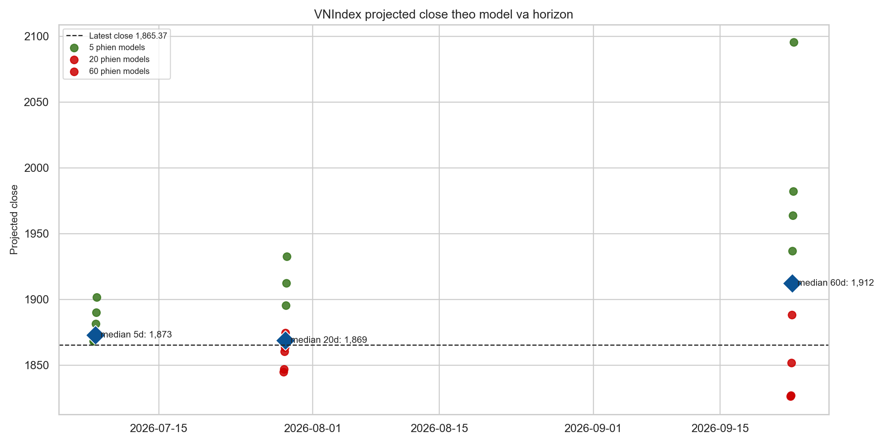

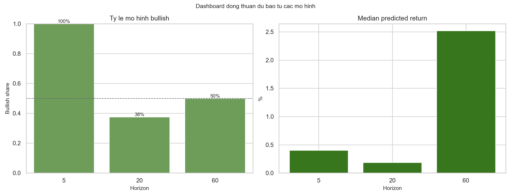

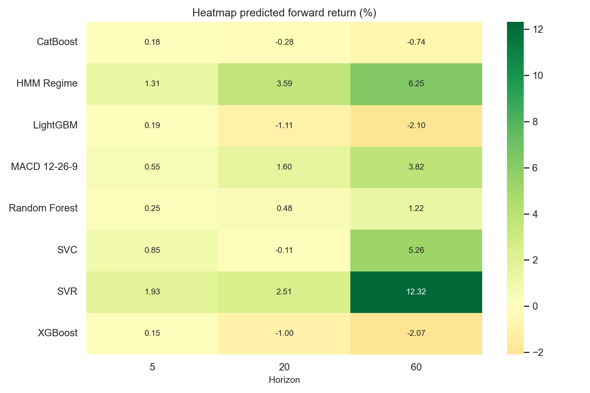

## Chỉ số học máy

Các chỉ số chính:

- `accuracy`: tỷ lệ dự báo đúng hướng tăng/giảm.
- `balanced_accuracy`: accuracy cân bằng giữa lớp tăng và giảm, hữu ích khi thị trường thiên lệch tăng.
- `precision`: khi mô hình báo tăng, tỷ lệ đúng là bao nhiêu.
- `recall`: trong các giai đoạn thực tế tăng, mô hình bắt được bao nhiêu.
- `f1`: cân bằng giữa precision và recall.
- `roc_auc`: khả năng xếp hạng xác suất tăng.
- `mae`, `rmse`, `r2`: sai số dự báo return.
- `spearman_ic`: Information Coefficient dạng rank correlation giữa return dự báo và return thực tế.

Ảnh heatmap:

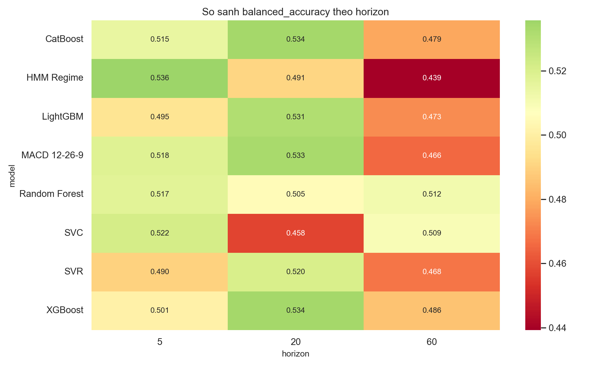

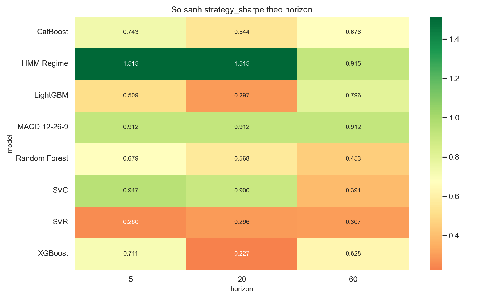

## Chỉ số tài chính

Các chỉ số chính:

- `strategy_total_return`: tổng lợi nhuận chiến lược long/flat trên test.
- `strategy_cagr`: tăng trưởng kép năm hóa.
- `strategy_ann_vol`: biến động năm hóa.
- `strategy_sharpe`: lợi nhuận điều chỉnh rủi ro.
- `strategy_sortino`: Sharpe chỉ phạt downside volatility.
- `strategy_max_drawdown`: mức sụt giảm lớn nhất.
- `strategy_calmar`: CAGR / Max Drawdown.
- `strategy_profit_factor`: tổng lãi / tổng lỗ.
- `strategy_exposure`: tỷ lệ thời gian ở trạng thái long.
- `strategy_turnover`: mức thay đổi vị thế bình quân.
- `strategy_beta_to_buy_hold`, `strategy_alpha_annualized`, `strategy_information_ratio`: so với buy-and-hold.

## Trực quan hóa theo mô hình và horizon

### Tổng quan giá, MACD và RSI

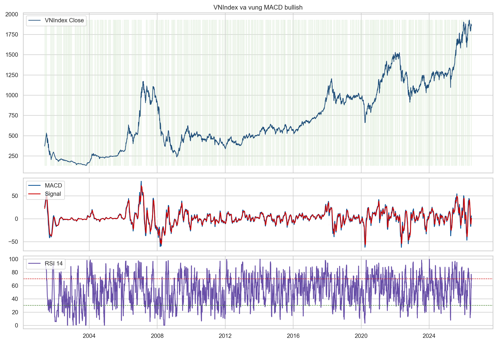

### Equity curves

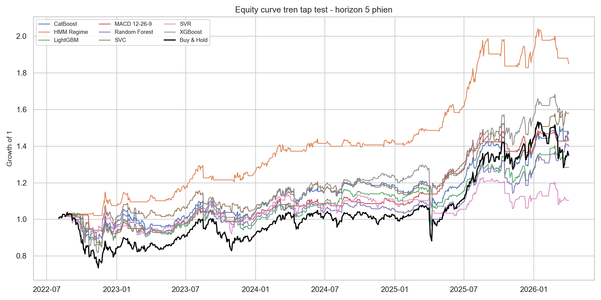

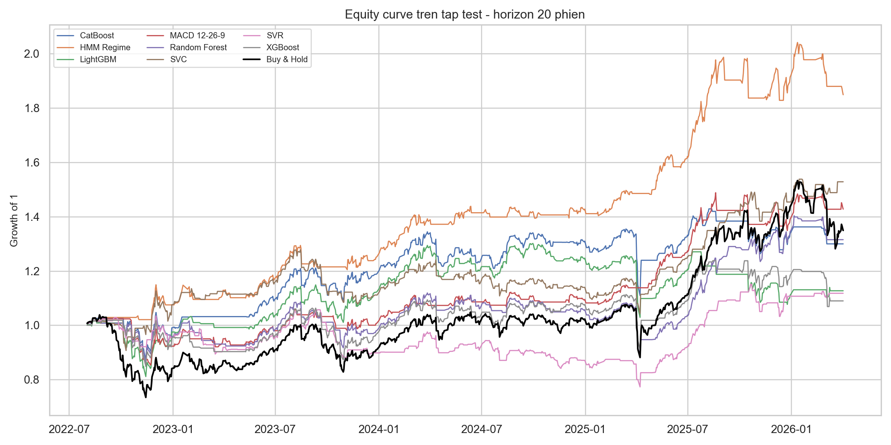

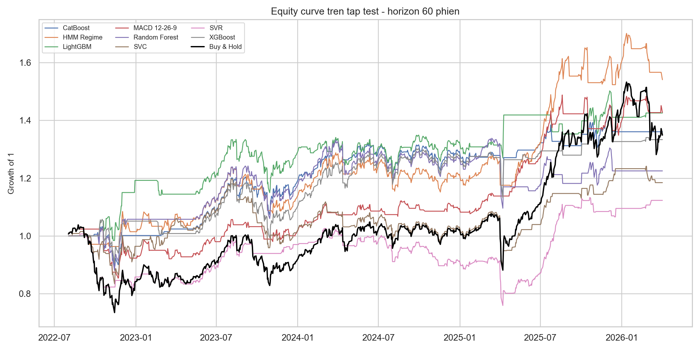

### Forecast panels

Mỗi panel hiển thị return tương lai thực tế, return dự báo và vùng xanh là giai đoạn mô hình chọn long.

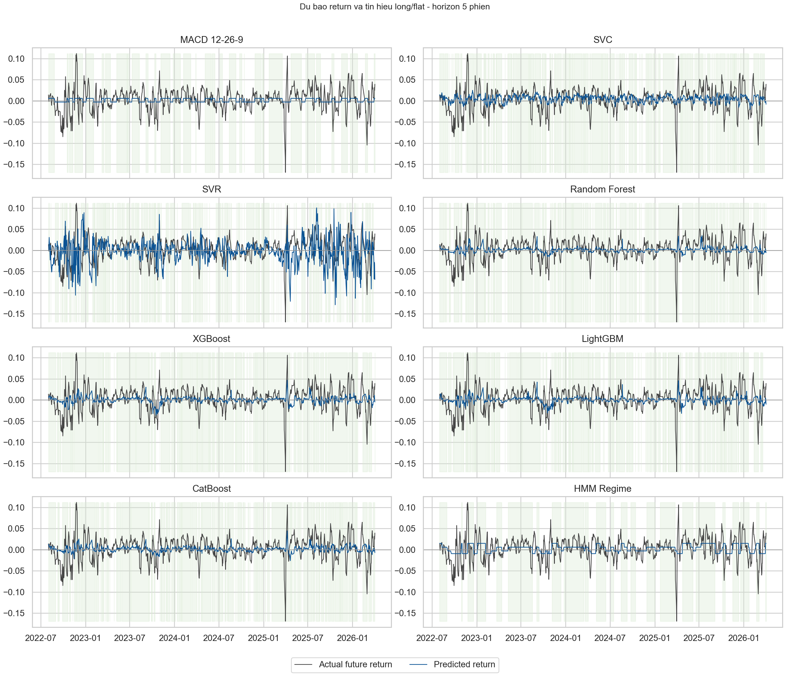

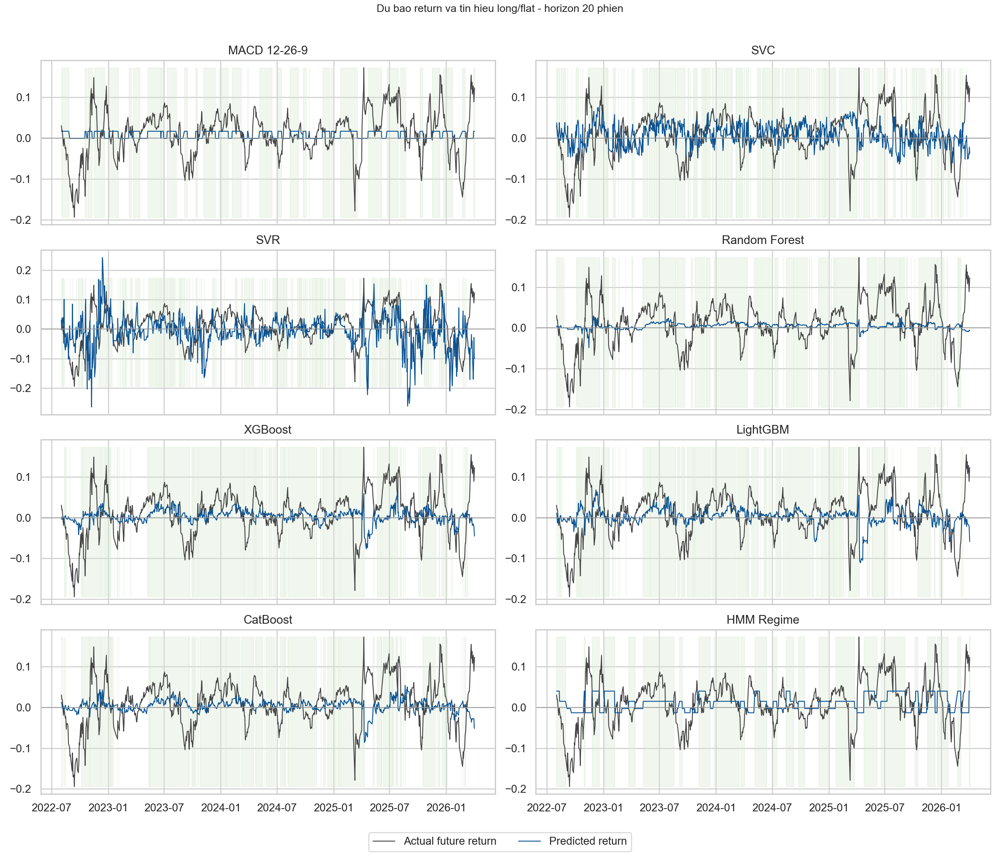

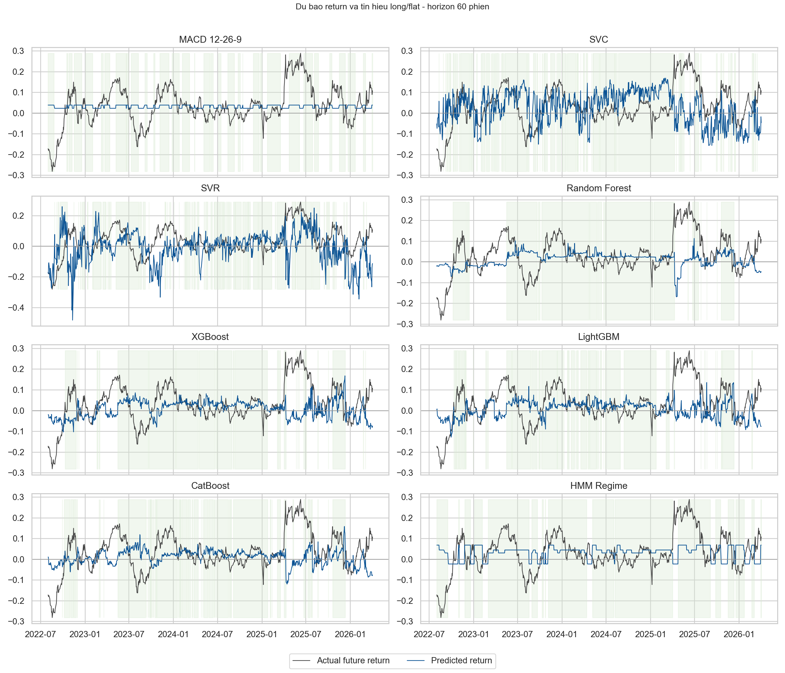

### Feature importance

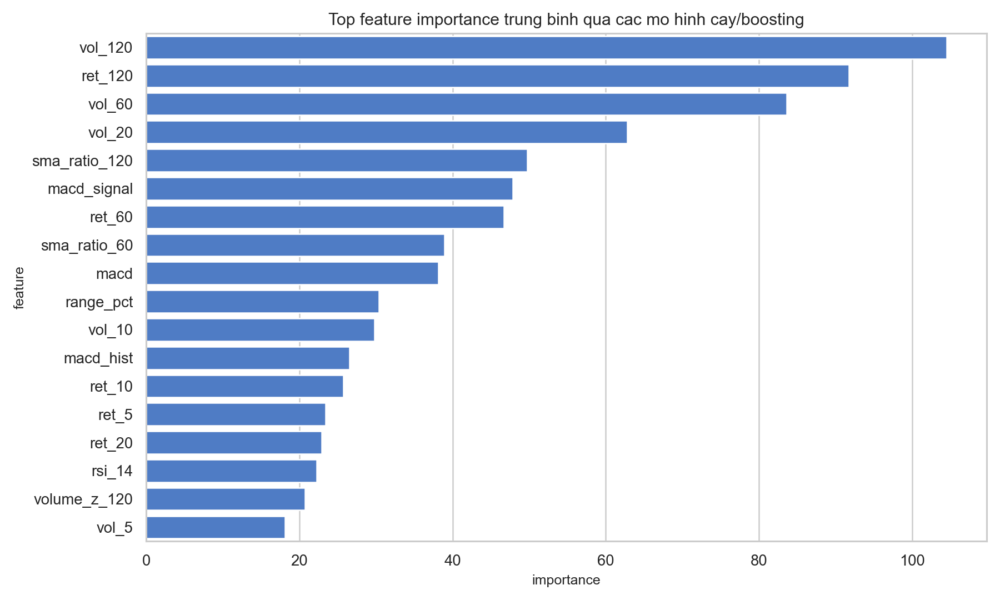

## Cách chạy lại

```bash
/home/namngyh/miniconda3/envs/eda/bin/python run_benchmark.py
```

Kết quả được ghi vào `outputs/`:

- `metrics_by_horizon.csv`: chỉ số học máy theo mô hình và horizon.
- `financial_metrics_by_horizon.csv`: chỉ số tài chính theo mô hình và horizon.
- `model_ranking.csv`: bảng xếp hạng tổng hợp.
- `predictions.csv`: dự báo từng ngày trên tập test.
- `future_forecasts.csv`: dự báo tương lai từ phiên mới nhất theo từng mô hình.
- `future_consensus.csv`: bảng đồng thuận tương lai theo horizon.
- `current_regime_forecast.csv`: regime hiện tại từ HMM theo từng horizon.
- `feature_importance.csv`: top feature importance của các mô hình cây/boosting.
- `regime_summary.csv`: trạng thái HMM và return kỳ vọng theo regime.
- `figures/*.png`: toàn bộ biểu đồ.

## Lưu ý diễn giải

Kết quả này là out-of-sample theo split thời gian, nhưng vẫn là nghiên cứu lịch sử. Nếu dùng giao dịch thật cần bổ sung transaction cost, slippage, walk-forward retraining, kiểm định ổn định theo từng giai đoạn thị trường và quản trị rủi ro vị thế.
