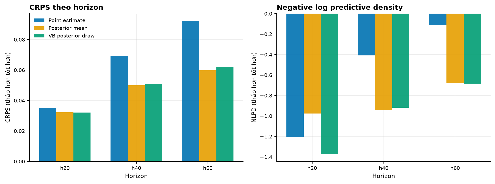
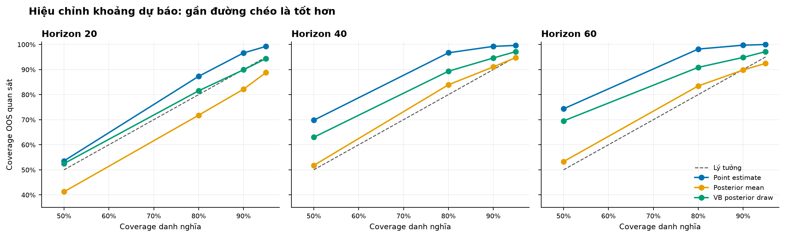
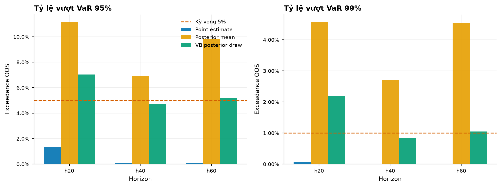
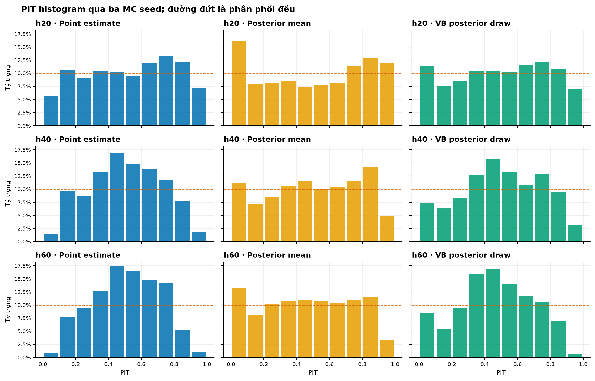
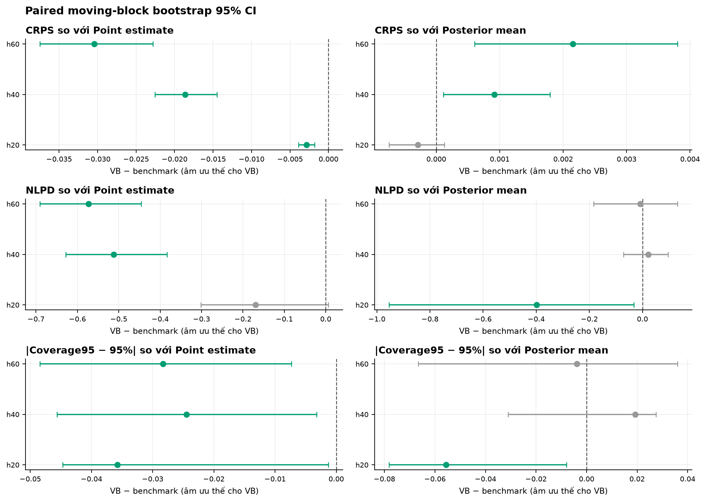
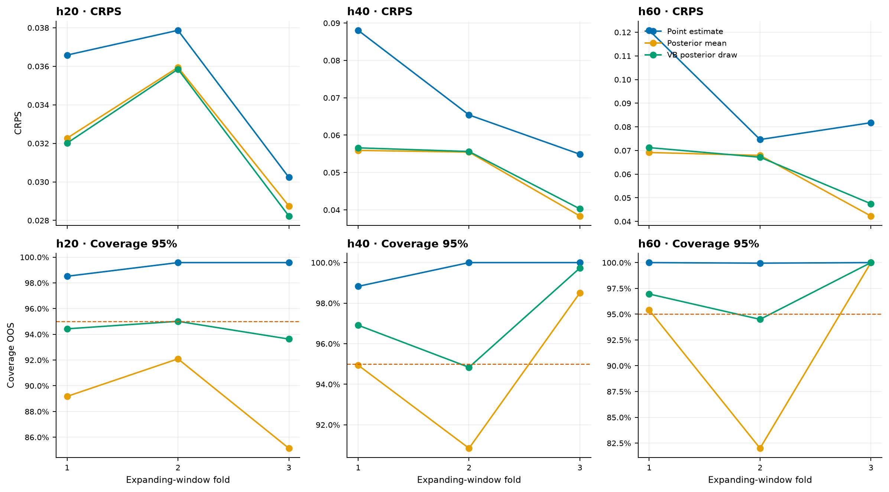
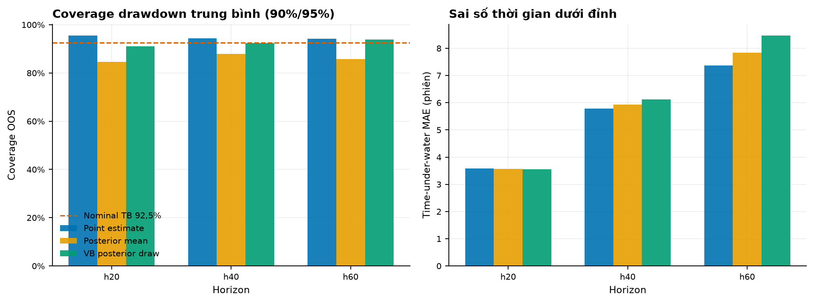
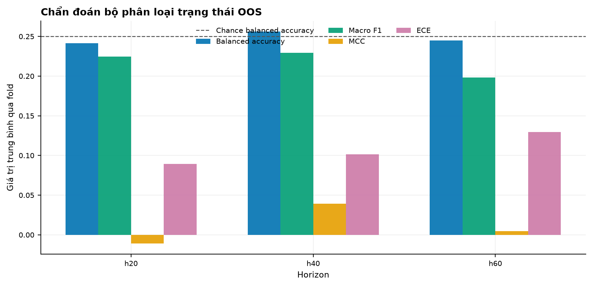
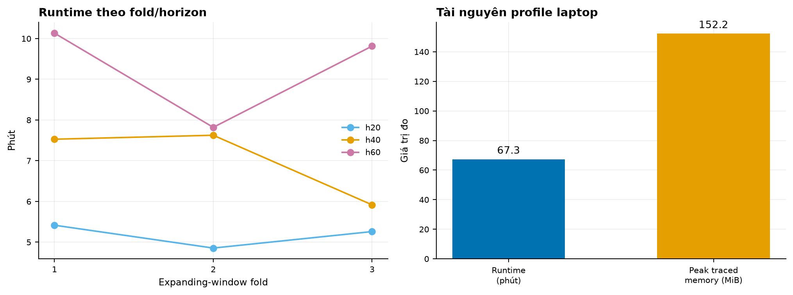

# Benchmark phân phối OOS trên profile laptop (v0.2.0 — lịch sử)

> **Lưu ý (2026-07-23):** tài liệu này mô tả run v0.2.0 với posterior PyMC
> mean-field 800 bước **chưa hội tụ** (9/9 fold not_converged). Run chính
> thức hiện tại là v0.3.0 (hierarchical prior, PyTorch full-rank ADVI
> multi-seed, cả 9 fold hội tụ, dữ liệu đến 2026-07-13) tại
> `outputs/distribution_oos_vb/report.md`. Khác biệt quan trọng: coverage
> "đẹp" của VB trong run này là sản phẩm phụ của posterior khuếch tán chưa
> hội tụ; run v0.3.0 cho kết quả trung thực hơn (proper scores tốt hơn
> nhưng under-coverage). Giữ tài liệu này để đối chiếu lịch sử.

Benchmark được chạy trên `data.csv` với dữ liệu từ 2000-07-28 đến 2026-07-01.
Đây là đánh giá nghiên cứu, không phải khuyến nghị đầu tư.

## Thiết kế và phạm vi

- Ba expanding-window folds với test blocks không chồng lấn trên 30% cuối mẫu.
- Train và validation được purge riêng cho từng horizon bằng điều kiện
  `target_end_date_h < boundary`.
- 5.634 horizon-origin OOS: 1.884 tại h20, 1.878 tại h40 và 1.872 tại h60.
- Ba mode: `point_estimate`, `posterior_mean_mc` và
  `variational_posterior`.
- Ba Monte Carlo seeds: 11, 42, 73.
- 300 paths/origin/seed, tương đương 900 paths qua ba seed.
- Mean-field ADVI, 800 steps và 900 posterior draws cho mỗi fold.
- Tổng cộng 50.706 origin-mode-seed rows.
- Hyperparameter EBM được khóa từ config; validation chỉ dùng cho temperature
  calibration. Test không được dùng để chọn prior, số bước ADVI, feature hoặc
  threshold.

Đây là benchmark OOS đầy đủ theo **profile laptop**, không phải cấu hình
`research.yaml` full-rank 30.000 bước. Mọi con số dưới đây được đọc trực tiếp
từ artifact trong `outputs/distribution_oos_laptop/`.

## Kết quả tổng hợp

| Horizon | Mode | CRPS | NLPD | Coverage 95% | VaR95 exceedance |
| ---: | --- | ---: | ---: | ---: | ---: |
| 20 | Point estimate | 0.03489 | -1.2060 | 99.22% | 1.36% |
| 20 | Posterior mean | 0.03232 | -0.9771 | 88.80% | 11.18% |
| 20 | VB posterior draw | 0.03203 | -1.3753 | 94.36% | 7.04% |
| 40 | Point estimate | 0.06944 | -0.4078 | 99.61% | 0.05% |
| 40 | Posterior mean | 0.04992 | -0.9422 | 94.76% | 6.92% |
| 40 | VB posterior draw | 0.05083 | -0.9201 | 97.16% | 4.72% |
| 60 | Point estimate | 0.09240 | -0.1107 | 99.98% | 0.05% |
| 60 | Posterior mean | 0.05980 | -0.6759 | 92.47% | 9.81% |
| 60 | VB posterior draw | 0.06195 | -0.6839 | 97.15% | 5.18% |

CRPS và NLPD càng thấp càng tốt. Coverage phải gần mức danh nghĩa, không phải
càng cao càng tốt.

## Proper scoring rules



**Nhận xét định lượng:** So với point MC, VB-MC giảm CRPS lần lượt khoảng
8,2%, 26,8% và 33,0% tại h20/h40/h60. So với posterior-mean MC, chênh lệch
CRPS của VB rất nhỏ tại h20, nhưng VB cao hơn 0,00092 tại h40 và 0,00215 tại
h60. NLPD của VB thấp nhất tại h20 và h60; tại h40 posterior mean thấp hơn VB
0,0220.

Proper scores cho thấy phần lớn lợi ích so với point MC có thể đến từ Bayesian
regularization. Việc tiếp tục truyền parameter uncertainty bằng posterior draw
không tự động cải thiện CRPS so với dùng posterior mean cố định.

## Calibration của khoảng dự báo



**Nhận xét định lượng:** Point MC over-cover rõ tại horizon dài: coverage 95%
là 99,61% ở h40 và 99,98% ở h60. Posterior mean under-cover tại h20
(88,80%) và h60 (92,47%). VB nằm giữa hai cực: 94,36%, 97,16% và 97,15%,
gần 95% hơn point MC ở cả ba horizon, nhưng vẫn over-cover khoảng 2,2 điểm
phần trăm tại h40/h60.

Đường calibration cho thấy sai lệch không chỉ xuất hiện ở đuôi 95%. Point MC
có dải quá rộng ở nhiều mức danh nghĩa khi horizon tăng, còn posterior mean
thường hẹp hơn. VB cải thiện sự cân bằng nhưng chưa nằm sát đường lý tưởng ở
mọi mức.

## Calibration VaR



**Nhận xét định lượng:** VaR95 của VB có exceedance 7,04%, 4,72% và 5,18%,
gần mức kỳ vọng 5% hơn hai mode còn lại ở h40/h60. Tại VaR99, VB đạt 2,19%,
0,85% và 1,05%; point MC gần như không có exceedance tại h40/h60, còn
posterior mean đạt 2,72% và 4,54%.

Kupiec VaR95 của VB không bác bỏ unconditional coverage tại h40/h60
(p-value trung bình 0,577 và 0,723), nhưng bác bỏ tại h20 (p-value 0,00036).
Quan trọng hơn, Christoffersen conditional-coverage p-value vẫn gần 0 cho mọi
mode/horizon: exceedance còn clustering theo thời gian.

## PIT histogram



**Nhận xét định lượng:** PIT mean của VB gần 0,5 tại h20/h40 nhưng giảm xuống
0,464 ở h60. PIT variance lý tưởng là khoảng 0,0833; VB đạt 0,0795, 0,0601
và 0,0523 tại h20/h40/h60. Sự co variance ở horizon dài phù hợp với dấu hiệu
phân phối dự báo còn quá rộng.

PIT không đều ở cả ba mode, vì vậy không mode nào có thể được xem là calibrated
hoàn toàn. Việc trung bình count qua ba MC seed làm giảm nhiễu mô phỏng nhưng
không loại bỏ sai lệch theo thời gian.

## Paired moving-block bootstrap



**Nhận xét định lượng:** Với 500 replicates và block length 20, CI 95% của
chênh lệch CRPS VB trừ point là [-0,00389; -0,00180] tại h20,
[-0,02257; -0,01448] tại h40 và [-0,03747; -0,02280] tại h60. So với
posterior mean, CI h20 chứa 0, còn CI h40 [0,00011; 0,00180] và h60
[0,00061; 0,00380] nằm hoàn toàn phía dương, tức VB xấu hơn theo CRPS.

Kết quả bootstrap chính:

- VB-MC có CRPS thấp hơn point MC tại cả ba horizon; CI 95% không chứa 0.
- Coverage-95 calibration error của VB-MC thấp hơn point MC tại cả ba horizon;
  CI không chứa 0.
- NLPD của VB tốt hơn point MC có bằng chứng ổn định tại h40/h60; CI h20 chứa
  0.
- So với posterior-mean MC, NLPD của VB tốt hơn rõ tại h20 nhưng không khác ổn
  định tại h40/h60.
- Lợi thế coverage/VaR của VB so với posterior mean không ổn định tại h40/h60;
  phần lớn CI chứa 0.

Vì vậy benchmark không cung cấp bằng chứng rằng parameter-uncertainty
propagation luôn tốt hơn Bayesian regularization bằng posterior mean.

## Độ ổn định theo fold



**Nhận xét định lượng:** Coverage 95% của VB tại h40 lần lượt là khoảng
96,91%, 94,84% và 99,73% qua ba fold; tại h60 là 96,96%, 94,50% và 100%.
VaR95 exceedance của VB tại h40 cũng dao động từ 4,15% đến 9,59% rồi 0,43%.

Độ biến thiên giữa các giai đoạn lớn hơn sai số giữa MC seeds. Do đó một con số
tổng hợp tốt không đủ để kết luận calibration ổn định qua các regime lịch sử.

## Drawdown và time under water



**Nhận xét định lượng:** Coverage drawdown của VB gần mức danh nghĩa hơn
posterior mean ở phần lớn horizon. Tuy nhiên time-under-water MAE của VB tăng
từ 3,55 phiên ở h20 lên 6,12 ở h40 và 8,46 ở h60; tại h60, sai số này cao hơn
posterior mean khoảng 0,63 phiên.

Đây là lý do không nên chỉ đánh giá phân phối terminal return. Chất lượng của
quỹ đạo drawdown và thời gian hồi phục có thể khác kết luận từ CRPS cuối kỳ.

## Phân loại trạng thái



**Nhận xét định lượng:** Balanced accuracy trung bình là 24,13%, 25,62% và
24,49% tại h20/h40/h60, quanh mức chance 25% cho bốn lớp. Macro-F1 chỉ đạt
0,225, 0,229 và 0,198; MCC lần lượt -0,011, 0,039 và 0,005. ECE tăng lên
0,130 tại h60.

Đây là điểm yếu quan trọng: cải thiện một số distribution scores không đồng
nghĩa bộ phân loại regime có năng lực phân biệt OOS mạnh. Phần scenario và
phần classification phải được đọc như hai thành phần liên quan nhưng không
thể thay thế metric cho nhau.

## Runtime và khả năng chạy laptop



**Nhận xét định lượng:** Runtime toàn benchmark và aggregation là 4.040,5 giây,
tức khoảng 67,3 phút. Peak Python-traced memory là 159.627.607 byte, khoảng
152 MiB. Fold chậm nhất mất khoảng 10,1 phút cho posterior h60; tổng artifact
cục bộ là khoảng 81,82 MiB với 127 files.

Laptop chạy được profile này nếu chạy nền và dùng checkpoint. RAM không phải
bottleneck chính trong lần đo; CPU, thermal throttling và tốc độ ADVI quan
trọng hơn. PyTensor ở môi trường pip đo benchmark không liên kết BLAS tối ưu.

Cả chín posterior fits đều hoàn tất nhưng ELBO moving-average status là
`not_converged` sau 800 bước. Vì vậy số liệu trên là kết quả hợp lệ của
**benchmark profile laptop đã định trước**, nhưng chưa đủ để xem như kết luận
cuối cho posterior research.

Profile `fullrank_advi`, 30.000 bước và 1.200 paths cho mỗi seed được ngoại suy
có thể tốn khoảng 7–12 giờ trên cùng máy. Đây là ước lượng từ runtime đã đo,
không phải runtime đã quan sát.

## Tái lập hình và dữ liệu báo cáo

Chạy benchmark có checkpoint:

```bash
python -m raemf_mc.cli benchmark-distribution \
  --data data.csv \
  --config configs/benchmark_distribution_laptop.yaml \
  --output-dir outputs/distribution_oos_laptop
```

Vẽ lại toàn bộ chín hình từ các CSV đã lưu mà không refit:

```bash
python -m raemf_mc.cli benchmark-plots \
  --run-dir outputs/distribution_oos_laptop
```

Repo lưu config snapshot, bảng tổng hợp, bootstrap, fold metadata và hình.
`origin_metrics.csv`, checkpoint từng seed và posterior binaries được giữ cục
bộ nhưng bỏ khỏi Git vì có thể tái lập và chiếm phần lớn dung lượng.

## Giới hạn kết luận

- Mean-field ADVI 800 bước chưa đạt convergence criterion.
- Chỉ có ba OOS folds; sai lệch theo giai đoạn còn lớn.
- PIT và Christoffersen test cho thấy calibration động chưa đạt.
- Classification regime gần chance dù một số distribution scores cải thiện.
- Dữ liệu chỉ gồm OHLCV VN-Index; không có biến vĩ mô, market breadth, tin tức
  hoặc thay đổi thành phần chỉ số.
- Benchmark không phải backtest chiến lược giao dịch và không bao gồm chi phí,
  tracking error hoặc khả năng giao dịch VN-Index trực tiếp.

Kết luận trung lập là: trên profile laptop này, VB-MC cải thiện rõ so với point
MC về CRPS và calibration tổng hợp, nhưng không vượt posterior-mean MC nhất
quán; convergence, PIT, clustering VaR và regime classification vẫn là các
giới hạn cần giải quyết.
