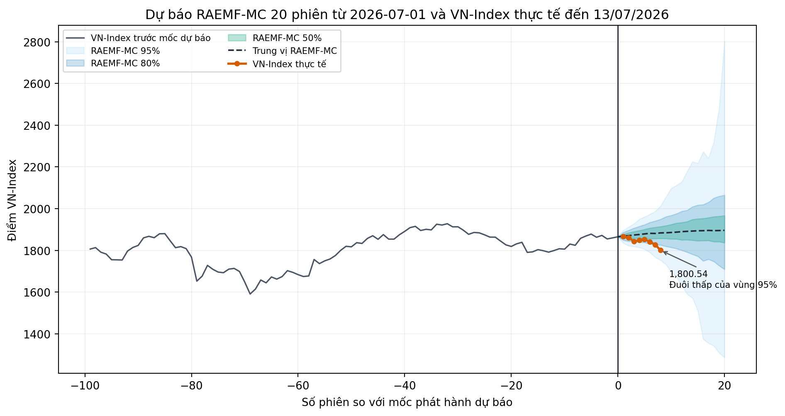
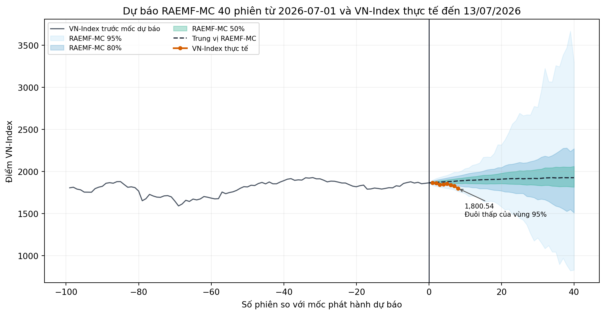
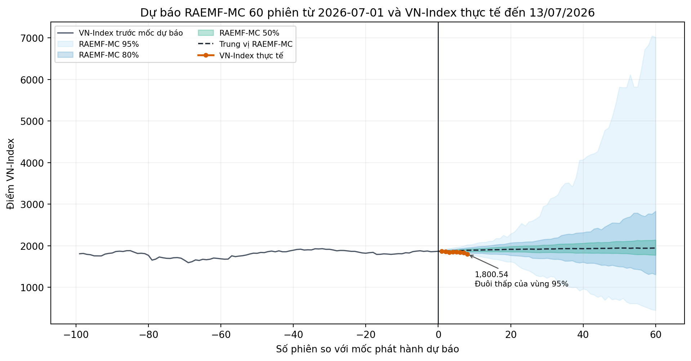
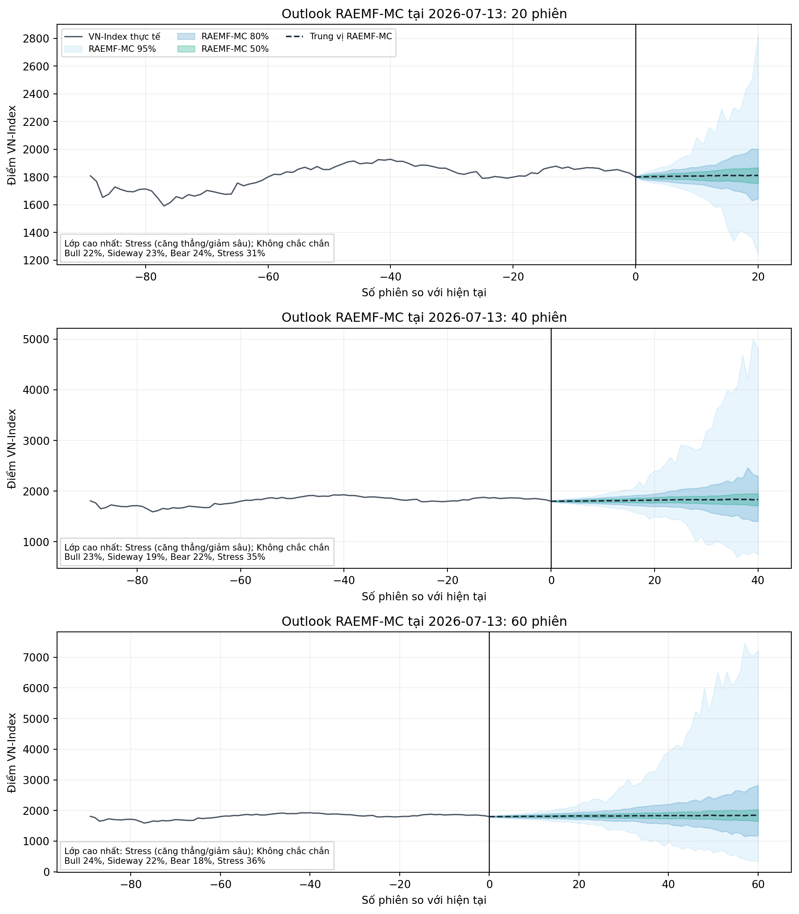

# Báo cáo RAEMF-MC cho người không chuyên

## Theo dõi dự báo RAEMF-MC đến dữ liệu hiện tại

Dự báo gốc được phát hành sau phiên **2026-07-01** tại VN-Index **1,865.37**. File mới có dữ liệu đến **2026-07-13**, tương đương **8 phiên mới**; VN-Index hiện ở **1,800.54**, thay đổi **-3.48%** so với mức neo dự báo.

> **Trạng thái đánh giá:** horizon ngắn nhất là 20 phiên nên hiện chưa có horizon nào đủ ngày để kết luận dự báo lớp đúng hay sai. Các số dưới đây là theo dõi giữa kỳ, không phải điểm accuracy mới. Dữ liệu mới sửa mức đóng cửa 01/07 thêm +0.10% so với file dùng khi phát hành dự báo. Đánh giá vẫn neo tại mức cũ để không sửa dự báo sau khi đã biết dữ liệu mới. Loader đã loại 1 bản ghi trùng hoàn toàn trước khi tính toán.

### Dự báo ngày 01/07 đang diễn biến thế nào?

| Horizon | Đã quan sát | Còn lại | Dự báo 01/07 | Trạng thái chấm | Lợi suất tạm thời | Vị trí trong dải |
| --- | ---: | ---: | --- | --- | ---: | --- |
| 20 phiên | 8 | 12 | Sideway (đi ngang) | Đang theo dõi, chưa đủ phiên | -3.48% | Đuôi thấp của vùng 95% |
| 40 phiên | 8 | 32 | Sideway (đi ngang) | Đang theo dõi, chưa đủ phiên | -3.48% | Đuôi thấp của vùng 95% |
| 60 phiên | 8 | 52 | Sideway (đi ngang) | Đang theo dõi, chưa đủ phiên | -3.48% | Đuôi thấp của vùng 95% |

Ba hình chỉ trả lời một câu hỏi giữa kỳ: đường VN-Index thực tế đang nằm ở đâu trong phân phối kịch bản RAEMF-MC đã tạo trước đó. Nằm trong dải không đồng nghĩa dự báo hướng đã đúng; kết luận lớp chỉ có thể chấm khi đủ 20, 40 hoặc 60 phiên.

### RAEMF-MC báo cáo gì tại 2026-07-13?

**Xác suất trạng thái**

| Horizon | Bull | Sideway | Bear | Stress | Lớp xác suất cao nhất | Độ tin cậy |
| --- | ---: | ---: | ---: | ---: | --- | --- |
| 20 phiên | 22.0% | 22.6% | 23.9% | 31.5% | Stress (căng thẳng/giảm sâu) | Không chắc chắn |
| 40 phiên | 23.3% | 19.1% | 22.5% | 35.2% | Stress (căng thẳng/giảm sâu) | Không chắc chắn |
| 60 phiên | 23.7% | 22.3% | 18.2% | 35.8% | Stress (căng thẳng/giảm sâu) | Không chắc chắn |

**Phân phối mức điểm và rủi ro**

| Horizon | Trung vị cuối kỳ | Dải 90% cuối kỳ | P(lợi suất dương) | P(drawdown >10%) | VaR 95% |
| --- | ---: | --- | ---: | ---: | ---: |
| 20 phiên | 1,810 | 1,433 - 2,405 | 55.3% | 21.4% | 22.8% |
| 40 phiên | 1,836 | 1,051 - 3,515 | 59.2% | 43.3% | 53.9% |
| 60 phiên | 1,842 | 697 - 4,604 | 57.4% | 57.9% | 94.9% |

Tại cả ba horizon, `Stress` là lớp có xác suất cao nhất nhưng chỉ ở mức 31.5%-35.8%, chưa phải xác suất đa số, và độ tin cậy đều là `Uncertain`. Trong khi đó trung vị Monte Carlo tương ứng là +0.5%, +1.9% và +2.3%. Bộ phân loại trạng thái và bộ mô phỏng đường giá là hai thành phần khác nhau; sự lệch này phải được đọc là dấu hiệu bất định cao, không phải dự báo chắc chắn rằng thị trường sẽ Stress hoặc sẽ tăng.

RAEMF-MC không dự đoán một điểm VN-Index chính xác. Mô hình báo cáo xác suất của bốn trạng thái tăng, đi ngang, giảm và căng thẳng; dải mức chỉ số có điều kiện; xác suất lợi suất dương/âm; cùng rủi ro đuôi và drawdown theo từng horizon.

### Cách đọc cho người không chuyên

- `Bull`, `Sideway`, `Bear`, `Stress` là bốn kịch bản thị trường, không phải lệnh mua hoặc bán.
- Cột xác suất cho biết mô hình đang phân bổ niềm tin như thế nào; các xác suất gần nhau nghĩa là mô hình chưa chắc chắn.
- Dải 50%, 80% và 95% càng rộng thì bất định càng lớn. Đây là kịch bản mô phỏng, không phải cam kết VN-Index sẽ nằm trong dải.
- Chỉ chấm đúng/sai cho horizon khi đủ số phiên tương ứng. Theo dõi vài phiên đầu chỉ cho biết quỹ đạo đang ở đâu, chưa đo được năng lực dự báo cuối kỳ.

### Hạn chế

- Mô hình chỉ dùng lịch sử OHLCV VN-Index; chưa có lãi suất, tỷ giá, vĩ mô, market breadth, tin tức hay thay đổi thành phần chỉ số.
- Deployment refit dùng tham số đã khóa từ nghiên cứu trước, nhưng HMM, EGARCH và EBM vẫn có thể bị regime drift khi thị trường đổi cấu trúc.
- Monte Carlo phụ thuộc giả định HMM, EGARCH Student-t và cách tái trọng số bằng xác suất EBM; đuôi phân phối có thể rất rộng.
- VN-Index không phải tài sản có thể giao dịch trực tiếp theo giả định đơn giản; phần này không phải backtest chiến lược và không phải lời khuyên đầu tư.
