# Báo cáo học thuật RAEMF-MC

## 1. Tóm tắt

RAEMF-MC kết hợp đặc trưng kỹ thuật nhân quả, Filtered HMM, EGARCH Student-t và EBM đa lớp cho VN-Index ở ba chân trời 20, 40 và 60 phiên. Báo cáo phân biệt rõ evaluation model và deployment model; metric và backtest chính chỉ sử dụng final test ngoài mẫu.

Metric này được đọc theo hướng thấp hơn là tốt hơn. 20 phiên: tốt nhất là MACD probabilistic (0.7274); RAEMF-MC đạt 0.7287, chênh +0.0013; 40 phiên: tốt nhất là MACD probabilistic (0.7172); RAEMF-MC đạt 0.7261, chênh +0.0088; 60 phiên: tốt nhất là MACD probabilistic (0.7082); RAEMF-MC đạt 0.7303, chênh +0.0221. So sánh điểm không tự nó chứng minh ưu thế ổn định theo thời gian.

## 2. Câu hỏi nghiên cứu

Nghiên cứu kiểm tra liệu thông tin chế độ thị trường và rủi ro có cải thiện chất lượng xác suất đa chân trời, mức độ hiệu chỉnh và kiểm soát drawdown so với các classifier head, mô hình technical-only và MACD hay không.

## 3. Dữ liệu

Dữ liệu là chuỗi OHLCV VN-Index trong `data.csv`. Validation bắt đầu `2017-07-05` và final test bắt đầu `2021-04-02`. Checksum, số dòng và phạm vi ngày được lưu cùng run.

## 4. Tiền xử lý

Bộ đọc dữ liệu xử lý các số bị tách bởi dấu phân cách hàng nghìn. Đặc trưng thiếu được forward-fill khi phù hợp hoặc thay bằng median fit trên train; pipeline không dùng `bfill()` xuyên toàn chuỗi.

## 5. Thiết kế nhãn

Nhãn Bull, Sideway, Bear và Stress dựa trên lợi suất log tương lai chuẩn hóa bởi volatility nhân quả và maximum adverse excursion. Mỗi nhãn lưu `target_end_date_h` để purge mọi quan sát có cửa sổ mục tiêu chạm boundary tiếp theo.

## 6. Đặc trưng

Đặc trưng bao gồm return, trend, volatility, OHLC shape, volume và calendar. Registry ghi nguồn và cửa sổ; selection chỉ dùng train của từng horizon.

## 7. Filtered HMM

| raw_state | mean_return | std_return | downside_rms | negative_probability | frequency | average_duration | aligned_state | economic_label | economic_interpretation |
| --- | --- | --- | --- | --- | --- | --- | --- | --- | --- |
| 3 | 0.0065 | 0.0196 | 0.0110 | 0.3459 | 0.1598 | 24.4231 | 0 | Expansion | Lợi suất tương đối mạnh với rủi ro không cực đại |
| 1 | 0.0002 | 0.0113 | 0.0080 | 0.4814 | 0.3815 | 31.7917 | 1 | Range | Trạng thái trung gian sau khi loại các cực trị tăng, giảm và biến động |
| 0 | 0.0000 | 0.0066 | 0.0046 | 0.5087 | 0.2850 | 49.4783 | 2 | Contraction | Lợi suất trung bình yếu nhất trong các trạng thái không hỗn loạn |
| 2 | -0.0036 | 0.0252 | 0.0202 | 0.5573 | 0.1737 | 27.8000 | 3 | Turbulence | Điểm tổng hợp biến động, downside và xác suất âm cao nhất |

Căn chỉnh train-only cho thấy Expansion: mean=0.651%, sigma=1.956%, tần suất=16.0%, Range: mean=0.021%, sigma=1.127%, tần suất=38.2%, Contraction: mean=0.000%, sigma=0.658%, tần suất=28.5%, Turbulence: mean=-0.360%, sigma=2.518%, tần suất=17.4%. Tên state là diễn giải tương đối theo quy tắc định lượng, không đồng nhất trực tiếp với nhãn dự báo.

## 8. EGARCH Student-t

EGARCH(1,1,1) Student-t được fit trên train evaluation và lọc đệ quy về phía trước. Deployment refit module rủi ro bằng lịch sử có sẵn tại ngày dự báo; bậc tự do ước lượng được chuyển trực tiếp sang Monte Carlo.

## 9. EBM đa chân trời

Mỗi horizon có một EBM đa lớp riêng. Global importance, shape plot và local counterfactual contribution được lưu để kiểm tra cơ chế dự báo mà không diễn giải tương quan thành nhân quả.

## 10. Calibration

| horizon | model | temperature | used | validation_log_loss_optimizer | brier_before | brier_after | log_loss_before | log_loss_after | ece_before | ece_after |
| --- | --- | --- | --- | --- | --- | --- | --- | --- | --- | --- |
| 20 | RAEMF-MC | 2.0000 | True | 1.3744 | 0.7529 | 0.7447 | 1.3864 | 1.3744 | 0.0666 | 0.0142 |
| 20 | XGBoost (full features) | 2.4000 | True | 1.3788 | 0.7828 | 0.7472 | 1.4390 | 1.3788 | 0.1539 | 0.0489 |
| 20 | Random Forest (full features) | 1.6000 | True | 1.3691 | 0.7465 | 0.7420 | 1.3754 | 1.3691 | 0.0615 | 0.0241 |
| 40 | RAEMF-MC | 1.3000 | True | 1.3410 | 0.7279 | 0.7263 | 1.3450 | 1.3410 | 0.0406 | 0.0255 |
| 40 | XGBoost (full features) | 2.1000 | True | 1.3313 | 0.7558 | 0.7238 | 1.3850 | 1.3313 | 0.1497 | 0.0319 |
| 40 | Random Forest (full features) | 1.6000 | True | 1.3370 | 0.7248 | 0.7232 | 1.3498 | 1.3370 | 0.0592 | 0.0371 |
| 60 | RAEMF-MC | 1.1000 | True | 1.3149 | 0.7117 | 0.7118 | 1.3149 | 1.3149 | 0.0313 | 0.0434 |
| 60 | XGBoost (full features) | 2.4000 | True | 1.3479 | 0.8306 | 0.7359 | 1.4984 | 1.3479 | 0.2578 | 0.0907 |
| 60 | Random Forest (full features) | 2.1000 | True | 1.3346 | 0.7496 | 0.7258 | 1.3859 | 1.3346 | 0.1405 | 0.0576 |

Trên validation 20 phiên, temperature scaling làm Brier thay đổi từ 0.7529 xuống 0.7447, log loss từ 1.3864 xuống 1.3744, và ECE từ 0.0666 xuống 0.0142. Reliability trên test vẫn có thể lệch do drift và số mẫu trong các bin không đồng đều.

## 11. Monte Carlo

Trạng thái được lấy theo ma trận chuyển HMM; drift và scale rủi ro phụ thuộc state; log variance cập nhật bằng phương trình EGARCH; cú sốc dùng Student-t với bậc tự do đã fit. Xác suất EBM tái trọng số state cuối kỳ với clipping, tempering và ESS safeguard.

## 12. Validation

Tuning dùng purged expanding-window folds nằm hoàn toàn trước final test. Evaluation model fit trên train, học temperature trên validation và chỉ sau đó chấm final test. Backtest áp dụng signal cuối ngày t cho position ở t+1.

## 13. Benchmark

Classifier-head benchmark cho EBM, XGBoost và Random Forest dùng cùng bộ đặc trưng mở rộng. Architecture benchmark tách technical-only khỏi technical + HMM/EGARCH. MACD deterministic chỉ dùng cho metric lớp/backtest; Brier và log loss dùng MACD probabilistic học mapping trên validation.

## 14. Tuning

| trial | horizon | objective | status | runtime_seconds | learning_rate | max_rounds | interactions | max_bins | min_samples_leaf | outer_bags |
| --- | --- | --- | --- | --- | --- | --- | --- | --- | --- | --- |
| 8 | 20 | 0.6976 | complete | 4.3028 | 0.0300 | 30 | 0 | 96 | 5 | 2 |
| 12 | 20 | 0.6992 | complete | 4.9410 | 0.0150 | 50 | 0 | 96 | 10 | 2 |
| 3 | 20 | 0.7005 | complete | 4.1767 | 0.0400 | 30 | 0 | 64 | 10 | 2 |
| 10 | 20 | 0.7016 | complete | 4.7733 | 0.0150 | 50 | 0 | 64 | 2 | 2 |
| 7 | 20 | 0.7018 | complete | 4.1901 | 0.0150 | 30 | 0 | 64 | 10 | 2 |
| 12 | 40 | 0.6952 | complete | 4.8943 | 0.0150 | 50 | 0 | 96 | 10 | 2 |
| 1 | 40 | 0.6953 | complete | 4.2655 | 0.0250 | 30 | 0 | 96 | 10 | 2 |
| 13 | 40 | 0.6963 | complete | 4.0929 | 0.0250 | 30 | 0 | 64 | 2 | 2 |
| 6 | 40 | 0.7020 | complete | 4.2740 | 0.0250 | 30 | 0 | 64 | 5 | 2 |
| 14 | 40 | 0.7022 | complete | 4.2820 | 0.0250 | 30 | 0 | 96 | 5 | 2 |
| 6 | 60 | 0.7169 | complete | 4.2572 | 0.0150 | 30 | 0 | 96 | 10 | 2 |
| 8 | 60 | 0.7222 | complete | 4.0664 | 0.0300 | 30 | 0 | 64 | 5 | 2 |
| 9 | 60 | 0.7268 | complete | 4.0966 | 0.0250 | 30 | 0 | 64 | 5 | 2 |
| 1 | 60 | 0.7291 | complete | 4.1875 | 0.0250 | 30 | 0 | 96 | 10 | 2 |
| 0 | 60 | 0.7326 | complete | 4.6924 | 0.0400 | 50 | 0 | 64 | 10 | 2 |

Random search tối ưu composite loss trên các fold purged, không nhìn final test. Số trial và fold được khóa trong config; HMM và EGARCH evaluation được cache ngoài vòng trial.

## 15. Ablation

| configuration | horizon | macro_f1 | balanced_accuracy | mcc | brier | log_loss | ece | recall_bull | recall_sideway | recall_bear | recall_stress |
| --- | --- | --- | --- | --- | --- | --- | --- | --- | --- | --- | --- |
| technical features only | 20 | 0.3036 | 0.3115 | 0.1098 | 0.7179 | 1.3260 | 0.0485 | 0.3369 | 0.6208 | 0.0593 | 0.2289 |
| technical + HMM | 20 | 0.3007 | 0.3069 | 0.1062 | 0.7191 | 1.3286 | 0.0365 | 0.3369 | 0.6075 | 0.0593 | 0.2239 |
| technical + EGARCH | 20 | 0.2988 | 0.3061 | 0.1054 | 0.7182 | 1.3261 | 0.0455 | 0.3603 | 0.6009 | 0.0444 | 0.2189 |
| technical + HMM + EGARCH | 20 | 0.3057 | 0.3118 | 0.1093 | 0.7186 | 1.3276 | 0.0369 | 0.3390 | 0.6075 | 0.0667 | 0.2338 |
| technical + HMM + EGARCH + calibration | 20 | 0.3057 | 0.3118 | 0.1093 | 0.7287 | 1.3451 | 0.0894 | 0.3390 | 0.6075 | 0.0667 | 0.2338 |
| full RAEMF-MC + Monte Carlo | 20 | 0.3057 | 0.3118 | 0.1093 | 0.7287 | 1.3451 | 0.0894 | 0.3390 | 0.6075 | 0.0667 | 0.2338 |
| XGBoost technical only | 20 | 0.3110 | 0.3172 | 0.0991 | 0.7221 | 1.3329 | 0.0390 | 0.3731 | 0.5055 | 0.0667 | 0.3234 |
| Random Forest technical only | 20 | 0.3279 | 0.3436 | 0.1556 | 0.7202 | 1.3291 | 0.0894 | 0.3134 | 0.6608 | 0.0519 | 0.3483 |
| MACD probabilistic | 20 | 0.1990 | 0.2544 | 0.0133 | 0.7274 | 1.3557 | 0.0657 | 0.7846 | 0.2328 | 0.0000 | 0.0000 |
| technical features only | 40 | 0.2855 | 0.2920 | 0.1142 | 0.7271 | 1.3429 | 0.0661 | 0.3928 | 0.6226 | 0.0105 | 0.1422 |
| technical + HMM | 40 | 0.2965 | 0.3027 | 0.1275 | 0.7265 | 1.3404 | 0.0739 | 0.3843 | 0.6421 | 0.0421 | 0.1422 |
| technical + EGARCH | 40 | 0.2903 | 0.3001 | 0.1283 | 0.7203 | 1.3295 | 0.0857 | 0.3992 | 0.6573 | 0.0105 | 0.1333 |
| technical + HMM + EGARCH | 40 | 0.3006 | 0.3058 | 0.1237 | 0.7257 | 1.3382 | 0.0705 | 0.3907 | 0.6226 | 0.0632 | 0.1467 |
| technical + HMM + EGARCH + calibration | 40 | 0.3006 | 0.3058 | 0.1237 | 0.7261 | 1.3388 | 0.0950 | 0.3907 | 0.6226 | 0.0632 | 0.1467 |
| full RAEMF-MC + Monte Carlo | 40 | 0.3006 | 0.3058 | 0.1237 | 0.7261 | 1.3388 | 0.0950 | 0.3907 | 0.6226 | 0.0632 | 0.1467 |
| XGBoost technical only | 40 | 0.3057 | 0.3093 | 0.0975 | 0.7348 | 1.3485 | 0.0654 | 0.4650 | 0.3731 | 0.0526 | 0.3467 |
| Random Forest technical only | 40 | 0.2850 | 0.2911 | 0.0915 | 0.7264 | 1.3424 | 0.0557 | 0.3758 | 0.5618 | 0.1158 | 0.1111 |
| MACD probabilistic | 40 | 0.1367 | 0.2500 | 0.0000 | 0.7172 | 1.3280 | 0.0940 | 1.0000 | 0.0000 | 0.0000 | 0.0000 |
| technical features only | 60 | 0.2782 | 0.2816 | 0.0577 | 0.7269 | 1.3371 | 0.0690 | 0.3476 | 0.5738 | 0.0143 | 0.1905 |
| technical + HMM | 60 | 0.2854 | 0.2890 | 0.0710 | 0.7285 | 1.3390 | 0.0839 | 0.3305 | 0.6195 | 0.0286 | 0.1775 |
| technical + EGARCH | 60 | 0.2810 | 0.2851 | 0.0676 | 0.7227 | 1.3278 | 0.0797 | 0.3605 | 0.5967 | 0.0143 | 0.1688 |
| technical + HMM + EGARCH | 60 | 0.2797 | 0.2815 | 0.0557 | 0.7312 | 1.3423 | 0.0690 | 0.3283 | 0.5655 | 0.0286 | 0.2035 |
| technical + HMM + EGARCH + calibration | 60 | 0.2797 | 0.2815 | 0.0557 | 0.7303 | 1.3417 | 0.0681 | 0.3283 | 0.5655 | 0.0286 | 0.2035 |
| full RAEMF-MC + Monte Carlo | 60 | 0.2797 | 0.2815 | 0.0557 | 0.7303 | 1.3417 | 0.0681 | 0.3283 | 0.5655 | 0.0286 | 0.2035 |
| XGBoost technical only | 60 | 0.2472 | 0.2572 | 0.0023 | 0.8049 | 1.4544 | 0.1766 | 0.2961 | 0.2890 | 0.0714 | 0.3723 |
| Random Forest technical only | 60 | 0.2167 | 0.2172 | -0.0290 | 0.7502 | 1.3742 | 0.0841 | 0.2597 | 0.4345 | 0.0143 | 0.1602 |
| MACD probabilistic | 60 | 0.1359 | 0.2500 | 0.0000 | 0.7082 | 1.2861 | 0.0926 | 1.0000 | 0.0000 | 0.0000 | 0.0000 |

20 phiên: technical features only có Brier thấp nhất (0.7179); 40 phiên: MACD probabilistic có Brier thấp nhất (0.7172); 60 phiên: MACD probabilistic có Brier thấp nhất (0.7082). Tác động của HMM, EGARCH và calibration không được giả định là nhất quán nếu thứ hạng đổi giữa các chân trời.

## 16. Kết quả phân loại

| model | horizon | n_obs | accuracy | balanced_accuracy | macro_precision | macro_recall | macro_f1 | weighted_f1 | mcc | brier | log_loss | ece | recall_bull | recall_sideway | recall_bear | recall_stress |
| --- | --- | --- | --- | --- | --- | --- | --- | --- | --- | --- | --- | --- | --- | --- | --- | --- |
| RAEMF-MC | 20 | 1256 | 0.3893 | 0.3118 | 0.3116 | 0.3118 | 0.3057 | 0.3748 | 0.1093 | 0.7287 | 1.3451 | 0.0894 | 0.3390 | 0.6075 | 0.0667 | 0.2338 |
| XGBoost (full features) | 20 | 1256 | 0.3989 | 0.3430 | 0.3419 | 0.3430 | 0.3394 | 0.3920 | 0.1278 | 0.7283 | 1.3445 | 0.0931 | 0.3902 | 0.5100 | 0.1037 | 0.3682 |
| Random Forest (full features) | 20 | 1256 | 0.4395 | 0.3639 | 0.3636 | 0.3639 | 0.3514 | 0.4199 | 0.1876 | 0.7278 | 1.3434 | 0.1445 | 0.3539 | 0.6741 | 0.0593 | 0.3682 |
| MACD probabilistic | 20 | 1256 | 0.3766 | 0.2544 | 0.1805 | 0.2544 | 0.1990 | 0.2934 | 0.0133 | 0.7274 | 1.3557 | 0.0657 | 0.7846 | 0.2328 | 0.0000 | 0.0000 |
| RAEMF-MC | 40 | 1252 | 0.4073 | 0.3058 | 0.3063 | 0.3058 | 0.3006 | 0.3943 | 0.1237 | 0.7261 | 1.3388 | 0.0950 | 0.3907 | 0.6226 | 0.0632 | 0.1467 |
| XGBoost (full features) | 40 | 1252 | 0.3371 | 0.2722 | 0.2751 | 0.2722 | 0.2696 | 0.3453 | 0.0594 | 0.7288 | 1.3403 | 0.0359 | 0.4034 | 0.3471 | 0.0316 | 0.3067 |
| Random Forest (full features) | 40 | 1252 | 0.3562 | 0.2705 | 0.2638 | 0.2705 | 0.2630 | 0.3484 | 0.0609 | 0.7335 | 1.3536 | 0.0669 | 0.3482 | 0.5531 | 0.1053 | 0.0756 |
| MACD probabilistic | 40 | 1252 | 0.3762 | 0.2500 | 0.0940 | 0.2500 | 0.1367 | 0.2057 | 0.0000 | 0.7172 | 1.3280 | 0.0940 | 1.0000 | 0.0000 | 0.0000 | 0.0000 |
| RAEMF-MC | 60 | 1248 | 0.3798 | 0.2815 | 0.2901 | 0.2815 | 0.2797 | 0.3661 | 0.0557 | 0.7303 | 1.3417 | 0.0681 | 0.3283 | 0.5655 | 0.0286 | 0.2035 |
| XGBoost (full features) | 60 | 1248 | 0.2933 | 0.2470 | 0.2513 | 0.2470 | 0.2363 | 0.3018 | 0.0064 | 0.7434 | 1.3625 | 0.0432 | 0.3004 | 0.2869 | 0.0286 | 0.3723 |
| Random Forest (full features) | 60 | 1248 | 0.2957 | 0.2195 | 0.2299 | 0.2195 | 0.2218 | 0.3023 | -0.0183 | 0.7416 | 1.3624 | 0.0181 | 0.2725 | 0.4179 | 0.0143 | 0.1732 |
| MACD probabilistic | 60 | 1248 | 0.3734 | 0.2500 | 0.0933 | 0.2500 | 0.1359 | 0.2030 | 0.0000 | 0.7082 | 1.2861 | 0.0926 | 1.0000 | 0.0000 | 0.0000 | 0.0000 |

Metric này được đọc theo hướng cao hơn là tốt hơn. 20 phiên: tốt nhất là Random Forest (full features) (0.3514); RAEMF-MC đạt 0.3057, chênh -0.0457; 40 phiên: tốt nhất là RAEMF-MC (0.3006); RAEMF-MC đạt 0.3006, chênh +0.0000; 60 phiên: tốt nhất là RAEMF-MC (0.2797); RAEMF-MC đạt 0.2797, chênh +0.0000. So sánh điểm không tự nó chứng minh ưu thế ổn định theo thời gian.

## 17. Calibration ngoài mẫu

Reliability diagram báo cáo đồng thời ECE, Brier và số quan sát mỗi bin. Calibration được chọn bằng validation, nên test reliability là phép kiểm tra thực sự ngoài mẫu.

## 18. Explainability

Global importance mô tả mức đóng góp term trên toàn bộ deployment fit; shape plot khảo sát phản ứng xác suất khi thay từng đặc trưng; local explanation đo thay đổi xác suất khi đưa đặc trưng mới nhất về median train.

## 19. Backtest ngoài mẫu

| model | cumulative_return | annualized_return | annualized_volatility | sharpe | sortino | calmar | max_drawdown | turnover | total_transaction_cost | hit_rate | average_exposure | time_in_market | state_changes |
| --- | --- | --- | --- | --- | --- | --- | --- | --- | --- | --- | --- | --- | --- |
| RAEMF-MC | 0.1759 | 0.0325 | 0.0826 | 0.3933 | 0.4567 | 0.1708 | -0.1903 | 21.5775 | 0.0216 | 0.5541 | 0.4306 | 0.9992 | 1255 |
| XGBoost (full features) | 0.1652 | 0.0307 | 0.0868 | 0.3535 | 0.4028 | 0.1556 | -0.1971 | 11.9342 | 0.0119 | 0.5549 | 0.4323 | 0.9992 | 1255 |
| Random Forest (full features) | 0.1653 | 0.0307 | 0.0843 | 0.3641 | 0.4162 | 0.1612 | -0.1905 | 10.0690 | 0.0101 | 0.5549 | 0.4323 | 0.9992 | 1255 |
| MACD probabilistic | 0.2099 | 0.0382 | 0.1168 | 0.3274 | 0.3752 | 0.1380 | -0.2770 | 7.8714 | 0.0079 | 0.5557 | 0.6021 | 0.9992 | 207 |
| MACD deterministic | 0.4189 | 0.0702 | 0.1137 | 0.6176 | 0.6615 | 0.3234 | -0.2171 | 79.9500 | 0.0799 | 0.4928 | 0.5674 | 0.9045 | 207 |
| Buy-and-Hold | 0.4153 | 0.0697 | 0.1969 | 0.3540 | 0.4072 | 0.1728 | -0.4034 | 1.0000 | 0.0010 | 0.5565 | 0.9992 | 0.9992 | 1 |
| Cash | 0.0000 | 0.0000 | 0.0000 | 0.0000 | 0.0000 | 0.0000 | 0.0000 | 0.0000 | 0.0000 | 0.0000 | 0.0000 | 0.0000 | 0 |

Trên cùng final-test OOS, Sharpe cao nhất thuộc MACD deterministic (0.618). RAEMF-MC có lợi suất tích lũy 17.6%, Sharpe 0.393, drawdown cực đại -19.0%, turnover 21.58 và chi phí 2.16%. Backtest là proxy trên VN-Index, chưa phản ánh tracking error, thanh khoản hay khả năng giao dịch chỉ số trực tiếp.

## 20. Rủi ro Monte Carlo

| horizon | expected_return | median_return | q01 | q05 | q25 | q50 | q75 | q95 | q99 | prob_positive | prob_negative | prob_drawdown_gt_5pct | prob_drawdown_gt_10pct | prob_drawdown_gt_15pct | prob_drawdown_gt_20pct | var_95 | cvar_95 | max_drawdown_mean | ess | ess_fraction | tempering_power | student_t_nu | dominant_terminal_state | proposal_class_probabilities |
| --- | --- | --- | --- | --- | --- | --- | --- | --- | --- | --- | --- | --- | --- | --- | --- | --- | --- | --- | --- | --- | --- | --- | --- | --- |
| 20 | 0.0111 | 0.0164 | -0.6758 | -0.2257 | -0.0154 | 0.0164 | 0.0530 | 0.1811 | 0.6566 | 0.6538 | 0.3462 | 0.3744 | 0.2034 | 0.1534 | 0.1259 | 0.2257 | 0.4834 | -0.0841 | 952.6010 | 0.7938 | 1.0000 | 6.6528 | 1 | 0.48916667;0.18000000;0.20166667;0.12916667 |
| 40 | 0.0188 | 0.0324 | -1.2360 | -0.4115 | -0.0270 | 0.0324 | 0.0999 | 0.3586 | 1.0859 | 0.6654 | 0.3346 | 0.5936 | 0.4082 | 0.3042 | 0.2468 | 0.4115 | 0.9003 | -0.1586 | 1170.8744 | 0.9757 | 1.0000 | 6.6528 | 1 | 0.32416667;0.25750000;0.23666667;0.18166667 |
| 60 | 0.0316 | 0.0409 | -1.9477 | -0.8374 | -0.0502 | 0.0409 | 0.1369 | 0.8283 | 1.9937 | 0.6445 | 0.3555 | 0.7234 | 0.5392 | 0.4293 | 0.3639 | 0.8374 | 1.5330 | -0.2321 | 1167.1037 | 0.9726 | 1.0000 | 6.6528 | 1 | 0.33333333;0.28000000;0.20250000;0.18416667 |

Tại 20 phiên, phân phối tái trọng số có xác suất lợi suất dương 65.4%, VaR 95% 22.6%, CVaR 95% 48.3%, và xác suất drawdown vượt 10% 20.3%. ESS đạt 953 (79.4% số quỹ đạo), với bậc tự do Student-t 6.65. Đây là phân phối kịch bản có điều kiện, không phải khoảng đảm bảo cho mức chỉ số tương lai.

## 21. Dự báo mới nhất

| date | horizon | Bull | Sideway | Bear | Stress | predicted_class | confidence | entropy | margin | market_filter |
| --- | --- | --- | --- | --- | --- | --- | --- | --- | --- | --- |
| 2026-07-01 | 20 | 0.2347 | 0.2823 | 0.2482 | 0.2349 | Sideway | Uncertain | 1.3833 | 0.0341 | Uncertain |
| 2026-07-01 | 40 | 0.2469 | 0.2886 | 0.2570 | 0.2075 | Sideway | Uncertain | 1.3795 | 0.0316 | Uncertain |
| 2026-07-01 | 60 | 0.2649 | 0.3191 | 0.1876 | 0.2284 | Sideway | Uncertain | 1.3676 | 0.0542 | Uncertain |

Dự báo deployment tại 2026-07-01: 20 phiên: Sideway (28.2%), confidence=Uncertain, entropy=1.38, margin=0.03; 40 phiên: Sideway (28.9%), confidence=Uncertain, entropy=1.38, margin=0.03; 60 phiên: Sideway (31.9%), confidence=Uncertain, entropy=1.37, margin=0.05. Xác suất phản ánh bất định của mô hình trên dữ liệu hiện có, không phải khuyến nghị đầu tư.

## 22. Bootstrap và độ ổn định

| horizon | benchmark | metric | mean_diff | ci_low | ci_high | direction | replicates |
| --- | --- | --- | --- | --- | --- | --- | --- |
| 20 | XGBoost (full features) | brier | 0.0017 | -0.0080 | 0.0125 | lower_is_better | 120 |
| 20 | XGBoost (full features) | log_loss | 0.0030 | -0.0164 | 0.0233 | lower_is_better | 120 |
| 20 | XGBoost (full features) | macro_f1 | -0.0362 | -0.1063 | 0.0385 | higher_is_better | 120 |
| 20 | XGBoost (full features) | recall_bear | -0.0202 | -0.1418 | 0.0947 | higher_is_better | 120 |
| 20 | XGBoost (full features) | recall_stress | -0.1329 | -0.3464 | 0.0761 | higher_is_better | 120 |
| 20 | Random Forest (full features) | brier | 0.0013 | -0.0069 | 0.0078 | lower_is_better | 120 |
| 20 | Random Forest (full features) | log_loss | 0.0026 | -0.0143 | 0.0152 | lower_is_better | 120 |
| 20 | Random Forest (full features) | macro_f1 | -0.0526 | -0.1110 | -0.0005 | higher_is_better | 120 |
| 20 | Random Forest (full features) | recall_bear | 0.0097 | -0.0694 | 0.1034 | higher_is_better | 120 |
| 20 | Random Forest (full features) | recall_stress | -0.1536 | -0.3370 | 0.0169 | higher_is_better | 120 |
| 20 | MACD probabilistic | brier | -0.0030 | -0.0401 | 0.0469 | lower_is_better | 120 |
| 20 | MACD probabilistic | log_loss | -0.0186 | -0.1010 | 0.0830 | lower_is_better | 120 |
| 20 | MACD probabilistic | macro_f1 | 0.1071 | 0.0532 | 0.1629 | higher_is_better | 120 |
| 20 | MACD probabilistic | recall_bear | 0.0663 | 0.0116 | 0.1813 | higher_is_better | 120 |
| 20 | MACD probabilistic | recall_stress | 0.2333 | 0.1350 | 0.3473 | higher_is_better | 120 |
| 40 | XGBoost (full features) | brier | -0.0028 | -0.0220 | 0.0194 | lower_is_better | 120 |
| 40 | XGBoost (full features) | log_loss | -0.0012 | -0.0387 | 0.0375 | lower_is_better | 120 |
| 40 | XGBoost (full features) | macro_f1 | 0.0312 | -0.0334 | 0.0996 | higher_is_better | 120 |
| 40 | XGBoost (full features) | recall_bear | 0.0327 | -0.0271 | 0.1167 | higher_is_better | 120 |
| 40 | XGBoost (full features) | recall_stress | -0.1615 | -0.2796 | -0.0409 | higher_is_better | 120 |
| 40 | Random Forest (full features) | brier | -0.0070 | -0.0188 | 0.0057 | lower_is_better | 120 |
| 40 | Random Forest (full features) | log_loss | -0.0137 | -0.0402 | 0.0122 | lower_is_better | 120 |
| 40 | Random Forest (full features) | macro_f1 | 0.0386 | -0.0004 | 0.0798 | higher_is_better | 120 |
| 40 | Random Forest (full features) | recall_bear | -0.0360 | -0.1561 | 0.0748 | higher_is_better | 120 |
| 40 | Random Forest (full features) | recall_stress | 0.0752 | 0.0115 | 0.1567 | higher_is_better | 120 |
| 40 | MACD probabilistic | brier | 0.0065 | -0.0352 | 0.0467 | lower_is_better | 120 |
| 40 | MACD probabilistic | log_loss | 0.0037 | -0.0923 | 0.0935 | lower_is_better | 120 |
| 40 | MACD probabilistic | macro_f1 | 0.1631 | 0.1057 | 0.2215 | higher_is_better | 120 |
| 40 | MACD probabilistic | recall_bear | 0.0704 | 0.0221 | 0.1309 | higher_is_better | 120 |
| 40 | MACD probabilistic | recall_stress | 0.1418 | 0.0443 | 0.2672 | higher_is_better | 120 |
| 60 | XGBoost (full features) | brier | -0.0130 | -0.0306 | 0.0058 | lower_is_better | 120 |
| 60 | XGBoost (full features) | log_loss | -0.0208 | -0.0528 | 0.0160 | lower_is_better | 120 |
| 60 | XGBoost (full features) | macro_f1 | 0.0444 | -0.0140 | 0.1123 | higher_is_better | 120 |
| 60 | XGBoost (full features) | recall_bear | 0.0000 | -0.0385 | 0.0417 | higher_is_better | 120 |
| 60 | XGBoost (full features) | recall_stress | -0.1600 | -0.3228 | 0.0272 | higher_is_better | 120 |
| 60 | Random Forest (full features) | brier | -0.0129 | -0.0293 | 0.0033 | lower_is_better | 120 |
| 60 | Random Forest (full features) | log_loss | -0.0238 | -0.0559 | 0.0096 | lower_is_better | 120 |
| 60 | Random Forest (full features) | macro_f1 | 0.0606 | 0.0293 | 0.0966 | higher_is_better | 120 |
| 60 | Random Forest (full features) | recall_bear | 0.0146 | -0.0278 | 0.0645 | higher_is_better | 120 |
| 60 | Random Forest (full features) | recall_stress | 0.0314 | -0.0426 | 0.0979 | higher_is_better | 120 |
| 60 | MACD probabilistic | brier | 0.0185 | -0.0347 | 0.0726 | lower_is_better | 120 |
| 60 | MACD probabilistic | log_loss | 0.0499 | -0.0473 | 0.1459 | lower_is_better | 120 |
| 60 | MACD probabilistic | macro_f1 | 0.1464 | 0.0964 | 0.2167 | higher_is_better | 120 |
| 60 | MACD probabilistic | recall_bear | 0.0316 | 0.0000 | 0.0784 | higher_is_better | 120 |
| 60 | MACD probabilistic | recall_stress | 0.2027 | 0.0693 | 0.3795 | higher_is_better | 120 |

Khoảng tin cậy chứa 0 được xem là chưa đủ bằng chứng về khác biệt ổn định. Dấu có lợi phụ thuộc hướng metric và được ghi trong cột `direction`.

## 23. Hạn chế và hướng nghiên cứu tiếp theo

Dữ liệu không có vĩ mô, market breadth hoặc thành phần chỉ số. Final test chỉ đại diện một giai đoạn lịch sử; số state HMM và quy tắc nhãn là giả định nghiên cứu. Backtest chưa mô hình hóa tracking error, thuế, spread biến thiên hay khả năng giao dịch VN-Index trực tiếp. Nghiên cứu tiếp theo nên bổ sung dữ liệu không bị bịa đặt, nested model-refit uncertainty và nhiều cửa sổ test độc lập.

## 24. Kết luận

Kết luận được giới hạn ở bằng chứng ngoài mẫu và bootstrap của run này. Repository không tuyên bố RAEMF-MC vượt trội khi khoảng tin cậy hoặc kết quả giữa các horizon không hỗ trợ nhận định đó. Đây không phải lời khuyên đầu tư.

## Phụ lục hình ảnh

### Ablation study

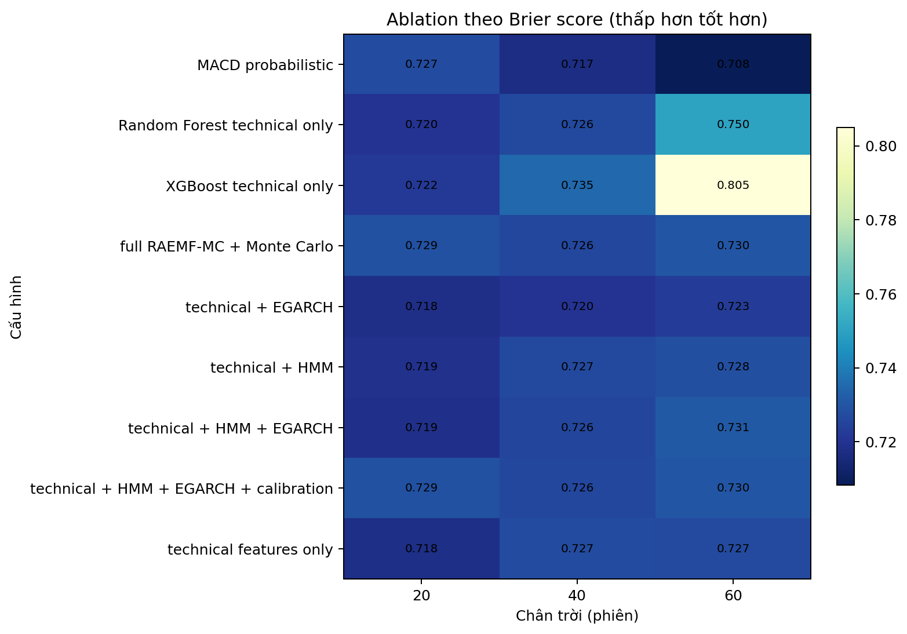

*Chú thích:* Hình được tạo từ dữ liệu và artifact của run hiện tại: `ablation_study.png`.

**Nhận xét định lượng:** 20 phiên: technical features only có Brier thấp nhất (0.7179); 40 phiên: MACD probabilistic có Brier thấp nhất (0.7172); 60 phiên: MACD probabilistic có Brier thấp nhất (0.7082). Tác động của HMM, EGARCH và calibration không được giả định là nhất quán nếu thứ hạng đổi giữa các chân trời.

### Backtest drawdown oos

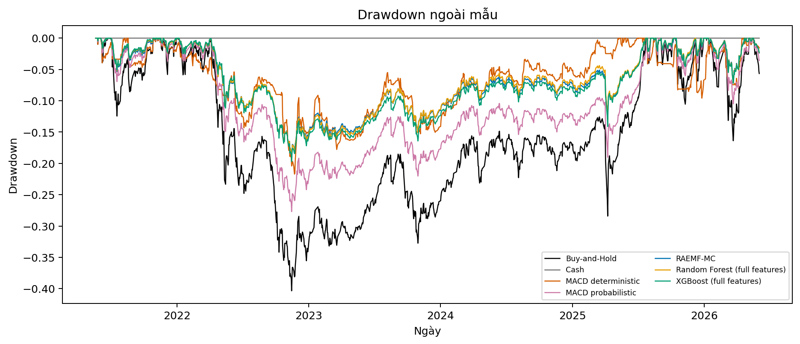

*Chú thích:* Hình được tạo từ dữ liệu và artifact của run hiện tại: `backtest_drawdown_oos.png`.

**Nhận xét định lượng:** Trên cùng final-test OOS, Sharpe cao nhất thuộc MACD deterministic (0.618). RAEMF-MC có lợi suất tích lũy 17.6%, Sharpe 0.393, drawdown cực đại -19.0%, turnover 21.58 và chi phí 2.16%. Backtest là proxy trên VN-Index, chưa phản ánh tracking error, thanh khoản hay khả năng giao dịch chỉ số trực tiếp.

### Backtest equity oos

*Chú thích:* Hình được tạo từ dữ liệu và artifact của run hiện tại: `backtest_equity_oos.png`.

**Nhận xét định lượng:** Trên cùng final-test OOS, Sharpe cao nhất thuộc MACD deterministic (0.618). RAEMF-MC có lợi suất tích lũy 17.6%, Sharpe 0.393, drawdown cực đại -19.0%, turnover 21.58 và chi phí 2.16%. Backtest là proxy trên VN-Index, chưa phản ánh tracking error, thanh khoản hay khả năng giao dịch chỉ số trực tiếp.

### Backtest exposure oos

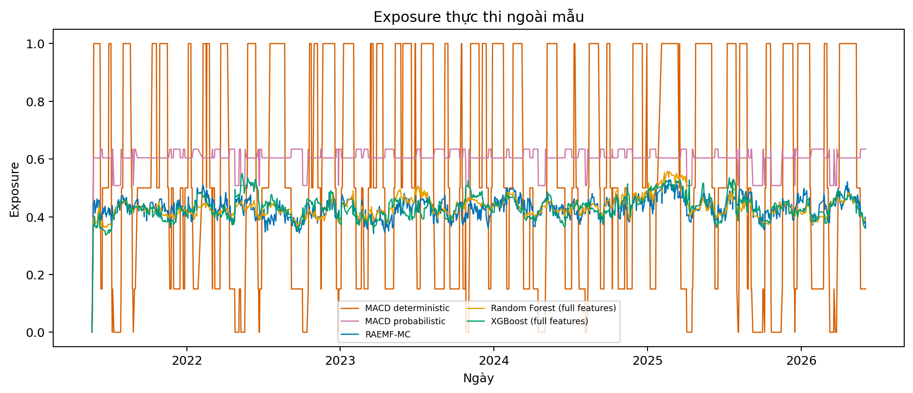

*Chú thích:* Hình được tạo từ dữ liệu và artifact của run hiện tại: `backtest_exposure_oos.png`.

**Nhận xét định lượng:** Trên cùng final-test OOS, Sharpe cao nhất thuộc MACD deterministic (0.618). RAEMF-MC có lợi suất tích lũy 17.6%, Sharpe 0.393, drawdown cực đại -19.0%, turnover 21.58 và chi phí 2.16%. Backtest là proxy trên VN-Index, chưa phản ánh tracking error, thanh khoản hay khả năng giao dịch chỉ số trực tiếp.

### Backtest rolling sharpe oos

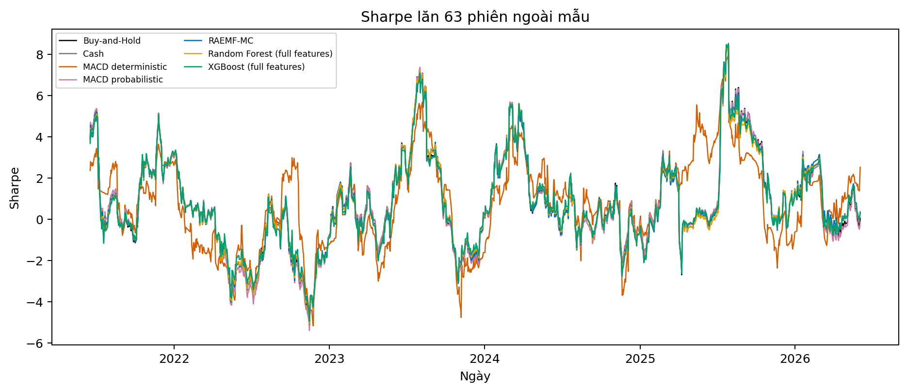

*Chú thích:* Hình được tạo từ dữ liệu và artifact của run hiện tại: `backtest_rolling_sharpe_oos.png`.

**Nhận xét định lượng:** Trên cùng final-test OOS, Sharpe cao nhất thuộc MACD deterministic (0.618). RAEMF-MC có lợi suất tích lũy 17.6%, Sharpe 0.393, drawdown cực đại -19.0%, turnover 21.58 và chi phí 2.16%. Backtest là proxy trên VN-Index, chưa phản ánh tracking error, thanh khoản hay khả năng giao dịch chỉ số trực tiếp.

### Backtest turnover oos

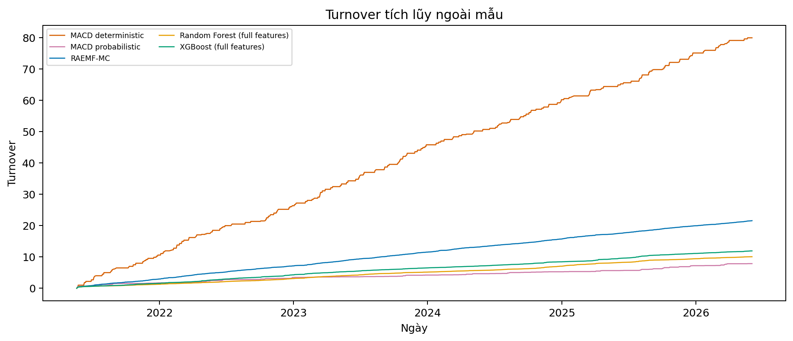

*Chú thích:* Hình được tạo từ dữ liệu và artifact của run hiện tại: `backtest_turnover_oos.png`.

**Nhận xét định lượng:** Trên cùng final-test OOS, Sharpe cao nhất thuộc MACD deterministic (0.618). RAEMF-MC có lợi suất tích lũy 17.6%, Sharpe 0.393, drawdown cực đại -19.0%, turnover 21.58 và chi phí 2.16%. Backtest là proxy trên VN-Index, chưa phản ánh tracking error, thanh khoản hay khả năng giao dịch chỉ số trực tiếp.

### Bootstrap forest brier

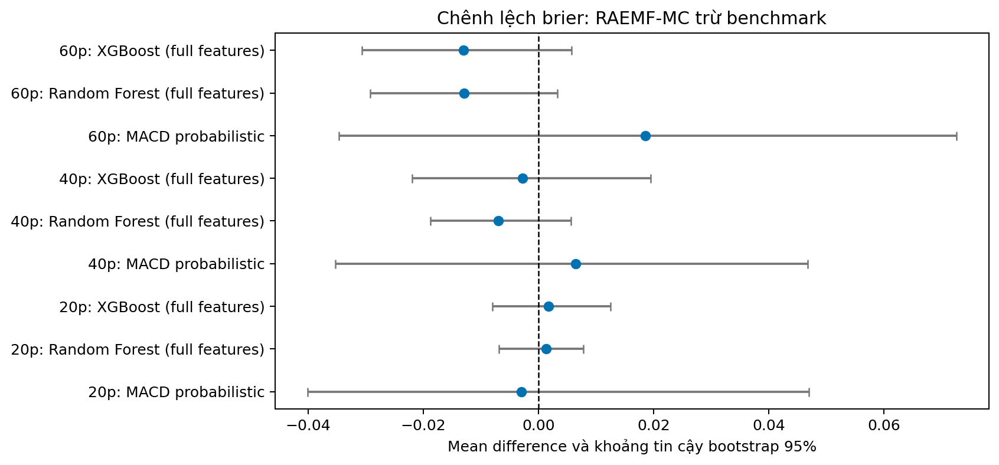

*Chú thích:* Hình được tạo từ dữ liệu và artifact của run hiện tại: `bootstrap_forest_brier.png`.

**Nhận xét định lượng:** Forest plot dùng định nghĩa RAEMF-MC trừ benchmark; chênh lệch âm có lợi cho RAEMF-MC. Có 0/9 khoảng tin cậy 95% không chứa 0. Các khoảng còn chứa 0 chưa cung cấp bằng chứng ổn định về khác biệt.

### Bootstrap forest log loss

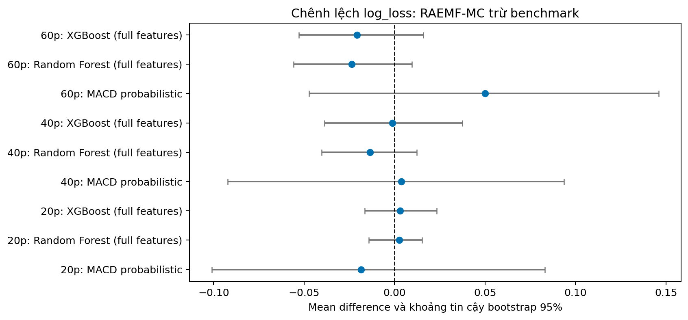

*Chú thích:* Hình được tạo từ dữ liệu và artifact của run hiện tại: `bootstrap_forest_log_loss.png`.

**Nhận xét định lượng:** Forest plot dùng định nghĩa RAEMF-MC trừ benchmark; chênh lệch âm có lợi cho RAEMF-MC. Có 0/9 khoảng tin cậy 95% không chứa 0. Các khoảng còn chứa 0 chưa cung cấp bằng chứng ổn định về khác biệt.

### Bootstrap forest macro f1

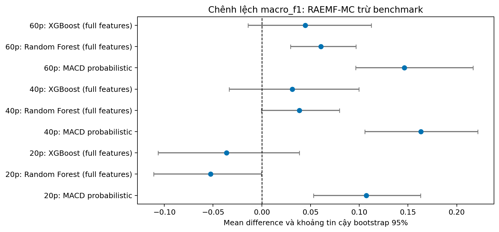

*Chú thích:* Hình được tạo từ dữ liệu và artifact của run hiện tại: `bootstrap_forest_macro_f1.png`.

**Nhận xét định lượng:** Forest plot dùng định nghĩa RAEMF-MC trừ benchmark; chênh lệch dương có lợi cho RAEMF-MC. Có 5/9 khoảng tin cậy 95% không chứa 0. Các khoảng còn chứa 0 chưa cung cấp bằng chứng ổn định về khác biệt.

### Bootstrap forest recall bear

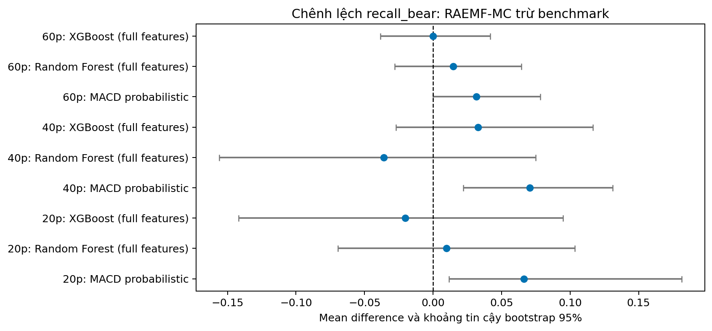

*Chú thích:* Hình được tạo từ dữ liệu và artifact của run hiện tại: `bootstrap_forest_recall_bear.png`.

**Nhận xét định lượng:** Forest plot dùng định nghĩa RAEMF-MC trừ benchmark; chênh lệch dương có lợi cho RAEMF-MC. Có 2/9 khoảng tin cậy 95% không chứa 0. Các khoảng còn chứa 0 chưa cung cấp bằng chứng ổn định về khác biệt.

### Bootstrap forest recall stress

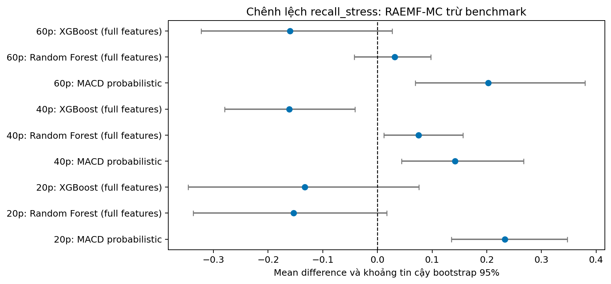

*Chú thích:* Hình được tạo từ dữ liệu và artifact của run hiện tại: `bootstrap_forest_recall_stress.png`.

**Nhận xét định lượng:** Forest plot dùng định nghĩa RAEMF-MC trừ benchmark; chênh lệch dương có lợi cho RAEMF-MC. Có 5/9 khoảng tin cậy 95% không chứa 0. Các khoảng còn chứa 0 chưa cung cấp bằng chứng ổn định về khác biệt.

### Confusion matrix macd probabilistic 20

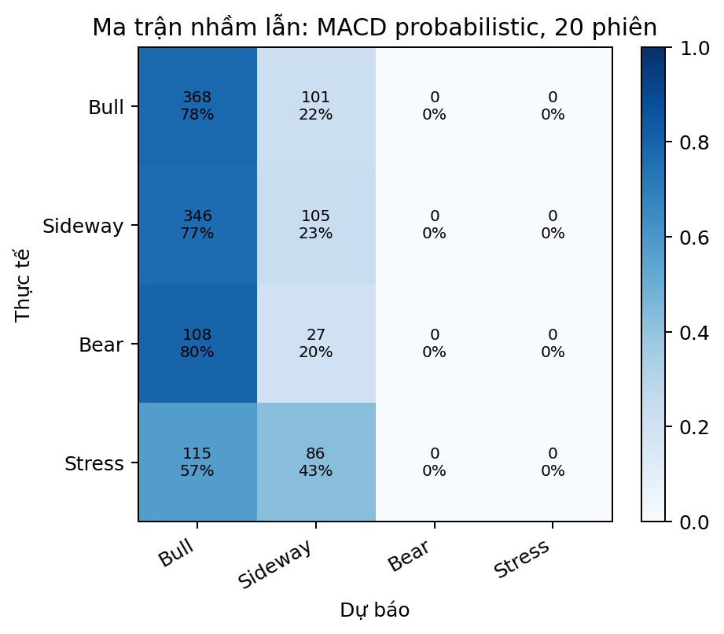

*Chú thích:* Hình được tạo từ dữ liệu và artifact của run hiện tại: `confusion_matrix_macd_probabilistic_20.png`.

**Nhận xét định lượng:** Hình tập trung vào sai số phân loại ngoài mẫu và các lớp rủi ro hiếm. Kết quả phải được đọc cùng support lớp; một đường cong hoặc ô recall cao trên ít quan sát có độ bất định lớn.

### Confusion matrix macd probabilistic 40

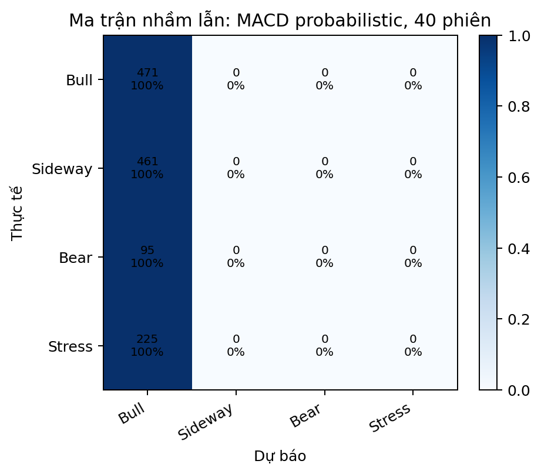

*Chú thích:* Hình được tạo từ dữ liệu và artifact của run hiện tại: `confusion_matrix_macd_probabilistic_40.png`.

**Nhận xét định lượng:** Hình tập trung vào sai số phân loại ngoài mẫu và các lớp rủi ro hiếm. Kết quả phải được đọc cùng support lớp; một đường cong hoặc ô recall cao trên ít quan sát có độ bất định lớn.

### Confusion matrix macd probabilistic 60

*Chú thích:* Hình được tạo từ dữ liệu và artifact của run hiện tại: `confusion_matrix_macd_probabilistic_60.png`.

**Nhận xét định lượng:** Hình tập trung vào sai số phân loại ngoài mẫu và các lớp rủi ro hiếm. Kết quả phải được đọc cùng support lớp; một đường cong hoặc ô recall cao trên ít quan sát có độ bất định lớn.

### Confusion matrix raemf mc 20

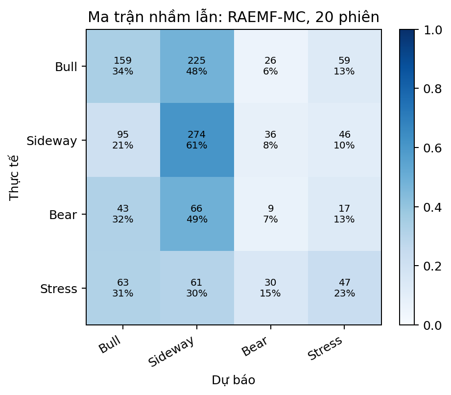

*Chú thích:* Hình được tạo từ dữ liệu và artifact của run hiện tại: `confusion_matrix_raemf_mc_20.png`.

**Nhận xét định lượng:** Hình tập trung vào sai số phân loại ngoài mẫu và các lớp rủi ro hiếm. Kết quả phải được đọc cùng support lớp; một đường cong hoặc ô recall cao trên ít quan sát có độ bất định lớn.

### Confusion matrix raemf mc 40

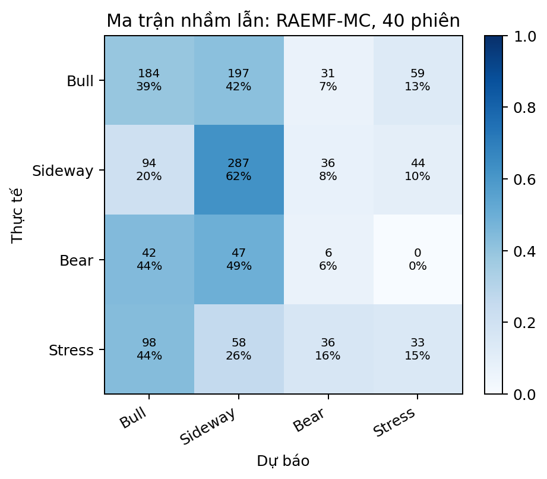

*Chú thích:* Hình được tạo từ dữ liệu và artifact của run hiện tại: `confusion_matrix_raemf_mc_40.png`.

**Nhận xét định lượng:** Hình tập trung vào sai số phân loại ngoài mẫu và các lớp rủi ro hiếm. Kết quả phải được đọc cùng support lớp; một đường cong hoặc ô recall cao trên ít quan sát có độ bất định lớn.

### Confusion matrix raemf mc 60

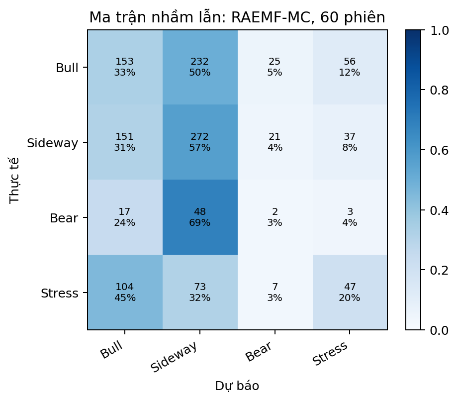

*Chú thích:* Hình được tạo từ dữ liệu và artifact của run hiện tại: `confusion_matrix_raemf_mc_60.png`.

**Nhận xét định lượng:** Hình tập trung vào sai số phân loại ngoài mẫu và các lớp rủi ro hiếm. Kết quả phải được đọc cùng support lớp; một đường cong hoặc ô recall cao trên ít quan sát có độ bất định lớn.

### Confusion matrix random forest full features 20

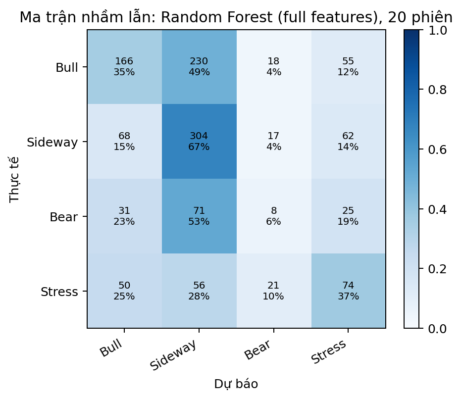

*Chú thích:* Hình được tạo từ dữ liệu và artifact của run hiện tại: `confusion_matrix_random_forest_full_features_20.png`.

**Nhận xét định lượng:** Hình tập trung vào sai số phân loại ngoài mẫu và các lớp rủi ro hiếm. Kết quả phải được đọc cùng support lớp; một đường cong hoặc ô recall cao trên ít quan sát có độ bất định lớn.

### Confusion matrix random forest full features 40

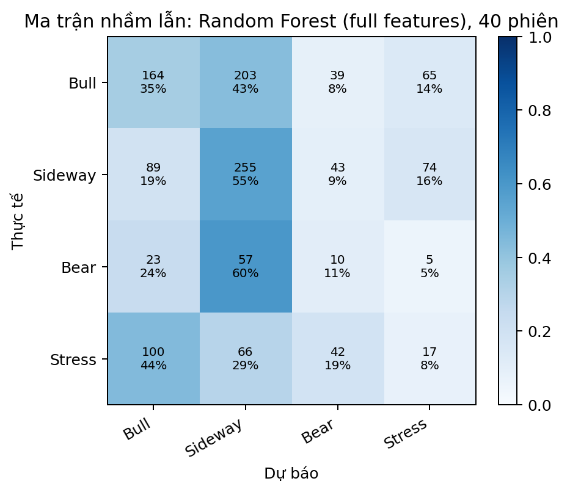

*Chú thích:* Hình được tạo từ dữ liệu và artifact của run hiện tại: `confusion_matrix_random_forest_full_features_40.png`.

**Nhận xét định lượng:** Hình tập trung vào sai số phân loại ngoài mẫu và các lớp rủi ro hiếm. Kết quả phải được đọc cùng support lớp; một đường cong hoặc ô recall cao trên ít quan sát có độ bất định lớn.

### Confusion matrix random forest full features 60

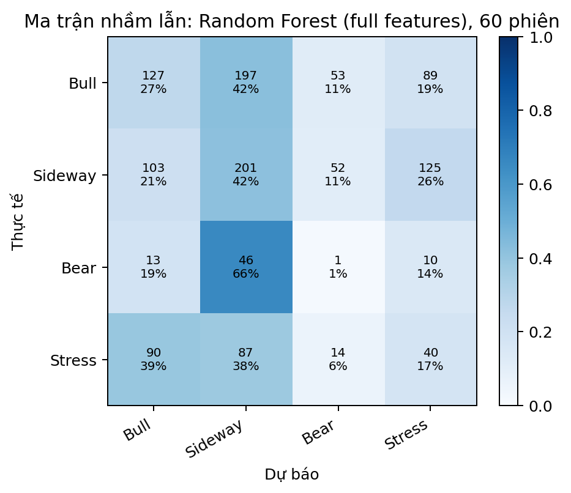

*Chú thích:* Hình được tạo từ dữ liệu và artifact của run hiện tại: `confusion_matrix_random_forest_full_features_60.png`.

**Nhận xét định lượng:** Hình tập trung vào sai số phân loại ngoài mẫu và các lớp rủi ro hiếm. Kết quả phải được đọc cùng support lớp; một đường cong hoặc ô recall cao trên ít quan sát có độ bất định lớn.

### Confusion matrix xgboost full features 20

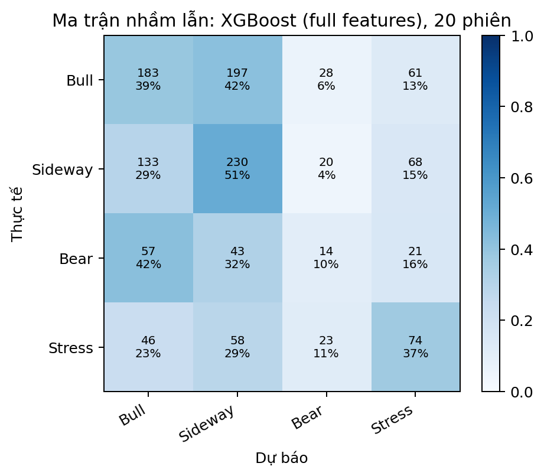

*Chú thích:* Hình được tạo từ dữ liệu và artifact của run hiện tại: `confusion_matrix_xgboost_full_features_20.png`.

**Nhận xét định lượng:** Hình tập trung vào sai số phân loại ngoài mẫu và các lớp rủi ro hiếm. Kết quả phải được đọc cùng support lớp; một đường cong hoặc ô recall cao trên ít quan sát có độ bất định lớn.

### Confusion matrix xgboost full features 40

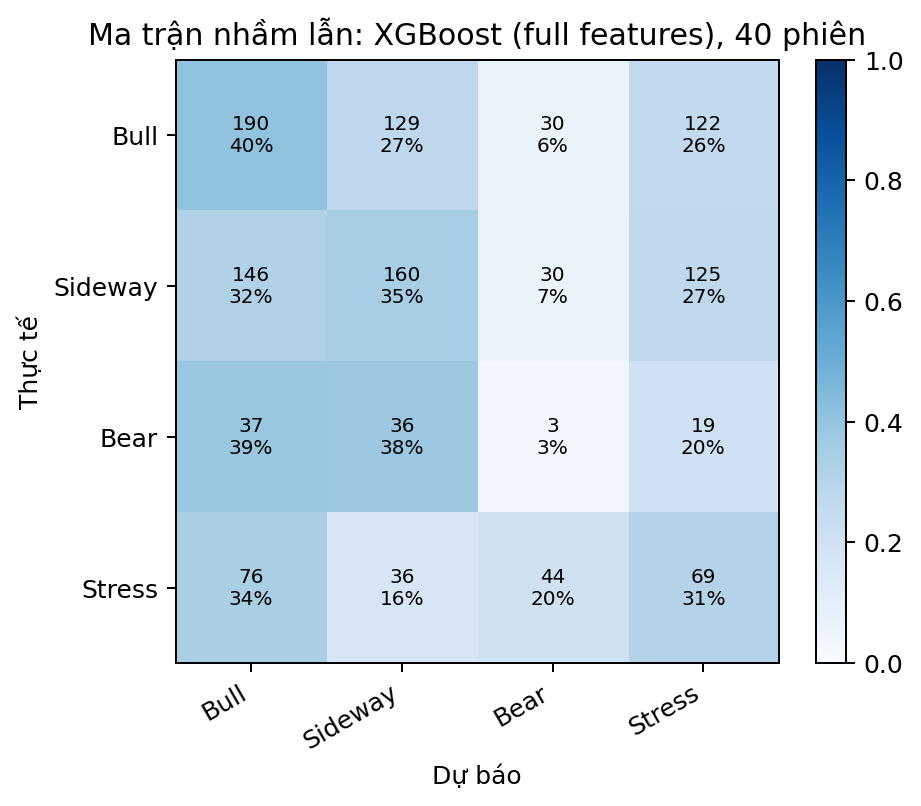

*Chú thích:* Hình được tạo từ dữ liệu và artifact của run hiện tại: `confusion_matrix_xgboost_full_features_40.png`.

**Nhận xét định lượng:** Hình tập trung vào sai số phân loại ngoài mẫu và các lớp rủi ro hiếm. Kết quả phải được đọc cùng support lớp; một đường cong hoặc ô recall cao trên ít quan sát có độ bất định lớn.

### Confusion matrix xgboost full features 60

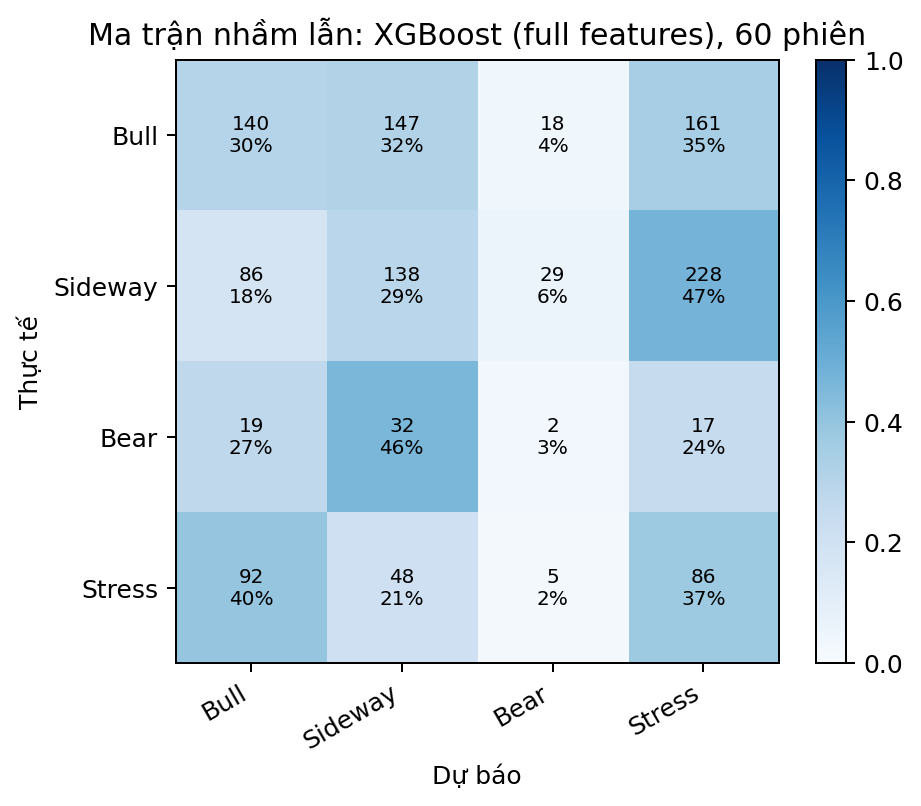

*Chú thích:* Hình được tạo từ dữ liệu và artifact của run hiện tại: `confusion_matrix_xgboost_full_features_60.png`.

**Nhận xét định lượng:** Hình tập trung vào sai số phân loại ngoài mẫu và các lớp rủi ro hiếm. Kết quả phải được đọc cùng support lớp; một đường cong hoặc ô recall cao trên ít quan sát có độ bất định lớn.

### Du bao moi nhat theo horizon

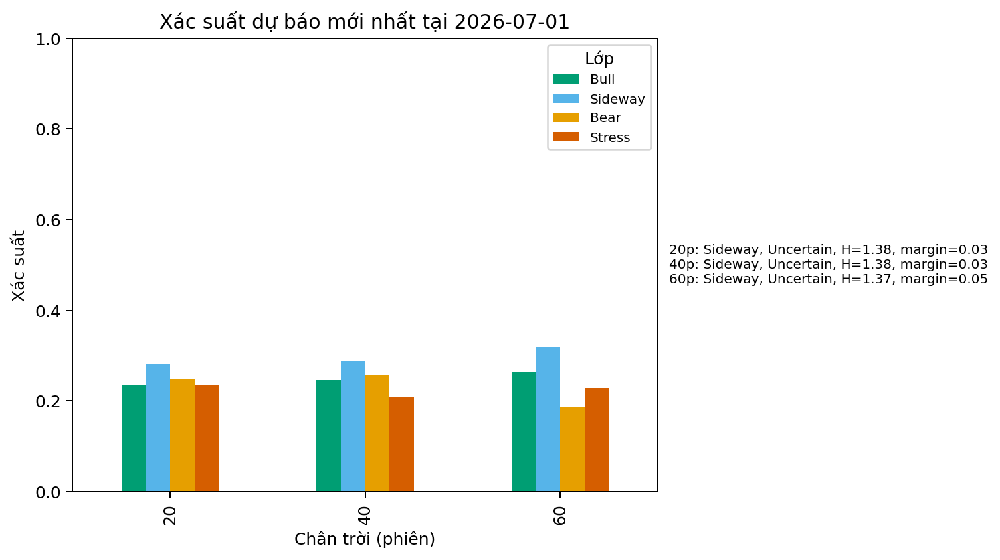

*Chú thích:* Hình được tạo từ dữ liệu và artifact của run hiện tại: `du_bao_moi_nhat_theo_horizon.png`.

**Nhận xét định lượng:** Dự báo deployment tại 2026-07-01: 20 phiên: Sideway (28.2%), confidence=Uncertain, entropy=1.38, margin=0.03; 40 phiên: Sideway (28.9%), confidence=Uncertain, entropy=1.38, margin=0.03; 60 phiên: Sideway (31.9%), confidence=Uncertain, entropy=1.37, margin=0.05. Xác suất phản ánh bất định của mô hình trên dữ liệu hiện có, không phải khuyến nghị đầu tư.

### Ebm shape plot 20

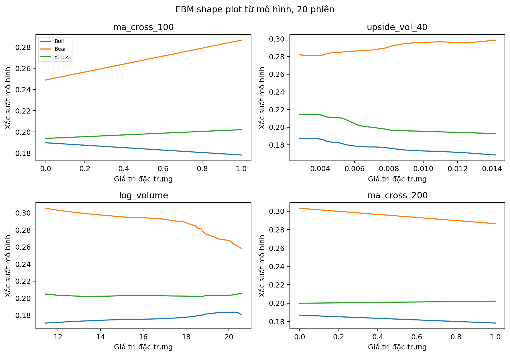

*Chú thích:* Hình được tạo từ dữ liệu và artifact của run hiện tại: `ebm_shape_plot_20.png`.

**Nhận xét định lượng:** Năm term quan trọng nhất ở 20 phiên là ma_cross_100 (0.043), upside_vol_40 (0.026), log_volume (0.023), ma_cross_200 (0.023), egarch_volatility_percentile (0.023). Độ quan trọng toàn cục không biểu thị quan hệ nhân quả và interaction term có thể chia sẻ tín hiệu với đặc trưng tương quan.

### Ebm shape plot 40

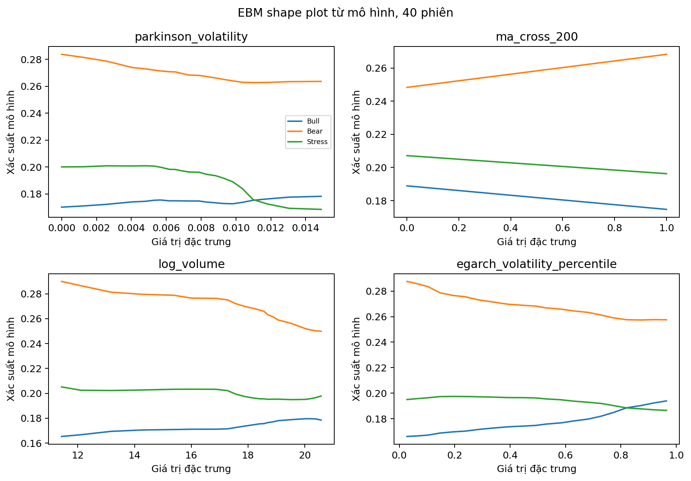

*Chú thích:* Hình được tạo từ dữ liệu và artifact của run hiện tại: `ebm_shape_plot_40.png`.

**Nhận xét định lượng:** Năm term quan trọng nhất ở 40 phiên là parkinson_volatility (0.028), ma_cross_200 (0.028), log_volume (0.027), egarch_volatility_percentile (0.025), sma_slope_200 (0.021). Độ quan trọng toàn cục không biểu thị quan hệ nhân quả và interaction term có thể chia sẻ tín hiệu với đặc trưng tương quan.

### Ebm shape plot 60

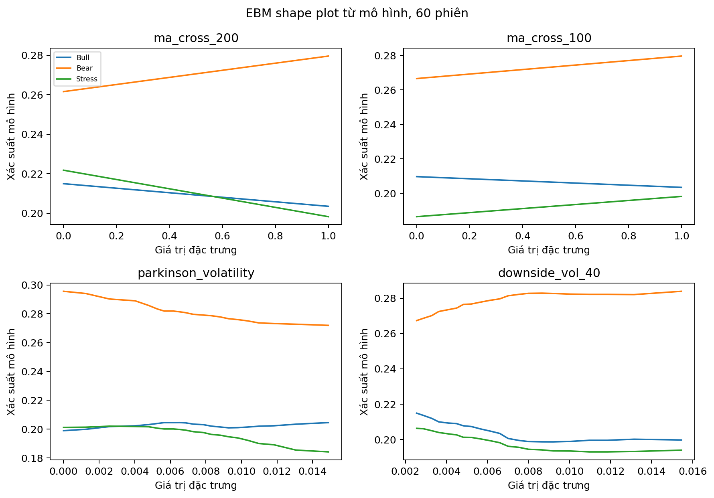

*Chú thích:* Hình được tạo từ dữ liệu và artifact của run hiện tại: `ebm_shape_plot_60.png`.

**Nhận xét định lượng:** Năm term quan trọng nhất ở 60 phiên là ma_cross_200 (0.036), ma_cross_100 (0.024), parkinson_volatility (0.021), downside_vol_40 (0.019), hl_range (0.018). Độ quan trọng toàn cục không biểu thị quan hệ nhân quả và interaction term có thể chia sẻ tín hiệu với đặc trưng tương quan.

### Egarch conditional volatility

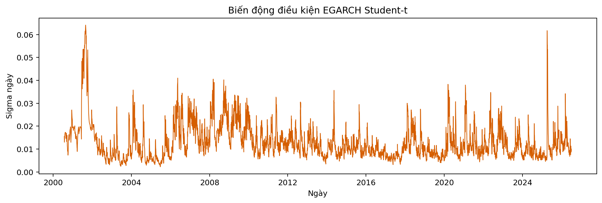

*Chú thích:* Hình được tạo từ dữ liệu và artifact của run hiện tại: `egarch_conditional_volatility.png`.

**Nhận xét định lượng:** Sigma EGARCH trung vị là 1.084% và cực đại 6.414%. Tham số được fit trên train cho evaluation; các đỉnh volatility là ước lượng mô hình, không phải volatility quan sát trực tiếp.

### Fan chart monte carlo 20

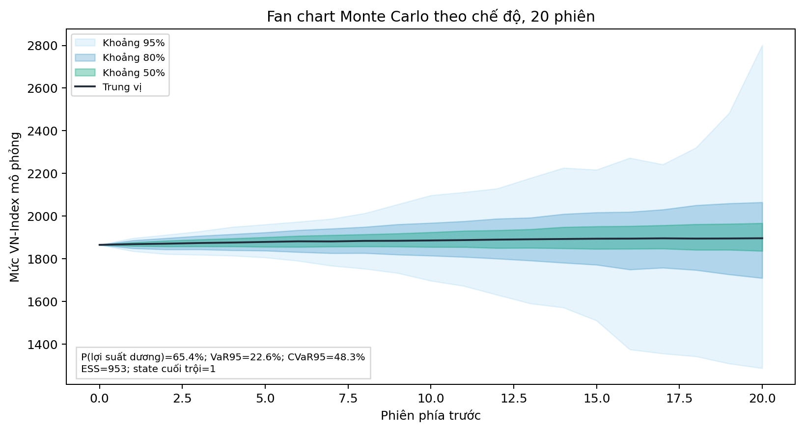

*Chú thích:* Hình được tạo từ dữ liệu và artifact của run hiện tại: `fan_chart_monte_carlo_20.png`.

**Nhận xét định lượng:** Tại 20 phiên, phân phối tái trọng số có xác suất lợi suất dương 65.4%, VaR 95% 22.6%, CVaR 95% 48.3%, và xác suất drawdown vượt 10% 20.3%. ESS đạt 953 (79.4% số quỹ đạo), với bậc tự do Student-t 6.65. Đây là phân phối kịch bản có điều kiện, không phải khoảng đảm bảo cho mức chỉ số tương lai.

### Fan chart monte carlo 40

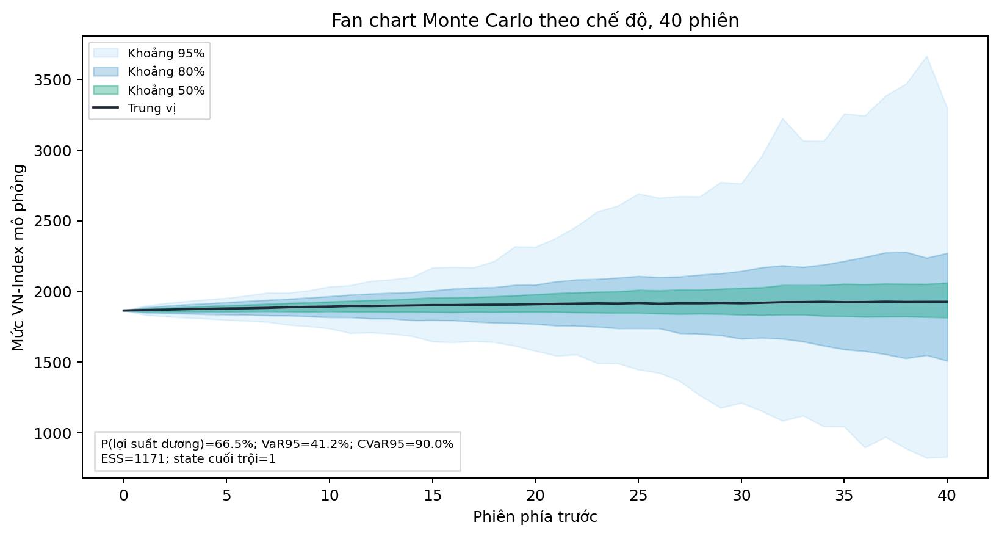

*Chú thích:* Hình được tạo từ dữ liệu và artifact của run hiện tại: `fan_chart_monte_carlo_40.png`.

**Nhận xét định lượng:** Tại 40 phiên, phân phối tái trọng số có xác suất lợi suất dương 66.5%, VaR 95% 41.2%, CVaR 95% 90.0%, và xác suất drawdown vượt 10% 40.8%. ESS đạt 1171 (97.6% số quỹ đạo), với bậc tự do Student-t 6.65. Đây là phân phối kịch bản có điều kiện, không phải khoảng đảm bảo cho mức chỉ số tương lai.

### Fan chart monte carlo 60

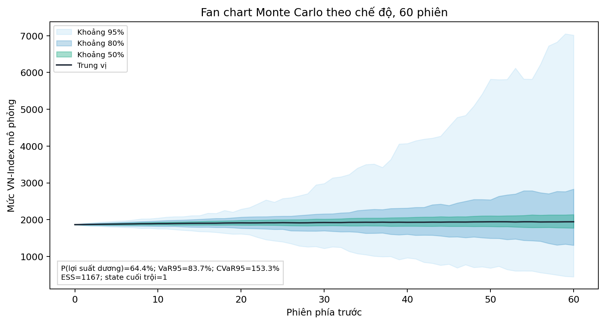

*Chú thích:* Hình được tạo từ dữ liệu và artifact của run hiện tại: `fan_chart_monte_carlo_60.png`.

**Nhận xét định lượng:** Tại 60 phiên, phân phối tái trọng số có xác suất lợi suất dương 64.4%, VaR 95% 83.7%, CVaR 95% 153.3%, và xác suất drawdown vượt 10% 53.9%. ESS đạt 1167 (97.3% số quỹ đạo), với bậc tự do Student-t 6.65. Đây là phân phối kịch bản có điều kiện, không phải khoảng đảm bảo cho mức chỉ số tương lai.

### Feature importance raemf mc 20

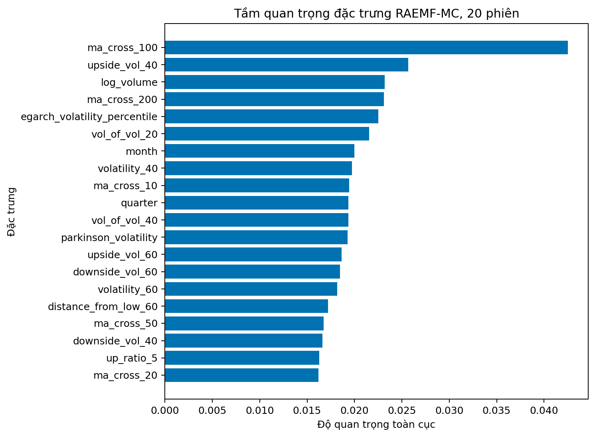

*Chú thích:* Hình được tạo từ dữ liệu và artifact của run hiện tại: `feature_importance_raemf_mc_20.png`.

**Nhận xét định lượng:** Năm term quan trọng nhất ở 20 phiên là ma_cross_100 (0.043), upside_vol_40 (0.026), log_volume (0.023), ma_cross_200 (0.023), egarch_volatility_percentile (0.023). Độ quan trọng toàn cục không biểu thị quan hệ nhân quả và interaction term có thể chia sẻ tín hiệu với đặc trưng tương quan.

### Feature importance raemf mc 40

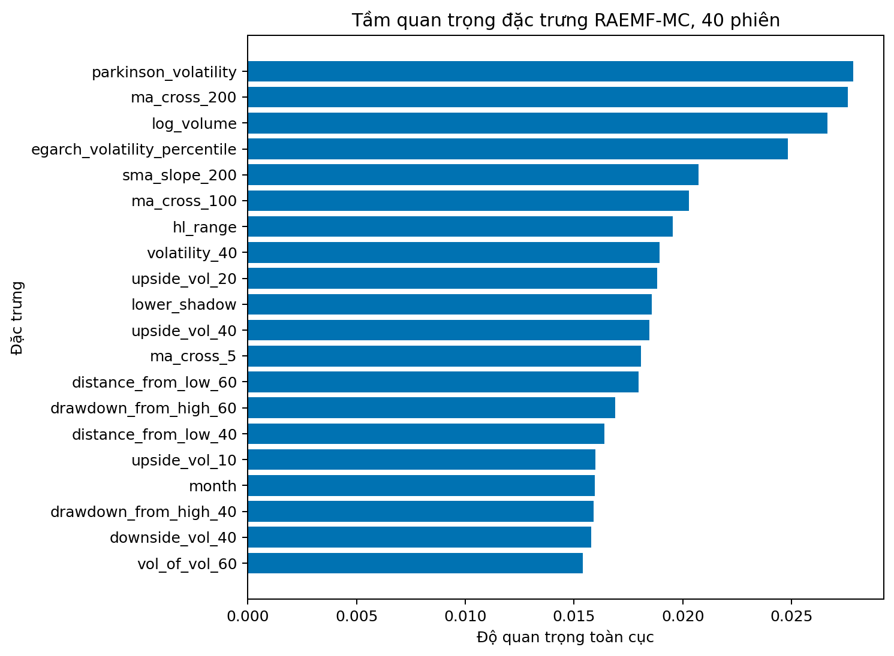

*Chú thích:* Hình được tạo từ dữ liệu và artifact của run hiện tại: `feature_importance_raemf_mc_40.png`.

**Nhận xét định lượng:** Năm term quan trọng nhất ở 40 phiên là parkinson_volatility (0.028), ma_cross_200 (0.028), log_volume (0.027), egarch_volatility_percentile (0.025), sma_slope_200 (0.021). Độ quan trọng toàn cục không biểu thị quan hệ nhân quả và interaction term có thể chia sẻ tín hiệu với đặc trưng tương quan.

### Feature importance raemf mc 60

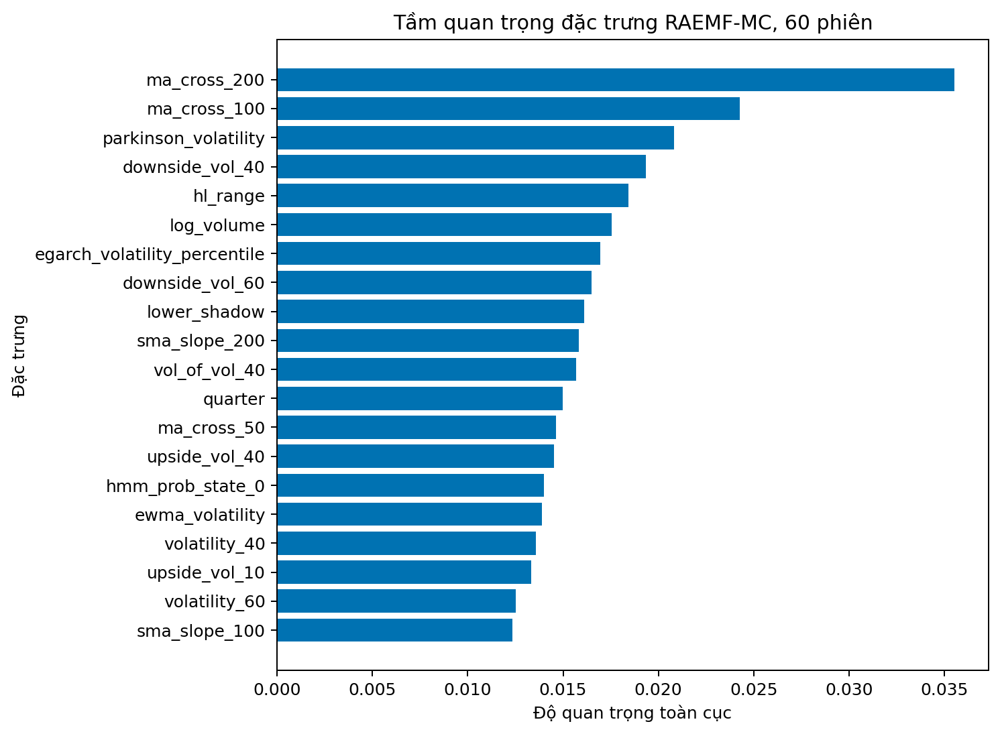

*Chú thích:* Hình được tạo từ dữ liệu và artifact của run hiện tại: `feature_importance_raemf_mc_60.png`.

**Nhận xét định lượng:** Năm term quan trọng nhất ở 60 phiên là ma_cross_200 (0.036), ma_cross_100 (0.024), parkinson_volatility (0.021), downside_vol_40 (0.019), hl_range (0.018). Độ quan trọng toàn cục không biểu thị quan hệ nhân quả và interaction term có thể chia sẻ tín hiệu với đặc trưng tương quan.

### Hmm regime overlay

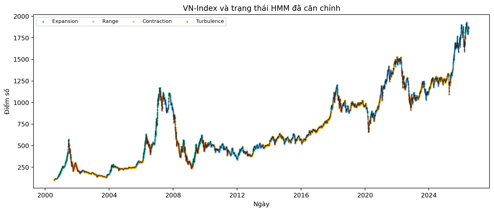

*Chú thích:* Hình được tạo từ dữ liệu và artifact của run hiện tại: `hmm_regime_overlay.png`.

**Nhận xét định lượng:** Căn chỉnh train-only cho thấy Expansion: mean=0.651%, sigma=1.956%, tần suất=16.0%, Range: mean=0.021%, sigma=1.127%, tần suất=38.2%, Contraction: mean=0.000%, sigma=0.658%, tần suất=28.5%, Turbulence: mean=-0.360%, sigma=2.518%, tần suất=17.4%. Tên state là diễn giải tương đối theo quy tắc định lượng, không đồng nhất trực tiếp với nhãn dự báo.

### Local explanation latest 20

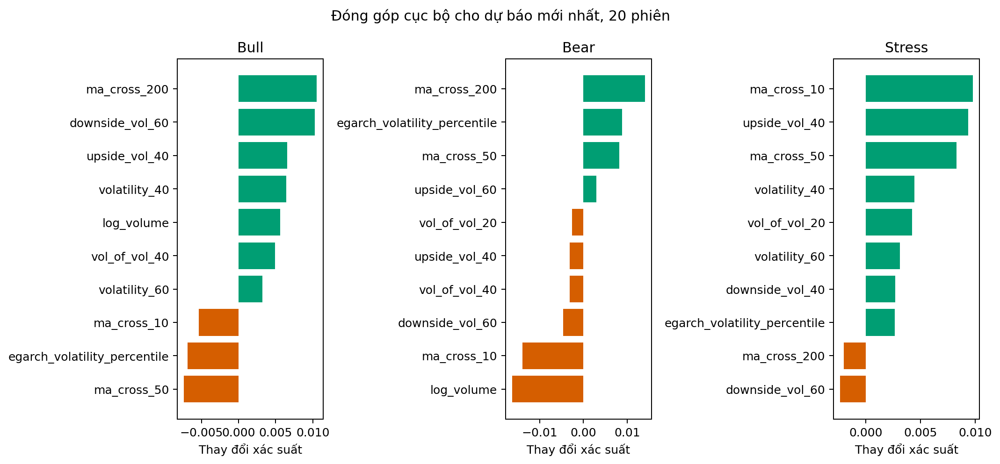

*Chú thích:* Hình được tạo từ dữ liệu và artifact của run hiện tại: `local_explanation_latest_20.png`.

**Nhận xét định lượng:** Năm term quan trọng nhất ở 20 phiên là ma_cross_100 (0.043), upside_vol_40 (0.026), log_volume (0.023), ma_cross_200 (0.023), egarch_volatility_percentile (0.023). Độ quan trọng toàn cục không biểu thị quan hệ nhân quả và interaction term có thể chia sẻ tín hiệu với đặc trưng tương quan.

### Local explanation latest 40

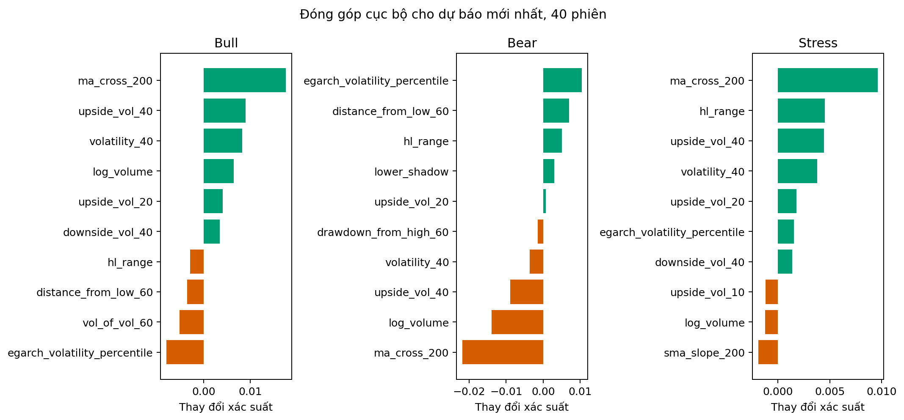

*Chú thích:* Hình được tạo từ dữ liệu và artifact của run hiện tại: `local_explanation_latest_40.png`.

**Nhận xét định lượng:** Năm term quan trọng nhất ở 40 phiên là parkinson_volatility (0.028), ma_cross_200 (0.028), log_volume (0.027), egarch_volatility_percentile (0.025), sma_slope_200 (0.021). Độ quan trọng toàn cục không biểu thị quan hệ nhân quả và interaction term có thể chia sẻ tín hiệu với đặc trưng tương quan.

### Local explanation latest 60

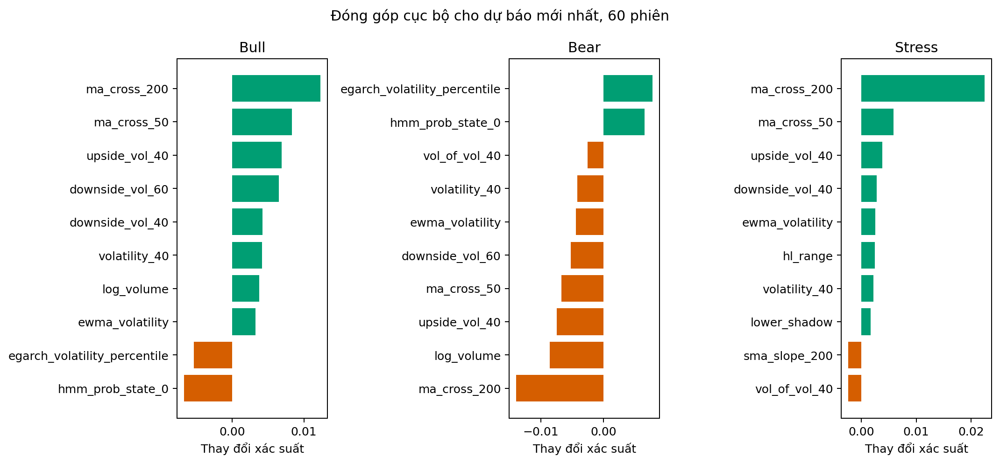

*Chú thích:* Hình được tạo từ dữ liệu và artifact của run hiện tại: `local_explanation_latest_60.png`.

**Nhận xét định lượng:** Năm term quan trọng nhất ở 60 phiên là ma_cross_200 (0.036), ma_cross_100 (0.024), parkinson_volatility (0.021), downside_vol_40 (0.019), hl_range (0.018). Độ quan trọng toàn cục không biểu thị quan hệ nhân quả và interaction term có thể chia sẻ tín hiệu với đặc trưng tương quan.

### Loi suat theo thoi gian

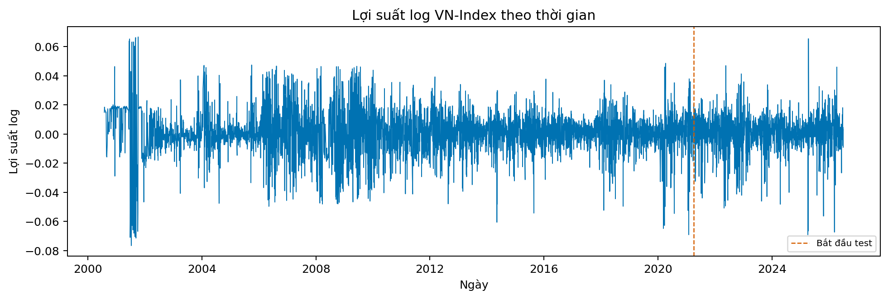

*Chú thích:* Hình được tạo từ dữ liệu và artifact của run hiện tại: `loi_suat_theo_thoi_gian.png`.

**Nhận xét định lượng:** Lợi suất có cụm biến động và đuôi dày, tạo động cơ cho EGARCH Student-t và bootstrap theo khối. Quan sát lịch sử không bảo đảm phân phối tương lai giữ nguyên.

### Metric theo fold walk forward

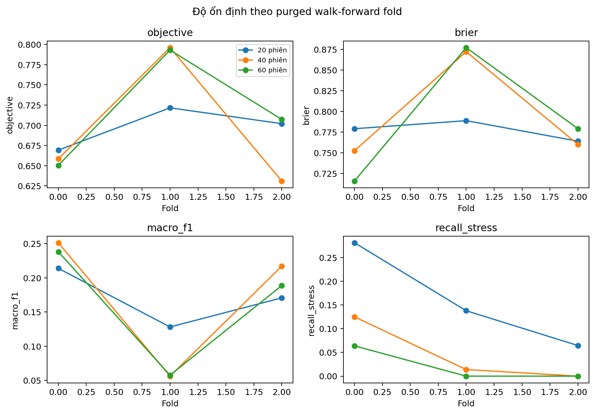

*Chú thích:* Hình được tạo từ dữ liệu và artifact của run hiện tại: `metric_theo_fold_walk_forward.png`.

**Nhận xét định lượng:** Độ lệch chuẩn Brier giữa các fold là 20 phiên=0.0125, 40 phiên=0.0671, 60 phiên=0.0812. Số fold nhỏ nên đây là kiểm tra ổn định, không phải bằng chứng bất biến theo chế độ thị trường.

### Phan phoi loi suat

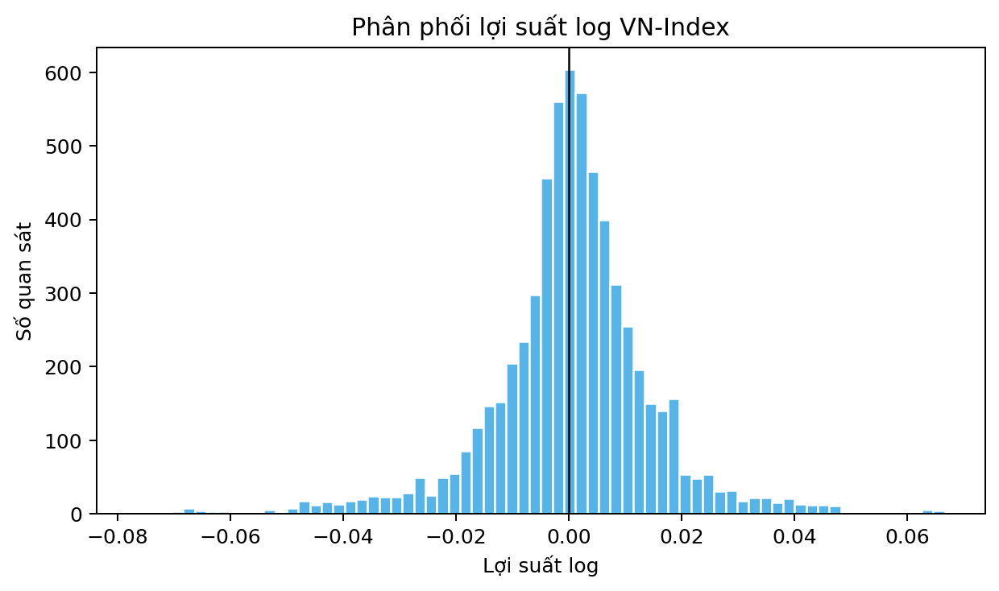

*Chú thích:* Hình được tạo từ dữ liệu và artifact của run hiện tại: `phan_phoi_loi_suat.png`.

**Nhận xét định lượng:** Lợi suất có cụm biến động và đuôi dày, tạo động cơ cho EGARCH Student-t và bootstrap theo khối. Quan sát lịch sử không bảo đảm phân phối tương lai giữ nguyên.

### Phan phoi lop theo horizon

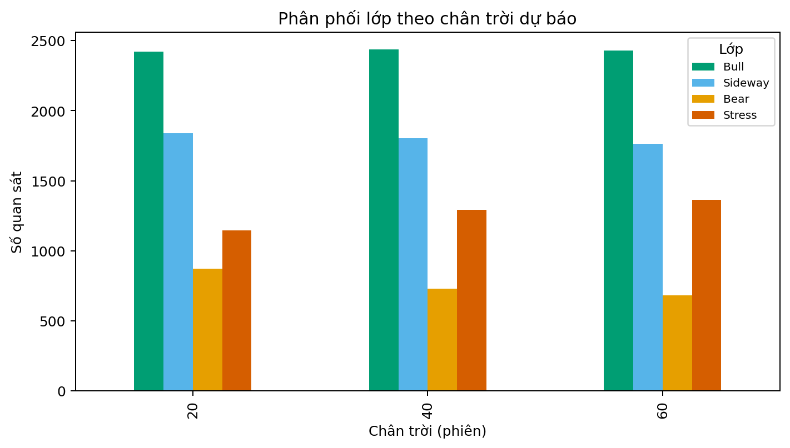

*Chú thích:* Hình được tạo từ dữ liệu và artifact của run hiện tại: `phan_phoi_lop_theo_horizon.png`.

**Nhận xét định lượng:** Tỷ trọng lớp thay đổi theo chân trời do lợi suất và maximum adverse excursion tích lũy khác nhau. Mất cân bằng này là lý do báo cáo macro F1, balanced accuracy và recall Bear/Stress thay cho chỉ accuracy.

### Precision recall bear 20

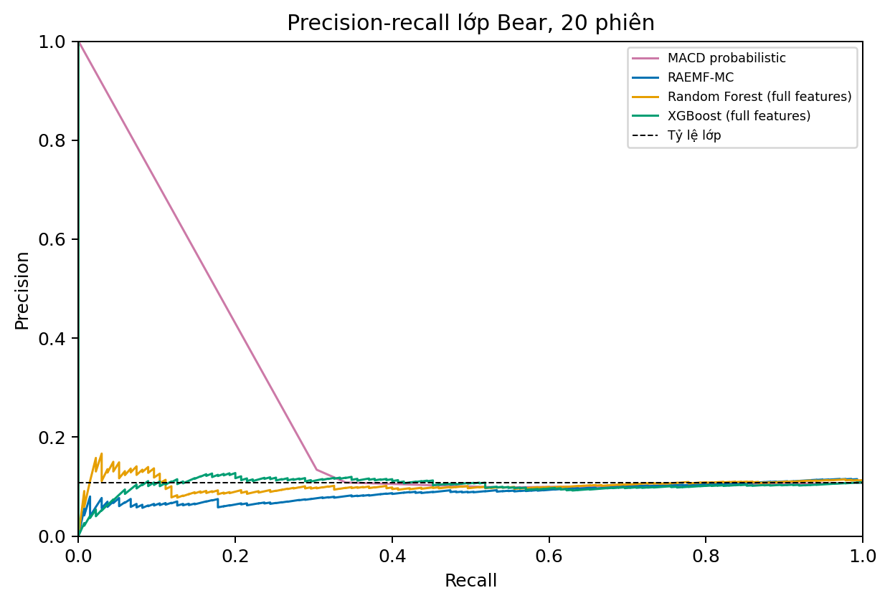

*Chú thích:* Hình được tạo từ dữ liệu và artifact của run hiện tại: `precision_recall_bear_20.png`.

**Nhận xét định lượng:** Hình tập trung vào sai số phân loại ngoài mẫu và các lớp rủi ro hiếm. Kết quả phải được đọc cùng support lớp; một đường cong hoặc ô recall cao trên ít quan sát có độ bất định lớn.

### Precision recall bear 40

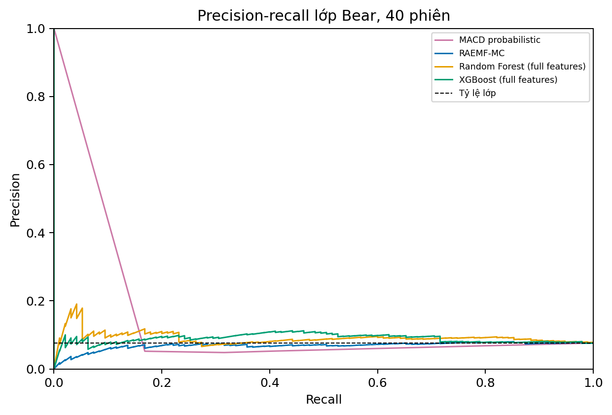

*Chú thích:* Hình được tạo từ dữ liệu và artifact của run hiện tại: `precision_recall_bear_40.png`.

**Nhận xét định lượng:** Hình tập trung vào sai số phân loại ngoài mẫu và các lớp rủi ro hiếm. Kết quả phải được đọc cùng support lớp; một đường cong hoặc ô recall cao trên ít quan sát có độ bất định lớn.

### Precision recall bear 60

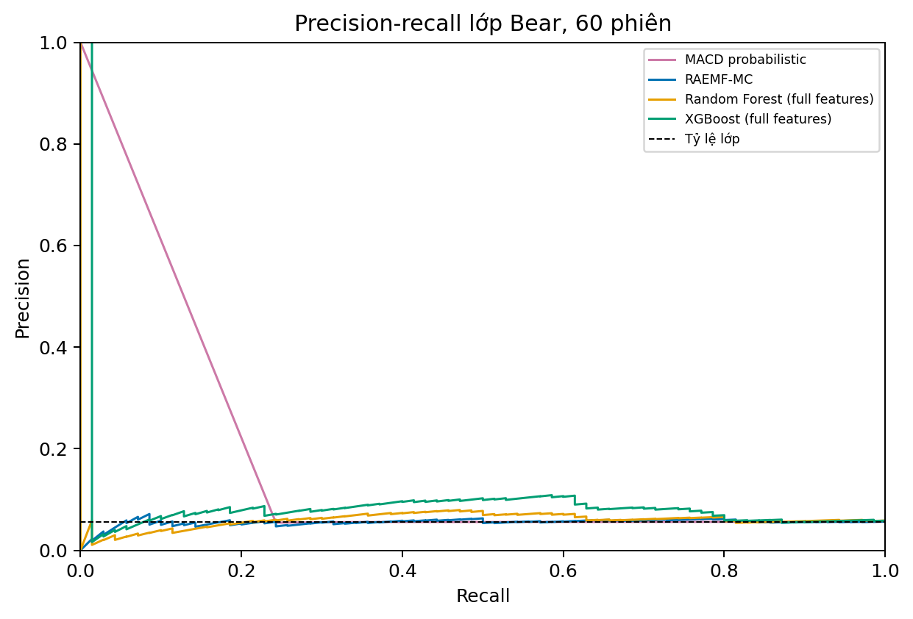

*Chú thích:* Hình được tạo từ dữ liệu và artifact của run hiện tại: `precision_recall_bear_60.png`.

**Nhận xét định lượng:** Hình tập trung vào sai số phân loại ngoài mẫu và các lớp rủi ro hiếm. Kết quả phải được đọc cùng support lớp; một đường cong hoặc ô recall cao trên ít quan sát có độ bất định lớn.

### Precision recall stress 20

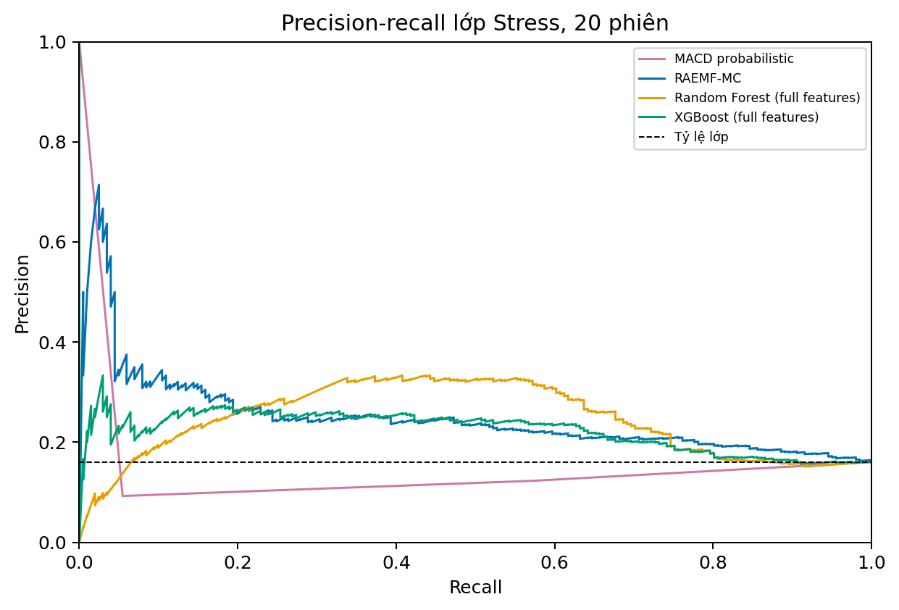

*Chú thích:* Hình được tạo từ dữ liệu và artifact của run hiện tại: `precision_recall_stress_20.png`.

**Nhận xét định lượng:** Hình tập trung vào sai số phân loại ngoài mẫu và các lớp rủi ro hiếm. Kết quả phải được đọc cùng support lớp; một đường cong hoặc ô recall cao trên ít quan sát có độ bất định lớn.

### Precision recall stress 40

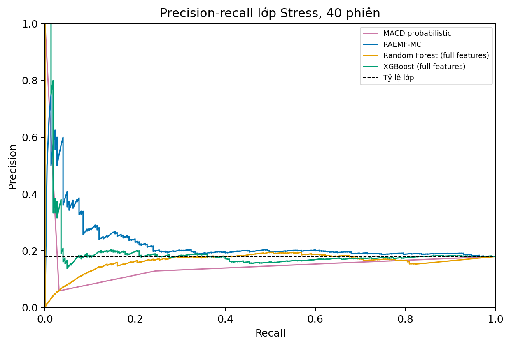

*Chú thích:* Hình được tạo từ dữ liệu và artifact của run hiện tại: `precision_recall_stress_40.png`.

**Nhận xét định lượng:** Hình tập trung vào sai số phân loại ngoài mẫu và các lớp rủi ro hiếm. Kết quả phải được đọc cùng support lớp; một đường cong hoặc ô recall cao trên ít quan sát có độ bất định lớn.

### Precision recall stress 60

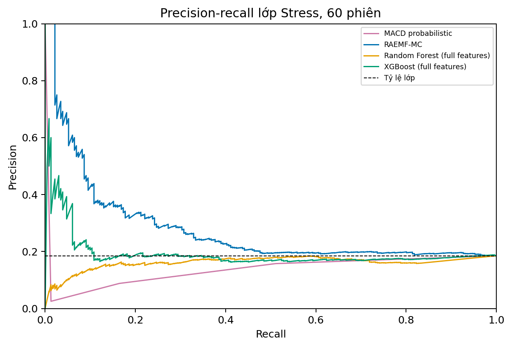

*Chú thích:* Hình được tạo từ dữ liệu và artifact của run hiện tại: `precision_recall_stress_60.png`.

**Nhận xét định lượng:** Hình tập trung vào sai số phân loại ngoài mẫu và các lớp rủi ro hiếm. Kết quả phải được đọc cùng support lớp; một đường cong hoặc ô recall cao trên ít quan sát có độ bất định lớn.

### Reliability diagram 20

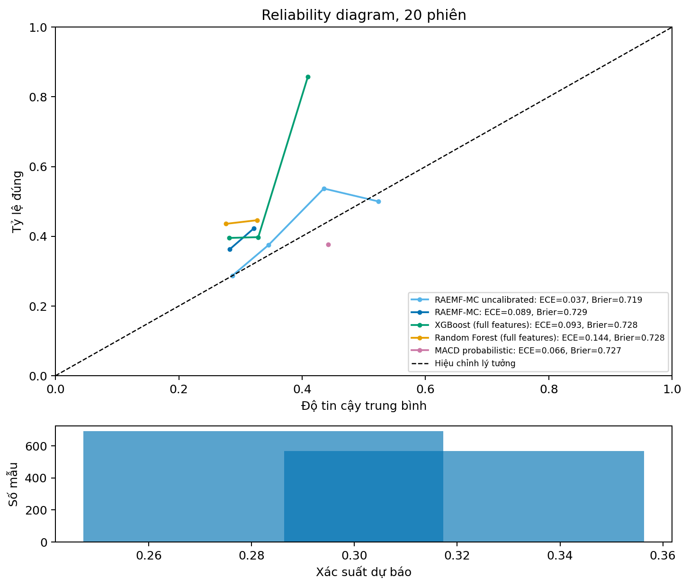

*Chú thích:* Hình được tạo từ dữ liệu và artifact của run hiện tại: `reliability_diagram_20.png`.

**Nhận xét định lượng:** Trên validation 20 phiên, temperature scaling làm Brier thay đổi từ 0.7529 xuống 0.7447, log loss từ 1.3864 xuống 1.3744, và ECE từ 0.0666 xuống 0.0142. Reliability trên test vẫn có thể lệch do drift và số mẫu trong các bin không đồng đều.

### Reliability diagram 40

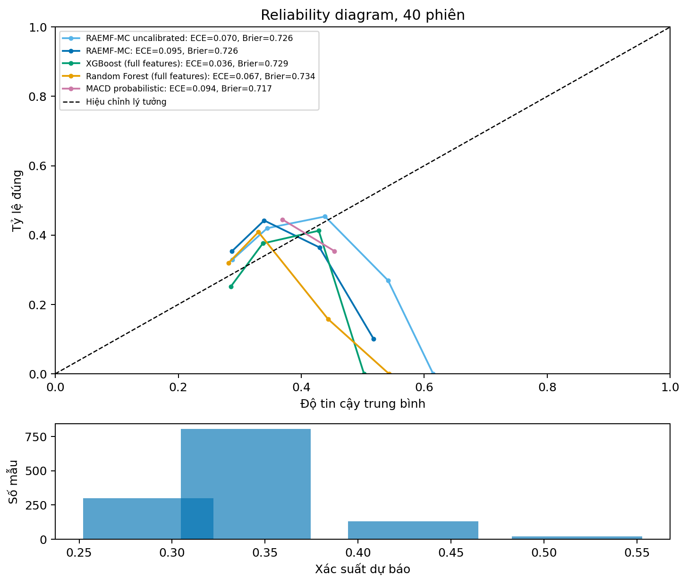

*Chú thích:* Hình được tạo từ dữ liệu và artifact của run hiện tại: `reliability_diagram_40.png`.

**Nhận xét định lượng:** Trên validation 40 phiên, temperature scaling làm Brier thay đổi từ 0.7279 xuống 0.7263, log loss từ 1.3450 xuống 1.3410, và ECE từ 0.0406 xuống 0.0255. Reliability trên test vẫn có thể lệch do drift và số mẫu trong các bin không đồng đều.

### Reliability diagram 60

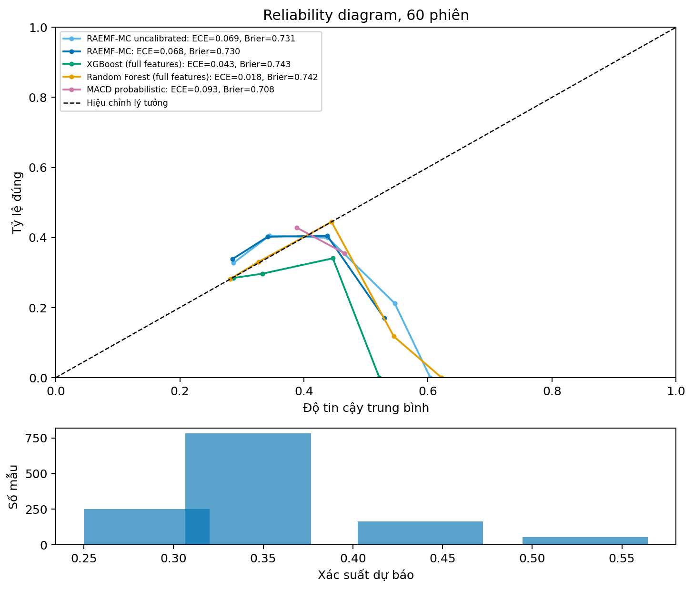

*Chú thích:* Hình được tạo từ dữ liệu và artifact của run hiện tại: `reliability_diagram_60.png`.

**Nhận xét định lượng:** Trên validation 60 phiên, temperature scaling làm Brier thay đổi từ 0.7117 xuống 0.7118, log loss từ 1.3149 xuống 1.3149, và ECE từ 0.0313 xuống 0.0434. Reliability trên test vẫn có thể lệch do drift và số mẫu trong các bin không đồng đều.

### So sanh balanced accuracy

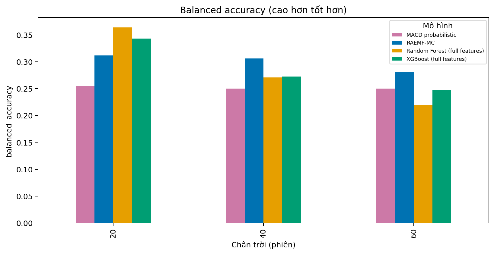

*Chú thích:* Hình được tạo từ dữ liệu và artifact của run hiện tại: `so_sanh_balanced_accuracy.png`.

**Nhận xét định lượng:** Metric này được đọc theo hướng cao hơn là tốt hơn. 20 phiên: tốt nhất là Random Forest (full features) (0.3639); RAEMF-MC đạt 0.3118, chênh -0.0521; 40 phiên: tốt nhất là RAEMF-MC (0.3058); RAEMF-MC đạt 0.3058, chênh +0.0000; 60 phiên: tốt nhất là RAEMF-MC (0.2815); RAEMF-MC đạt 0.2815, chênh +0.0000. So sánh điểm không tự nó chứng minh ưu thế ổn định theo thời gian.

### So sanh brier

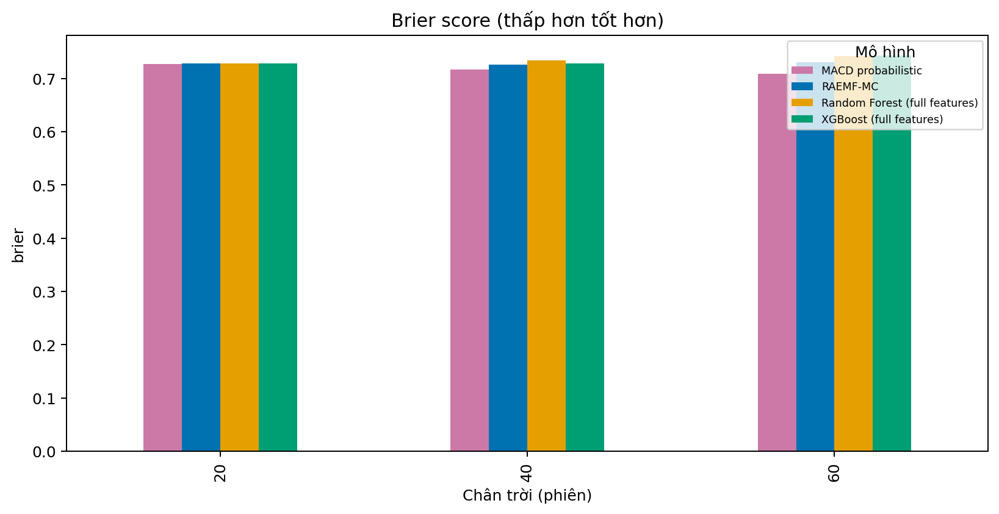

*Chú thích:* Hình được tạo từ dữ liệu và artifact của run hiện tại: `so_sanh_brier.png`.

**Nhận xét định lượng:** Metric này được đọc theo hướng thấp hơn là tốt hơn. 20 phiên: tốt nhất là MACD probabilistic (0.7274); RAEMF-MC đạt 0.7287, chênh +0.0013; 40 phiên: tốt nhất là MACD probabilistic (0.7172); RAEMF-MC đạt 0.7261, chênh +0.0088; 60 phiên: tốt nhất là MACD probabilistic (0.7082); RAEMF-MC đạt 0.7303, chênh +0.0221. So sánh điểm không tự nó chứng minh ưu thế ổn định theo thời gian.

### So sanh ece

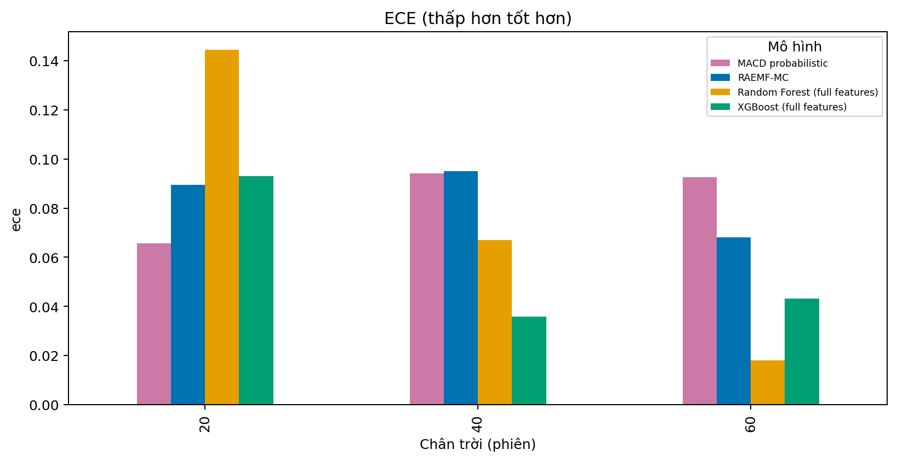

*Chú thích:* Hình được tạo từ dữ liệu và artifact của run hiện tại: `so_sanh_ece.png`.

**Nhận xét định lượng:** Metric này được đọc theo hướng thấp hơn là tốt hơn. 20 phiên: tốt nhất là MACD probabilistic (0.0657); RAEMF-MC đạt 0.0894, chênh +0.0237; 40 phiên: tốt nhất là XGBoost (full features) (0.0359); RAEMF-MC đạt 0.0950, chênh +0.0591; 60 phiên: tốt nhất là Random Forest (full features) (0.0181); RAEMF-MC đạt 0.0681, chênh +0.0500. So sánh điểm không tự nó chứng minh ưu thế ổn định theo thời gian.

### So sanh log loss

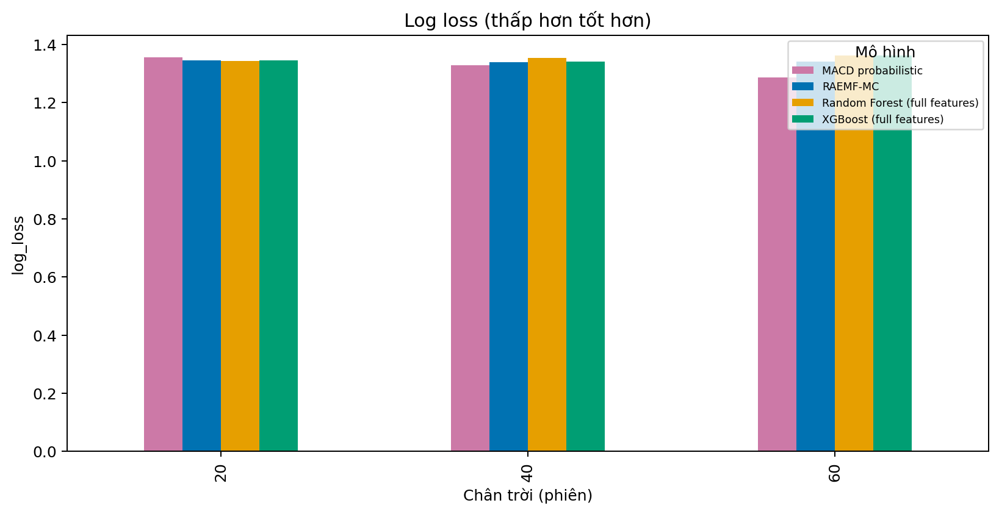

*Chú thích:* Hình được tạo từ dữ liệu và artifact của run hiện tại: `so_sanh_log_loss.png`.

**Nhận xét định lượng:** Metric này được đọc theo hướng thấp hơn là tốt hơn. 20 phiên: tốt nhất là Random Forest (full features) (1.3434); RAEMF-MC đạt 1.3451, chênh +0.0017; 40 phiên: tốt nhất là MACD probabilistic (1.3280); RAEMF-MC đạt 1.3388, chênh +0.0108; 60 phiên: tốt nhất là MACD probabilistic (1.2861); RAEMF-MC đạt 1.3417, chênh +0.0556. So sánh điểm không tự nó chứng minh ưu thế ổn định theo thời gian.

### So sanh macro f1

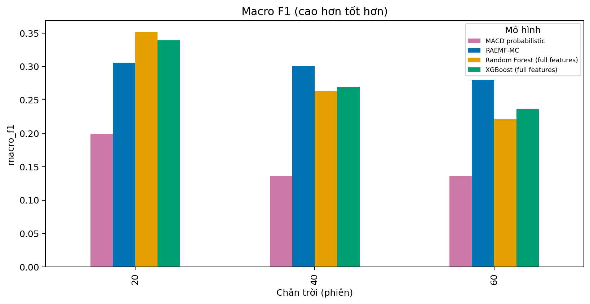

*Chú thích:* Hình được tạo từ dữ liệu và artifact của run hiện tại: `so_sanh_macro_f1.png`.

**Nhận xét định lượng:** Metric này được đọc theo hướng cao hơn là tốt hơn. 20 phiên: tốt nhất là Random Forest (full features) (0.3514); RAEMF-MC đạt 0.3057, chênh -0.0457; 40 phiên: tốt nhất là RAEMF-MC (0.3006); RAEMF-MC đạt 0.3006, chênh +0.0000; 60 phiên: tốt nhất là RAEMF-MC (0.2797); RAEMF-MC đạt 0.2797, chênh +0.0000. So sánh điểm không tự nó chứng minh ưu thế ổn định theo thời gian.

### So sanh mcc

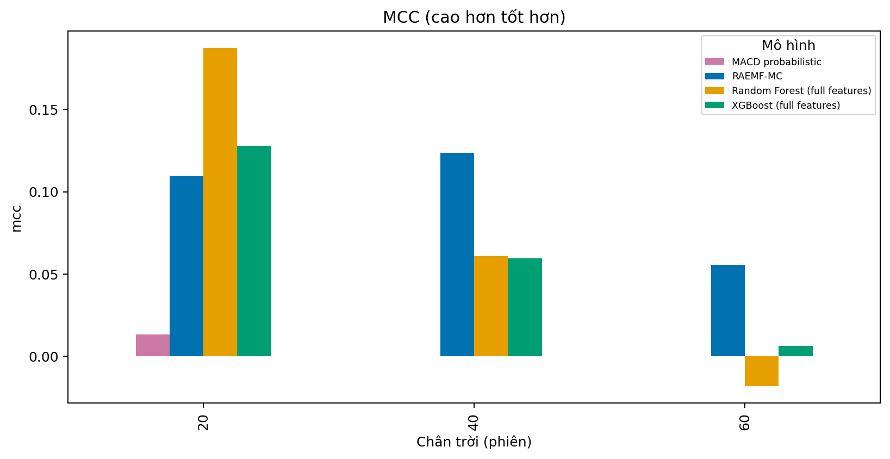

*Chú thích:* Hình được tạo từ dữ liệu và artifact của run hiện tại: `so_sanh_mcc.png`.

**Nhận xét định lượng:** Metric này được đọc theo hướng cao hơn là tốt hơn. 20 phiên: tốt nhất là Random Forest (full features) (0.1876); RAEMF-MC đạt 0.1093, chênh -0.0782; 40 phiên: tốt nhất là RAEMF-MC (0.1237); RAEMF-MC đạt 0.1237, chênh +0.0000; 60 phiên: tốt nhất là RAEMF-MC (0.0557); RAEMF-MC đạt 0.0557, chênh +0.0000. So sánh điểm không tự nó chứng minh ưu thế ổn định theo thời gian.

### So sanh recall bear

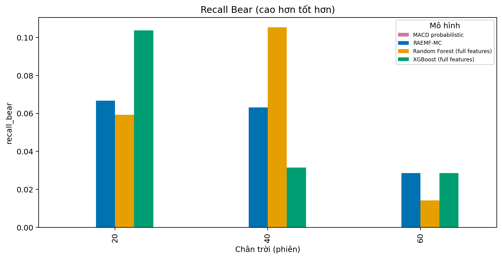

*Chú thích:* Hình được tạo từ dữ liệu và artifact của run hiện tại: `so_sanh_recall_bear.png`.

**Nhận xét định lượng:** Metric này được đọc theo hướng cao hơn là tốt hơn. 20 phiên: tốt nhất là XGBoost (full features) (0.1037); RAEMF-MC đạt 0.0667, chênh -0.0370; 40 phiên: tốt nhất là Random Forest (full features) (0.1053); RAEMF-MC đạt 0.0632, chênh -0.0421; 60 phiên: tốt nhất là RAEMF-MC (0.0286); RAEMF-MC đạt 0.0286, chênh +0.0000. So sánh điểm không tự nó chứng minh ưu thế ổn định theo thời gian.

### So sanh recall stress

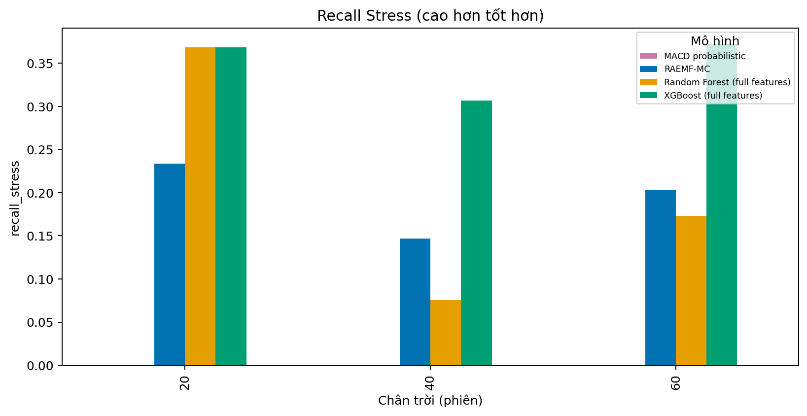

*Chú thích:* Hình được tạo từ dữ liệu và artifact của run hiện tại: `so_sanh_recall_stress.png`.

**Nhận xét định lượng:** Metric này được đọc theo hướng cao hơn là tốt hơn. 20 phiên: tốt nhất là XGBoost (full features) (0.3682); RAEMF-MC đạt 0.2338, chênh -0.1343; 40 phiên: tốt nhất là XGBoost (full features) (0.3067); RAEMF-MC đạt 0.1467, chênh -0.1600; 60 phiên: tốt nhất là XGBoost (full features) (0.3723); RAEMF-MC đạt 0.2035, chênh -0.1688. So sánh điểm không tự nó chứng minh ưu thế ổn định theo thời gian.

### Vnindex va phan chia du lieu

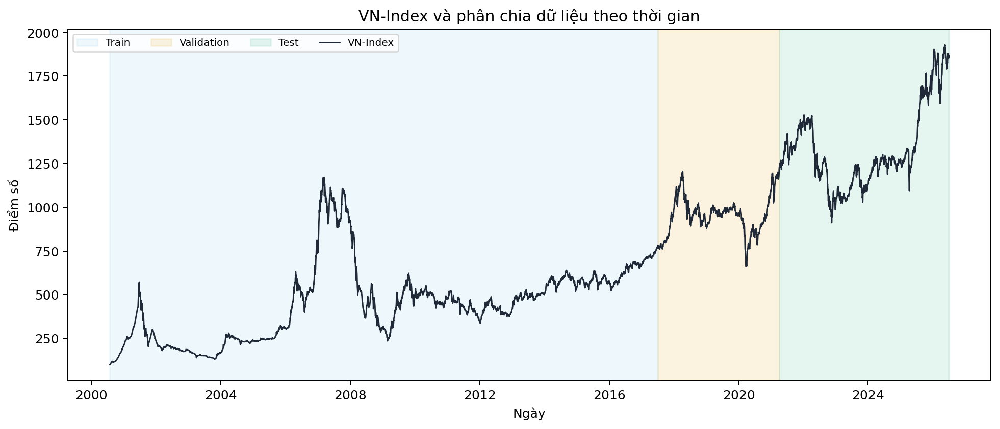

*Chú thích:* Hình được tạo từ dữ liệu và artifact của run hiện tại: `vnindex_va_phan_chia_du_lieu.png`.

**Nhận xét định lượng:** Validation bắt đầu 2017-07-05 và final test bắt đầu 2021-04-02. Mọi metric chính và backtest chỉ dùng final test; ranh giới được xác định theo thời gian, không xáo trộn quan sát.

### Xac suat filtered hmm

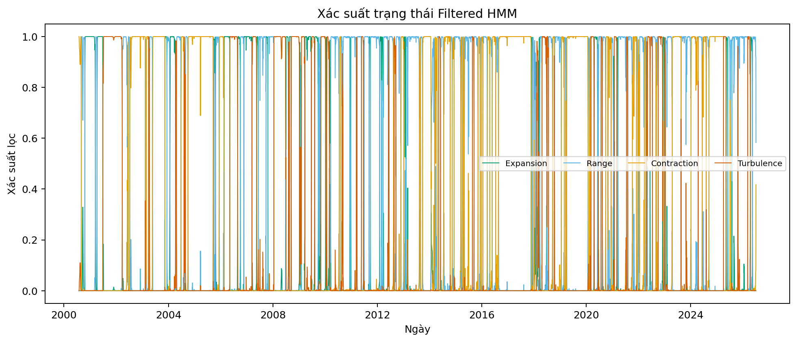

*Chú thích:* Hình được tạo từ dữ liệu và artifact của run hiện tại: `xac_suat_filtered_hmm.png`.

**Nhận xét định lượng:** Căn chỉnh train-only cho thấy Expansion: mean=0.651%, sigma=1.956%, tần suất=16.0%, Range: mean=0.021%, sigma=1.127%, tần suất=38.2%, Contraction: mean=0.000%, sigma=0.658%, tần suất=28.5%, Turbulence: mean=-0.360%, sigma=2.518%, tần suất=17.4%. Tên state là diễn giải tương đối theo quy tắc định lượng, không đồng nhất trực tiếp với nhãn dự báo.
